# AI CFO Assistant: Technical Reference Guide

**Version:** 1.4 (Revised for Clarity)

## Table of Contents

*   [Chapter 1: Introduction](#chapter-1-introduction)
    *   [1.5 Key Objectives](#15-key-objectives)
*   [Chapter 2: System Architecture](#chapter-2-system-architecture)
*   [Chapter 3: Data Ingestion Pipeline](#chapter-3-data-ingestion-pipeline)
*   [Chapter 4: Embedding & Storage](#chapter-4-embedding--storage)
*   [Chapter 5: Retrieval Process](#chapter-5-retrieval-process)
*   [Chapter 6: Answer Generation & Tools](#chapter-6-answer-generation--tools)
*   [Chapter 7: Final Output & Sources](#chapter-7-final-output--sources)
*   [Chapter 8: Evaluation](#chapter-8-evaluation)
*   [Chapter 9: Building the System (Current State)](#chapter-9-building-the-system-current-state)
*   [Chapter 10: Monitoring & Logs (Future Work)](#chapter-10-monitoring--logs-future-work)
*   [Chapter 11: Running the System](#chapter-11-running-the-system)
*   [Chapter 12: Next Steps](#chapter-12-next-steps)
*   [Chapter 13: Strategic Considerations and Future Vision](#chapter-13-strategic-considerations-and-future-vision)
*   [Appendix](#appendix)

---

## Chapter 1: Introduction

This guide outlines the AI CFO Assistant, a system designed to help Small and Medium Businesses (SMEs) securely upload financial documents and get reliable, context-aware answers about their finances. It leverages Retrieval-Augmented Generation (RAG), AI Tool Use, and a Supabase backend.

SMEs often struggle with extracting timely insights from complex PDF financial reports. This assistant provides an intelligent interface to these documents. Users upload reports, the system processes them, and users can ask natural language questions. The system retrieves information *only from the user's documents*, performs calculations using validated tools, generates factual answers, and cites sources.

**Core Design Goal: Reliability**
Accuracy and trustworthiness are paramount. The system prioritizes this through:
1.  **Grounded Answers:** Derived solely from user-provided documents.
2.  **Accurate Calculations:** Performed by reliable Python tools, not the LLM.
3.  **Verifiable Sources:** Answers include citations to specific document sections.
4.  **Data Privacy:** User data is strictly isolated via multi-tenancy.

**Key Objectives:**
*   Accurately parse and extract data from financial PDFs.
*   Implement effective context retrieval.
*   Integrate reliable calculation tools.
*   Ensure AI answers are grounded and avoid hallucination.
*   Establish an automated evaluation framework.
*   Build a functional Proof-of-Concept.
*   Implement secure multi-tenancy.
*   Design for flexibility amidst rapid AI advancements.

**Scope:**
*   **Ingestion (Completed):** Handling PDF financial reports, AI-driven data extraction (text, layout, metadata), structuring content as Markdown, segmenting into sections, chunking, generating embeddings, and secure storage in Supabase with multi-tenancy.
*   **Query/API (Partially Implemented / Future Work):** Context retrieval (filtering, vector search - Implemented; keyword search, re-ranking - Future), LLM-based answer generation (Implemented), tool use for retrieval (Implemented), calculation tools (Future), API layer (Future), user authentication (Future), automated evaluation (Future), system logging (Future), streaming responses (LLM supports streaming; API integration - Future).
*   **Out of Scope (Initial):** Non-financial/non-PDF documents, direct accounting software integration, financial advice, advanced visualization, polished UI.

**Technology Overview:**
Python, Google Gemini & OpenAI APIs, Supabase (PostgreSQL, Auth, Storage), `pymupdf`, `chonkie`, `pydantic`. Future: FastAPI.

**Document Purpose:**
This document details the design, implementation, and rationale for the AI CFO Assistant, guiding its development and outlining strategic considerations.

---

## Chapter 2: System Architecture

The system uses a modular architecture for ingesting financial documents and querying them. Supabase provides backend infrastructure (DB, Auth, Storage), enabling secure multi-tenancy.

**Ingestion Pipeline Diagram (Conceptual):**

```mermaid
graph LR
    User_Upload[User_Upload_PDF_Context] --> Parser[AI_PDF_Parsing];
    Parser -- Markdown --> Meta_Extract[AI_Metadata_Extraction];
    Parser -- Markdown --> Sectioner_Service[Content_Sectioning];

    User_Upload -- UserID_PDF_Buffer_Filename --> SB_Save_Doc[Store_Document_File_And_Base_Record];
    Meta_Extract -- Extracted_Doc_Metadata --> SB_Save_Doc;
    Parser -- Full_Markdown_Content --> SB_Save_Doc;
    SB_Save_Doc -- Doc_ID_Storage_Path --> DB_Docs[DB_documents_table];
    SB_Save_Doc -- Original_PDF_File --> Storage_Files[Supabase_Storage_PDF];

    DB_Docs -- Doc_ID --> Sectioner_Service;
    User_Upload -- UserID --> Sectioner_Service;
    Sectioner_Service -- Sections_Data --> SB_Save_Sec[Store_Sections_Data];
    SB_Save_Sec -- Section_IDs --> DB_Secs[DB_sections_table];
    
    DB_Secs -- Enriched_Sections_Data_with_IDs --> Chunker_Service[Content_Chunking];
    Meta_Extract -- Extracted_Doc_Metadata --> Chunker_Service;
    DB_Docs -- Doc_ID --> Chunker_Service;
    User_Upload -- UserID --> Chunker_Service;
    Chunker_Service -- Chunks_Data --> Embed_Service[Text_Embedding];

    Embed_Service -- Chunks_with_Embeddings --> SB_Save_Chunks[Store_Chunks_And_Embeddings];
    SB_Save_Chunks -- Success_Status --> DB_Chunks[DB_chunks_table];

    DB_Docs -- Doc_ID --> SB_Update_Status[Update_Document_Processing_Status];
    SB_Save_Chunks -- Ingestion_Outcome --> SB_Update_Status;
```

**High-Level Component Functions:**
The system comprises orchestrated services for AI interaction, PDF processing, data structuring (metadata, sections, chunks), embedding generation, and persistence to a secure, multi-tenant backend.

**Data Flow (Ingestion):**
1.  **Input:** User provides PDF, user ID, filename, document type.
2.  **Parse:** PDF is converted to structured Markdown using AI.
3.  **Extract Metadata:** Key document details (type, company, dates, summary) are extracted from the Markdown using AI.
4.  **Store Original & Initial Record:** The PDF is uploaded to secure storage, and an initial document record is saved in the database.
5.  **Section:** The Markdown is divided into logical sections.
6.  **Store Sections:** Section data is saved to the database.
7.  **Chunk:** Section content is broken into smaller, embeddable pieces, retaining metadata.
8.  **Embed:** Text chunks are converted into vector embeddings.
9.  **Store Chunks:** Chunks and their embeddings are saved to the database.
10. **Finalize:** Document processing status is updated.

---

## Chapter 3: Data Ingestion Pipeline

**Input:** The process begins with an authenticated user uploading a financial PDF, along with their `user_id` and document metadata.

**AI-Powered Parsing:** PDFs are converted into structured Markdown. Each page is rendered as an image and processed by a multimodal AI to ensure accurate capture of text, tables, and layout. The result is a single Markdown string representing the entire document, with page separators. This full content is stored.

**AI-Powered Metadata Extraction:** Key document-level details (e.g., type, company, dates, summary) are extracted from an initial snippet of the Markdown. An AI model, guided by a Pydantic schema, returns this information in a structured JSON format.

**Content Sectioning:** The full Markdown is segmented into logical sections based on headings and page markers. This process identifies section content, associated page numbers, and a sequential index for each section.

**Financial Document "AST" Analogy:**
Similar to how Abstract Syntax Trees (ASTs) capture code structure, these initial stages create a structural representation of the financial document. This allows the system to understand hierarchy and components beyond raw text, crucial for accurate filtering and contextual understanding by the LLM.

---

## Chapter 4: Embedding & Storage

**Content Chunking:** Section Markdown is further divided into smaller, fixed-size chunks suitable for embedding, while preserving contextual metadata (like document type, year, company, section heading) copied from parent document/section levels.

**Context-Aware Embedding:** Vector embeddings are generated for each chunk. To enhance meaning, key metadata is pre-pended to the chunk text before sending it to an embedding model (OpenAI `text-embedding-3-small`).

**Supabase Backend:**
*   **Auth:** Manages user accounts and provides the `user_id` for multi-tenancy.
*   **Storage:** Securely stores original PDF files, segregated by `user_id`.
*   **PostgreSQL with `pgvector`:** Core database for all structured data, including efficient vector similarity search.

**Database Structure:**
*   **`documents`:** Stores document metadata, `user_id`, storage path, status, and full Markdown. RLS enabled.
*   **`sections`:** Stores logical sections, their Markdown, page numbers, and links. RLS enabled.
*   **`chunks`:** Stores text chunks, vector embeddings, copied metadata, and links. Indexed for vector search. RLS enabled.

**Storage Security:** Files are stored in a private bucket under user-specific paths. Row-Level Security (RLS) policies ensure users can only access their own files.

**Persistence:** All interactions with Supabase (database operations, file uploads) are handled ensuring `user_id` is applied for RLS, maintaining data isolation.

---

## Chapter 5: Retrieval Process

**Current Retrieval Approach:**
A dedicated service, usable as an LLM "Tool," finds relevant document chunks.
1.  User query and `user_id` are received.
2.  The query is embedded.
3.  A database function (`match_chunks`) is called, which:
    *   **Mandatorily filters by `user_id`**.
    *   Optionally filters by metadata (doc type, company, year, quarter).
    *   Performs vector similarity search on chunks within the filtered set.
    *   Returns matching chunks (text, metadata, original filename).

**Goal: Context Provider, Not Just RAG:**
The retrieval aim is to be an effective **context provider** for the LLM, supplying the most relevant information from user documents, potentially using multiple techniques beyond just vector search.

**Handling Complex Queries (Future):** An LLM may decompose complex questions into sub-queries, making multiple calls to retrieval or other tools.

**Identifying Key Details & Filters (Partially Implemented):**
Currently, retrieval accepts explicit metadata filters. Future work involves an LLM parsing these from natural language queries.

**Filtering by Details (Inc. User ID - Implemented):** Mandatory `user_id` filtering is the primary data isolation mechanism, complemented by metadata filters.

**Finding Relevant Text (Implemented):** Uses vector search on `pgvector` combined with pre-filtering by metadata. Future work includes keyword search.

**Refining Results (Re-ranking - Future):** Initial results may be re-ranked using more advanced models for better relevance.

**Final Selection (Implemented):** A `match_count` parameter limits the number of top chunks returned as context.

---

# Chapter 6: Answer Generation & Tools

This stage creates the final answer using retrieved information and tools.

**AI Model for Generation (Implemented):** Google Gemini (e.g., `gemini-2.0-flash`) is used for its text handling, instruction following, and tool use capabilities.

**Preparing Context (Implemented):** Input for the AI combines the user's question, detailed instructions, tool descriptions, and the formatted text/metadata of retrieved document chunks.

**Guiding the AI (Prompting - Implemented):**
Prompts are critical for reliability. Key principles embedded in system prompts include:
*   **Clarity:** Direct instructions ("MUST", "MUST NOT").
*   **Groundedness:** *Only* use provided document text.
*   **Graceful Refusal:** Instruct how to respond if information is missing.
*   **Source Citation:** Mandate specific Markdown link format for citations.

**Using Calculation Tools (Future Work):**
Financial calculations will be handled by deterministic Python code (not the LLM) for accuracy and auditability. These will be exposed as tools for the AI.

**Managing Tool Use (Retrieval Tool Implemented):**
1.  LLM is aware of available tools (e.g., for chunk retrieval).
2.  LLM may request a tool call (e.g., "retrieve chunks for query X").
3.  The system executes the tool (e.g., `RetrievalService.retrieve_chunks`).
4.  Tool results (e.g., JSON of chunks) are sent back to the LLM.
5.  LLM uses this information to generate the final answer, guided by specific prompts.

---

# Chapter 7: Final Output & Sources

The AI's raw answer undergoes final processing.

**Cleaning the Answer (Future):** Removing extraneous text and ensuring consistent formatting.

**Basic Checks (Future):** Validating numbers against source text and checking for correct refusal messages.

**Showing Sources (Prompting Implemented):**
To build trust, answers include citations linking back to specific document sections. Prompts instruct the LLM to format these as Markdown links, leveraging `document_filename` and `section_id` from retrieved data. This ensures verifiability.

---

# Chapter 8: Evaluation

**Why Evaluate?**
To prove reliability, not just assume it. Evaluation measures performance, identifies issues, validates improvements, and demonstrates system trustworthiness.

**The Need for Rigorous, Quantitative Evals:**
Reliability in finance is non-negotiable. A rigorous, quantitative evaluation framework is essential for building trust and guiding development, ensuring accuracy.

**Test Data:**
Primarily uses synthetic financial PDFs created in-house, allowing control over content and known correct answers for various report types and periods.

**Creating Test Cases:**
A "Golden Dataset" of (Question, Correct Answer, Ground Truth Source Sections, Expected Numbers, Is_Refusal_Correct?) is created. This includes cases where refusal is the correct response.

**Measuring Performance:**
Automated measurement against the Golden Dataset covers:
*   **Number Accuracy:** Correctness of numerical values.
*   **Faithfulness:** Answer uses *only* provided document sections (LLM-assisted check).
*   **Source Accuracy:** Citations point to correct sources.
*   **Retrieval Performance:** Effectiveness in finding relevant sections.
*   **Refusal Accuracy:** Correctly refusing unanswerable questions.
*   **Structured Extraction Accuracy:** For table/metric extraction against ground truth.

**RAG Evaluation: Key Tips & Metrics:**
*(This section remains detailed as it provides foundational guidance for RAG system evaluation.)*

**Core Principle:** Evaluate the **Retriever** (finds info) and the **Generator** (creates answer) separately and together.

#### I. High-Value Evaluation Tips:
1.  **Smart Test Data is King:**
    *   "Golden" Datasets: Manually verified (Question, Ideal Answer, Ideal Source(s)).
    *   Synthetic Data Nuance: Use LLMs for diverse Q&A pairs *from your documents*, including unanswerable ones. Quality check samples.
2.  **LLM-as-a-Judge (Carefully!):** Use another LLM for subjective assessments (faithfulness, relevance) with specific prompts. Calibrate against human judgments.
3.  **Focus on Failure Modes:** Test known weaknesses (complex tables, date reasoning).
4.  **The Iterative Loop:** Evaluate -> Analyze Failures -> Hypothesize Fix -> Implement -> Re-Evaluate.

#### II. Key Metrics (Most Useful & Actionable):

**A. Evaluating the Retriever:**
*   **1. Context Precision (LLM-as-Judge):** % of retrieved chunks truly relevant to the question. *Why: Are we feeding good info to the generator?*
*   **2. Context Recall (LLM-as-Judge - advanced):** Of all relevant info, how much was found? *Why: Is critical info being missed?*
*   **3. Mean Reciprocal Rank (MRR) for Top-K Retrieval:** How high up is the *first* correct chunk? *Why: Good for top-result user scenarios.*

**B. Evaluating the Generator:**
*   **1. Faithfulness / Groundedness (LLM-as-Judge):** Does the answer *only* use retrieved context? Avoids hallucination? *Why: Critical for reliability.*
*   **2. Answer Relevance (LLM-as-Judge):** Does the answer directly address the user's question? *Why: Is the LLM answering the specific question?*

**Remember:** Use a combination of metrics, connected to user experience and business goals.

**Automation:**
An automated script runs test cases and calculates metrics, enabling rapid feedback on changes.

**Improving with Evaluation:**
1.  Test to find weaknesses.
2.  Make targeted improvements (prompts, retrieval, parsing, tools).
3.  Re-test to confirm improvements and check for regressions.
4.  Track results to demonstrate reliability gains.

---

## Chapter 9: Building the System (Current State)

**Technology Summary:**
Python, Google Gemini & OpenAI APIs, Supabase (PostgreSQL + `pgvector`, Auth, Storage), `pymupdf` (PDF parsing), `chonkie` (chunking), `pydantic` (data models). `.env` for configuration. Future: FastAPI.

**Setup & Configuration:**
Uses Python virtual environments, `requirements.txt`, and `.env` files for secrets. AI model names and chunking parameters are configurable within the codebase.

**Version Control:** Git and GitHub.

**Development Philosophy: Agility and Iteration:**
The system's modular design allows for quick iteration and adaptation to rapid AI advancements. Components can be swapped or updated with minimal impact, crucial for a fast-moving field.

---

## Chapter 10: Monitoring & Logs (Future Work)

Comprehensive system monitoring and detailed logging (e.g., to Supabase) will be implemented to track performance, diagnose issues, and understand usage patterns in a production environment. This includes logging key events, errors, AI interactions, and resource utilization.

---

## Chapter 11: Running the System

**Testing Setup (Notebooks):** Ingestion pipeline components and end-to-end flow were developed and tested using Jupyter notebooks, demonstrating functionality against a configured Supabase project.

**Production Ideas:** A production deployment would involve a web framework like FastAPI, scalable service deployment (e.g., Docker on a cloud platform), and background task queues for ingestion.

**Handling More Users:** Multi-tenancy is supported. Scaling involves database optimization, connection pooling, API rate limit management, and scaling application instances.

**Managing Costs:** Primarily AI API usage and Supabase resources. Track token counts and usage metrics. Optimize with model selection, efficient processing, and optimized queries.

**User Experience: Streaming Responses (Partially Implemented):**
To enhance responsiveness, API responses will be streamed.
*   **Implemented:** The LLM client supports streaming.
*   **Future Work:** The API layer (FastAPI) will use Server-Sent Events (SSE) to stream status updates and LLM tokens incrementally.

---

## Chapter 12: Next Steps

### 12.1 Immediate Next Steps

1.  **Refine Context Retrieval Logic (Ongoing):** Implement robust extraction of filter parameters from natural language queries for the retrieval tool; explore keyword search and re-ranking.
2.  **Implement Calculation Tools (Future):** Create Python functions for financial calculations, define tool schemas, and integrate with LLM tool use.
3.  **Implement Full Chat Orchestration (Ongoing):** Build the main loop managing LLM conversation, tool execution, and result presentation.
4.  **Develop API Layer (FastAPI - Future):** Endpoints for document upload and querying, auth middleware, and streaming responses.
5.  **Develop Frontend (Future):** UI for login, upload, querying, displaying streamed updates and answers with citations.

### 12.2 Future Enhancements

*   **Integrations with External Data Sources:** QuickBooks, Gmail (for financial document processing), cloud storage (Google Drive, Dropbox) with strict access controls.
*   **Templated Reporting & Real-Time Dashboards:** Generate standardized reports and dynamic dashboards from extracted/calculated data and integrated sources.
*   **Spreadsheet Export Functionality:** Export data and analysis to CSV, XLSX.
*   Anomaly Detection.
*   User feedback mechanisms.
*   More robust error handling and logging for query/answer pipeline.
*   Sophisticated table extraction and financial statement recognition.
*   Support for other file types (DOCX, XLSX).
*   Advanced context retrieval (graph-based methods, query transformation).
*   Fine-tuning models.
*   OCR for scanned PDFs.

---

## Chapter 13: Strategic Considerations and Future Vision

### 13.1 Market Validation: The Office of the CFO Needs

Market analysis confirms SMEs struggle with financial document insights and workflows. Key needs include automating document processing, financial reconciliation, reporting, supporting strategic analysis, and reliable calculation capabilities. This validates the AI CFO Assistant's focus.

### 13.2 The "Bitter Lesson": Vertical vs. Horizontal AI Applications

The "Bitter Lesson" suggests general AI methods eventually outperform specialized ones. This means "vertical workflows" like this assistant (specialized, engineered for current models) could be vulnerable to powerful, general "horizontal agents" from large labs as AI improves. Reliance solely on the AI processing pipeline is a long-term risk.

### 13.3 Implications of Opaque AI Reasoning

As AI reasoning becomes less interpretable ("latent space"), auditing AI decisions becomes harder. This reinforces the design choices of:
*   **Deterministic Calculation Tools:** Ensuring numerical results are transparent and auditable.
*   **Grounded Answers with Citations:** Providing verifiable links to human-readable source documents, crucial for trust.

### 13.4 Impact of Future Models

Highly capable future models ("GPT-5 level") might reduce the need for current data preparation steps like chunking, embedding, and complex RAG. The system's value would shift from data prep to orchestrating these powerful models securely, reliably, and verifiably. Core components like Supabase, API, calculation tools, and citation logic would remain vital.

### 13.5 Defending Against General Agents

To defend against general AI agents, the AI CFO Assistant must focus on:
1.  **Trust and Security Moat:** A secure, multi-tenant platform for sensitive financial data with guaranteed isolation and auditability.
2.  **Reliability and Accuracy for Domain-Specific Tasks:** Validated accuracy for specific financial analyses using deterministic tools and rigorous evaluation.
3.  **Domain-Specific User Experience & Workflow Integration:** Tailored financial workflows and interfaces.
4.  **Regulatory and Compliance Readiness:** Features for financial compliance and auditability.

### 13.6 Evolution: Becoming Infrastructure

The AI CFO Assistant could evolve into specialized infrastructure used by general agents, offering:
*   **Secure Financial Document Access API:** Authorized, RLS-enforced access.
*   **Structured Financial Data Extraction Service:** Reliable, clean data extraction.
*   **Domain-Specific Calculation Service:** Deterministic, callable financial functions.
*   **Grounded Financial Retrieval Service:** API for citable document sections.

This strategy leverages strengths (security, reliability, domain expertise) to complement general AI capabilities, becoming a valuable, trusted component in the future AI ecosystem.

---

## Appendix

### A. Example AI Prompts
*(Prompts are located in `src/prompts/templates/`)*
*   `pdf_annotation.j2`
*   `metadata_extraction.j2`
*   `chat_system_prompt.j2`
*   `citation_answer.j2`

### B. Database Setup SQL (`database_setup.sql`)
*(Contents of `scripts/database_setup.sql` - assumed to be the same as your original)*

### C. Storage Setup SQL (`storage_setup.sql`)
*(Contents of `scripts/storage_setup.sql` - assumed to be the same as your original)*

### D. Key Terms
*   **AI Model (LLM):** Large language model.
*   **API:** Application Programming Interface.
*   **AST (Abstract Syntax Tree):** Structural representation concept applied to documents.
*   **Chunking:** Splitting text into smaller pieces.
*   **Context Provider:** Role of retrieval to find relevant LLM input.
*   **Embedding:** Numerical vector representation of text.
*   **Function Calling / Tool Use:** LLM requesting external code execution.
*   **Grounded Answer:** Answer derived solely from provided sources.
*   **Ingestion:** Processing and storing documents.
*   **Markdown:** Text formatting language.
*   **Metadata:** Data *about* a document.
*   **Multi-tenancy:** Supporting multiple users with isolated data.
*   **`pgvector`:** PostgreSQL extension for vector search.
*   **Pipeline:** Sequence of processing steps.
*   **Pydantic:** Data validation/schema library.
*   **RAG:** Retrieval-Augmented Generation.
*   **Reliability:** Core goal: accuracy, trust, verifiability.
*   **Retrieval:** Finding relevant information.
*   **RLS (Row-Level Security):** Database per-user data access rules.
*   **RPC (Remote Procedure Call):** Executing database functions.
*   **Sectioning:** Dividing document into logical parts.
*   **Semantic Search:** Meaning-based search using embeddings.
*   **Service:** Modular code component.
*   **SSE (Server-Sent Events):** Protocol for server-to-client streaming.
*   **StreamingResponse:** FastAPI class for incremental data sending.
*   **Structured Extraction:** Pulling data into defined fields.
*   **Supabase:** Backend-as-a-Service platform.
*   **Vector:** List of numbers representing data.
*   **Vertical Workflow:** AI application specialized for a narrow domain.

---