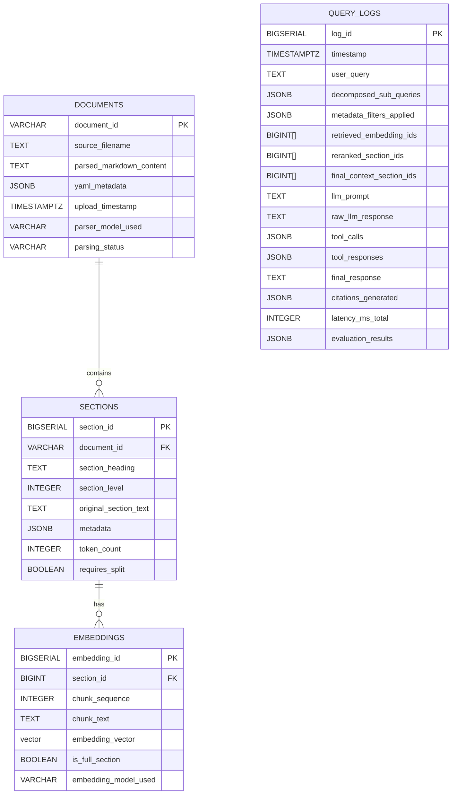

# AI CFO Assistant: Technical Reference Guide

## Table of Contents

*   [Chapter 1: Introduction](#chapter-1-introduction)
    *   [1.1 Project Overview](#11-project-overview)
    *   [1.2 The Problem: Financial Insight Bottleneck for SMEs](#12-the-problem-financial-insight-bottleneck-for-smes)
    *   [1.3 The Solution: AI CFO Assistant](#13-the-solution-ai-cfo-assistant)
    *   [1.4 Core Design Philosophy: Reliability First](#14-core-design-philosophy-reliability-first)
    *   [1.5 Key Objectives](#15-key-objectives)
    *   [1.6 Scope Definition](#16-scope-definition)
        *   [1.6.1 In Scope](#161-in-scope)
        *   [1.6.2 Out of Scope](#162-out-of-scope)
    *   [1.7 High-Level Technology Stack](#17-high-level-technology-stack)
    *   [1.8 Document Purpose & Audience](#18-document-purpose--audience)
*   [Chapter 2: System Architecture](#chapter-2-system-architecture)
    *   [2.1 Architectural Overview (RAG + Function Calling)](#21-architectural-overview-rag--function-calling)
    *   [2.2 Core Pipeline Stages Diagram](#22-core-pipeline-stages-diagram)
    *   [2.3 Component Descriptions](#23-component-descriptions)
        *   [2.3.1 PDF Parser (Gemini Vision)](#231-pdf-parser-gemini-vision)
        *   [2.3.2 Markdown Formatter & Metadata Extractor](#232-markdown-formatter--metadata-extractor)
        *   [2.3.3 Semantic Chunker (Heading-Based)](#233-semantic-chunker-heading-based)
        *   [2.3.4 Embedding Generator (Nomic + Fireworks AI)](#234-embedding-generator-nomic--fireworks-ai)
        *   [2.3.5 Vector Store (NeonDB + pgvector)](#235-vector-store-neondb--pgvector)
        *   [2.3.6 Query Decomposer (Gemini)](#236-query-decomposer-gemini)
        *   [2.3.7 Metadata Filter](#237-metadata-filter)
        *   [2.3.8 Vector Retriever](#238-vector-retriever)
        *   [2.3.9 Cross-Encoder Re-ranker](#239-cross-encoder-re-ranker)
        *   [2.3.10 Context Assembler](#2310-context-assembler)
        *   [2.3.11 Calculation Tool Executor](#2311-calculation-tool-executor)
        *   [2.3.12 Generator & Function Calling Orchestrator (Gemini 1.5 Pro)](#2312-generator--function-calling-orchestrator-gemini-15-pro)
        *   [2.3.13 Post-processor & Validator](#2313-post-processor--validator)
        *   [2.3.14 Citation Generator](#2314-citation-generator)
        *   [2.3.15 Logging Service](#2315-logging-service)
    *   [2.4 Data Flow](#24-data-flow)
        *   [2.4.1 Ingestion Flow](#241-ingestion-flow)
        *   [2.4.2 Query Flow (Simple Query)](#242-query-flow-simple-query)
        *   [2.4.3 Query Flow (Complex Query with Calculation)](#243-query-flow-complex-query-with-calculation)
*   [Chapter 3: Data Ingestion & Processing](#chapter-3-data-ingestion--processing)
    *   [3.1 Input Format: Financial PDFs](#31-input-format-financial-pdfs)
    *   [3.2 Parsing with Gemini Pro/Vision API](#32-parsing-with-gemini-provision-api)
        *   [3.2.1 API Interaction](#321-api-interaction)
        *   [3.2.2 Prompting for Structured Output](#322-prompting-for-structured-output)
        *   [3.2.3 Handling Layouts and Tables](#323-handling-layouts-and-tables)
        *   [3.2.4 Error Handling & Rate Limits](#324-error-handling--rate-limits)
    *   [3.3 Structuring Output: Markdown + YAML Front Matter](#33-structuring-output-markdown--yaml-front-matter)
        *   [3.3.1 Standard Metadata Schema (YAML)](#331-standard-metadata-schema-yaml)
        *   [3.3.2 Markdown Formatting Conventions](#332-markdown-formatting-conventions)
        *   [3.3.3 Mapping Content to Page Numbers (Challenge)](#333-mapping-content-to-page-numbers-challenge)
    *   [3.4 Semantic Chunking Strategy](#34-semantic-chunking-strategy)
        *   [3.4.1 Primary Split: Markdown Headings](#341-primary-split-markdown-headings)
        *   [3.4.2 Handling Large Sections (> 8K Tokens)](#342-handling-large-sections--8k-tokens)
            *   [3.4.2.1 Recursive Splitting Logic](#3421-recursive-splitting-logic)
            *   [3.4.2.2 Maintaining Parent Section Linkage](#3422-maintaining-parent-section-linkage)
        *   [3.4.3 Chunk Representation](#343-chunk-representation)
*   [Chapter 4: Embedding & Storage](#chapter-4-embedding--storage)
    *   [4.1 Embedding Strategy: Context-Awareness](#41-embedding-strategy-context-awareness)
        *   [4.1.1 Model Selection: `nomic-embed-text-v1.5`](#411-model-selection-nomic-embed-text-v15)
        *   [4.1.2 Metadata Prepending Technique](#412-metadata-prepending-technique)
        *   [4.1.3 Implementation via Fireworks AI API](#413-implementation-via-fireworks-ai-api)
            *   [4.1.3.1 API Call Structure](#4131-api-call-structure)
            *   [4.1.3.2 Batching Considerations](#4132-batching-considerations)
    *   [4.2 Vector Database: NeonDB](#42-vector-database-neondb)
        *   [4.2.1 Rationale for Choice (Serverless, Postgres Compatibility)](#421-rationale-for-choice-serverless-postgres-compatibility)
        *   [4.2.2 Enabling `pgvector`](#422-enabling-pgvector)
    *   [4.3 Database Schema Design](#43-database-schema-design)
        *   [4.3.1 `documents` Table](#431-documents-table)
        *   [4.3.2 `sections` Table](#432-sections-table)
        *   [4.3.3 `embeddings` Table](#433-embeddings-table)
        *   [4.3.4 `query_logs` Table](#434-query_logs-table)
        *   [4.3.5 Relationships (ERD Diagram)](#435-relationships-erd-diagram)
    *   [4.4 Indexing Strategy](#44-indexing-strategy)
        *   [4.4.1 Vector Indexing (HNSW on `embedding_vector`)](#441-vector-indexing-hnsw-on-embedding_vector)
        *   [4.4.2 Metadata Indexing (GIN on `metadata` JSONB)](#442-metadata-indexing-gin-on-metadata-jsonb)
        *   [4.4.3 Standard Indexes (FKs, IDs)](#443-standard-indexes-fks-ids)
    *   [4.5 Data Insertion Process](#45-data-insertion-process)
        *   [4.5.1 Orchestration Script](#451-orchestration-script)
        *   [4.5.2 Transaction Management](#452-transaction-management)
*   [Chapter 5: Retrieval Pipeline](#chapter-5-retrieval-pipeline)
    *   [5.1 Overview of Retrieval Goals](#51-overview-of-retrieval-goals)
    *   [5.2 Query Decomposition (for Complex Queries)](#52-query-decomposition-for-complex-queries)
        *   [5.2.1 Triggering Decomposition](#521-triggering-decomposition)
        *   [5.2.2 Gemini Model & Prompting](#522-gemini-model--prompting)
        *   [5.2.3 Handling Sub-query Execution](#523-handling-sub-query-execution)
    *   [5.3 Query Analysis & Metadata Extraction](#53-query-analysis--metadata-extraction)
        *   [5.3.1 Identifying Entities (Dates, Report Types)](#531-identifying-entities-dates-report-types)
        *   [5.3.2 Methods (Regex, Keywords, LLM Call)](#532-methods-regex-keywords-llm-call)
    *   [5.4 Metadata Filtering](#54-metadata-filtering)
        *   [5.4.1 Constructing SQL `WHERE` Clauses](#541-constructing-sql-where-clauses)
        *   [5.4.2 Querying `sections.metadata` JSONB](#542-querying-sectionsmetadata-jsonb)
    *   [5.5 Vector Search](#55-vector-search)
        *   [5.5.1 Query Embedding (Nomic)](#551-query-embedding-nomic)
        *   [5.5.2 Using `pgvector` Similarity Operators](#552-using-pgvector-similarity-operators)
        *   [5.5.3 Retrieving Top K Candidates](#553-retrieving-top-k-candidates)
    *   [5.6 Hybrid Search Considerations (Future)](#56-hybrid-search-considerations-future)
        *   [5.6.1 Need for Keyword Search (Specific Terms)](#561-need-for-keyword-search-specific-terms)
        *   [5.6.2 Integration Options (BM25, FTS)](#562-integration-options-bm25-fts)
        *   [5.6.3 Result Fusion (RRF)](#563-result-fusion-rrf)
    *   [5.7 Re-ranking with Cross-Encoders](#57-re-ranking-with-cross-encoders)
        *   [5.7.1 Rationale: Enhancing Top-K Relevance](#571-rationale-enhancing-top-k-relevance)
        *   [5.7.2 Model Selection (e.g., `ms-marco-MiniLM-L-6-v2`)](#572-model-selection-eg-ms-marco-minilm-l-6-v2)
        *   [5.7.3 Process: Re-ranking Full Parent Sections](#573-process-re-ranking-full-parent-sections)
        *   [5.7.4 Implementation (`sentence-transformers`)](#574-implementation-sentence-transformers)
    *   [5.8 Final Context Selection](#58-final-context-selection)
*   [Chapter 6: Generation & Function Calling](#chapter-6-generation--function-calling)
    *   [6.1 Generator Model: Gemini 1.5 Pro (1M Context)](#61-generator-model-gemini-15-pro-1m-context)
        *   [6.1.1 Rationale (Context Window, Function Calling)](#611-rationale-context-window-function-calling)
    *   [6.2 Context Assembly for Prompting](#62-context-assembly-for-prompting)
        *   [6.2.1 Including Metadata](#621-including-metadata)
        *   [6.2.2 Including Full Re-ranked Section Text](#622-including-full-re-ranked-section-text)
        *   [6.2.3 Formatting and Delimiters](#623-formatting-and-delimiters)
    *   [6.3 Prompt Engineering for Reliability](#63-prompt-engineering-for-reliability)
        *   [6.3.1 Core Principles (Clarity, Specificity)](#631-core-principles-clarity-specificity)
        *   [6.3.2 Persona Setting](#632-persona-setting)
        *   [6.3.3 Strict Context-Only Constraints (CRITICAL INSTRUCTION)](#633-strict-context-only-constraints-critical-instruction)
        *   [6.3.4 Graceful Refusal Instruction](#634-graceful-refusal-instruction)
        *   [6.3.5 Citation Requirements](#635-citation-requirements)
        *   [6.3.6 Tool Usage Instructions](#636-tool-usage-instructions)
        *   [6.3.7 Few-Shot Examples (Recommended)](#637-few-shot-examples-recommended)
            *   [6.3.7.1 Example: Successful Contextual Answer + Citation](#6371-example-successful-contextual-answer--citation)
            *   [6.3.7.2 Example: Correct Refusal When Info Absent](#6372-example-correct-refusal-when-info-absent)
            *   [6.3.7.3 Example: Tool Use for Calculation](#6373-example-tool-use-for-calculation)
    *   [6.4 Defining Calculation Tools](#64-defining-calculation-tools)
        *   [6.4.1 Identifying Necessary Tools (Sum, Avg, Ratio, Change %)](#641-identifying-necessary-tools-sum-avg-ratio-change-)
        *   [6.4.2 Implementing Tools as Python Functions](#642-implementing-tools-as-python-functions)
            *   [6.4.2.1 Input/Output Definitions](#6421-inputoutput-definitions)
            *   [6.4.2.2 Error Handling (Division by Zero, Type Errors)](#6422-error-handling-division-by-zero-type-errors)
        *   [6.4.3 Creating Tool Schemas (JSON for Gemini API)](#643-creating-tool-schemas-json-for-gemini-api)
    *   [6.5 Function Calling Orchestration](#65-function-calling-orchestration)
        *   [6.5.1 Initial Gemini API Call (with Tools)](#651-initial-gemini-api-call-with-tools)
        *   [6.5.2 Handling `function_call` Response](#652-handling-function_call-response)
        *   [6.5.3 Executing the Local Python Tool](#653-executing-the-local-python-tool)
        *   [6.5.4 Sending `function_response` Back to Gemini](#654-sending-function_response-back-to-gemini)
        *   [6.5.5 Receiving the Final Natural Language Answer](#655-receiving-the-final-natural-language-answer)
*   [Chapter 7: Post-processing & Attribution](#chapter-7-post-processing--attribution)
    *   [7.1 Answer Clean-up](#71-answer-clean-up)
        *   [7.1.1 Removing Extraneous Prefixes/Suffixes](#711-removing-extraneous-prefixessuffixes)
        *   [7.1.2 Standardizing Formatting](#712-standardizing-formatting)
    *   [7.2 Basic Validation Checks](#72-basic-validation-checks)
        *   [7.2.1 Numerical Cross-Referencing (Heuristic)](#721-numerical-cross-referencing-heuristic)
            *   [7.2.1.1 Extracting Numbers from Response](#7211-extracting-numbers-from-response)
            *   [7.2.1.2 Checking Presence in Cited Context](#7212-checking-presence-in-cited-context)
            *   [7.2.1.3 Limitations](#7213-limitations)
        *   [7.2.2 Checking for Refusal Message](#722-checking-for-refusal-message)
    *   [7.3 Citation Generation](#73-citation-generation)
        *   [7.3.1 Identifying Used Context Sections](#731-identifying-used-context-sections)
        *   [7.3.2 Mapping Section IDs to Document Metadata](#732-mapping-section-ids-to-document-metadata)
        *   [7.3.3 Standard Citation Format](#733-standard-citation-format)
*   [Chapter 8: Evaluation Framework](#chapter-8-evaluation-framework)
    *   [8.1 Evaluation Philosophy: Proving Reliability](#81-evaluation-philosophy-proving-reliability)
    *   [8.2 Source Data: Synthetic Financial PDFs](#82-source-data-synthetic-financial-pdfs)
        *   [8.2.1 Creation Method (Excel/Sheets -> PDF Recommended)](#821-creation-method-excelsheets---pdf-recommended)
        *   [8.2.2 Content & Structure Guidelines](#822-content--structure-guidelines)
        *   [8.2.3 Timeframe & Volume](#823-timeframe--volume)
    *   [8.3 Golden Dataset Creation](#83-golden-dataset-creation)
        *   [8.3.1 Structure Per Entry (Query, Ideal Answer, Ground Truth Chunks/Sections, Numerical Values)](#831-structure-per-entry-query-ideal-answer-ground-truth-chunkssections-numerical-values)
        *   [8.3.2 Query Type Coverage](#832-query-type-coverage)
        *   [8.3.3 Including Cases Requiring Refusal (CRITICAL)](#833-including-cases-requiring-refusal-critical)
        *   [8.3.4 Manual Verification & Annotation Guideline](#834-manual-verification--annotation-guideline)
    *   [8.4 Metrics Definitions & Implementation](#84-metrics-definitions--implementation)
        *   [8.4.1 Numerical Accuracy (Exact Match + Normalization)](#841-numerical-accuracy-exact-match--normalization)
        *   [8.4.2 Faithfulness (LLM-as-judge Methodology & Prompt)](#842-faithfulness-llm-as-judge-methodology--prompt)
        *   [8.4.3 Attribution Accuracy (Precision/Recall/F1 of Citations)](#843-attribution-accuracy-precisionrecallf1-of-citations)
        *   [8.4.4 Retrieval Performance (Precision@K, Recall@K, MRR)](#844-retrieval-performance-precisionk-recallk-mrr)
        *   [8.4.5 Refusal Accuracy (Did it refuse correctly?)](#845-refusal-accuracy-did-it-refuse-correctly)
    *   [8.5 Automated Evaluation Script (`evaluate.py`)](#85-automated-evaluation-script-evaluatepy)
        *   [8.5.1 Input: Golden Dataset, System Endpoint/Functions](#851-input-golden-dataset-system-endpointfunctions)
        *   [8.5.2 Process: Run Queries, Collect Responses, Calculate Metrics](#852-process-run-queries-collect-responses-calculate-metrics)
        *   [8.5.3 Output: Metrics Report (CSV, JSON, or Formatted Text)](#853-output-metrics-report-csv-json-or-formatted-text)
    *   [8.6 Evaluation Strategy: Baseline & Iteration](#86-evaluation-strategy-baseline--iteration)
*   [Chapter 9: Implementation Details & Configuration](#chapter-9-implementation-details--configuration)
    *   [9.1 Core Technology Stack Summary](#91-core-technology-stack-summary)
    *   [9.2 Key Python Libraries](#92-key-python-libraries)
    *   [9.3 Environment Setup](#93-environment-setup)
        *   [9.3.1 `requirements.txt`](#931-requirementstxt)
        *   [9.3.2 Environment Variables (`.env`) for Secrets](#932-environment-variables-env-for-secrets)
            *   [9.3.2.1 API Keys (Gemini, Fireworks AI)](#9321-api-keys-gemini-fireworks-ai)
            *   [9.3.2.2 Database Credentials (NeonDB)](#9322-database-credentials-neondb)
    *   [9.4 Configuration Management](#94-configuration-management)
        *   [9.4.1 Using YAML or Python Files for Config](#941-using-yaml-or-python-files-for-config)
        *   [9.4.2 Configurable Parameters (Model Names, Thresholds, Prompts)](#942-configurable-parameters-model-names-thresholds-prompts)
    *   [9.5 Recommended Code Structure (Modularity)](#95-recommended-code-structure-modularity)
        *   [9.5.1 Example Directory Layout (`src/`, `scripts/`, `config/`, `data/`)](#951-example-directory-layout-src-scripts-config-data)
        *   [9.5.2 Modules (e.g., `parsing`, `embedding`, `retrieval`, `generation`, `evaluation`, `tools`)](#952-modules-eg-parsing-embedding-retrieval-generation-evaluation-tools)
    *   [9.6 Version Control (Git & GitHub)](#96-version-control-git--github)
*   [Chapter 10: Logging & Observability](#chapter-10-logging--observability)
    *   [10.1 Importance of Logging in RAG Systems](#101-importance-of-logging-in-rag-systems)
    *   [10.2 Logging Schema (`query_logs` Table Deep Dive)](#102-logging-schema-query_logs-table-deep-dive)
        *   [10.2.1 Capturing Key Information at Each Stage](#1021-capturing-key-information-at-each-stage)
        *   [10.2.2 Linking Logs to Evaluation Results](#1022-linking-logs-to-evaluation-results)
    *   [10.3 Logging Implementation](#103-logging-implementation)
        *   [10.3.1 Using Python's `logging` Module](#1031-using-pythons-logging-module)
        *   [10.3.2 Writing Logs to NeonDB](#1032-writing-logs-to-neondb)
    *   [10.4 Use Cases](#104-use-cases)
        *   [10.4.1 Debugging Failures](#1041-debugging-failures)
        *   [10.4.2 Performance Analysis (Latency)](#1042-performance-analysis-latency)
        *   [10.4.3 Cost Estimation](#1043-cost-estimation)
        *   [10.4.4 Auditing & Compliance (Future)](#1044-auditing--compliance-future)
*   [Chapter 11: Deployment & Scalability (Considerations)](#chapter-11-deployment--scalability-considerations)
    *   [11.1 FYP Deployment (Local / Simple Cloud)](#111-fyp-deployment-local--simple-cloud)
        *   [11.1.1 Running via CLI or Streamlit App](#1111-running-via-cli-or-streamlit-app)
        *   [11.1.2 Containerization (Docker)](#1112-containerization-docker)
    *   [11.2 Production Deployment Considerations (Beyond FYP)](#112-production-deployment-considerations-beyond-fyp)
        *   [11.2.1 Web Application Framework (Flask, FastAPI)](#1121-web-application-framework-flask-fastapi)
        *   [11.2.2 Cloud Platforms (AWS, GCP, Azure)](#1122-cloud-platforms-aws-gcp-azure)
        *   [11.2.3 Serverless vs. VMs](#1123-serverless-vs-vms)
    *   [11.3 Scalability Factors](#113-scalability-factors)
        *   [11.3.1 Database (NeonDB Auto-scaling)](#1131-database-neondb-auto-scaling)
        *   [11.3.2 API Rate Limits & Quotas (Gemini, Fireworks AI)](#1132-api-rate-limits--quotas-gemini-fireworks-ai)
        *   [11.3.3 Concurrent Users](#1133-concurrent-users)
        *   [11.3.4 Computation (Re-ranking, Tool Execution)](#1134-computation-re-ranking-tool-execution)
    *   [11.4 Cost Management](#114-cost-management)
*   [Chapter 12: Future Work & Enhancements](#chapter-12-future-work--enhancements)
    *   [12.1 Based on Evaluation Results (Targeted Improvements)](#121-based-on-evaluation-results-targeted-improvements)
        *   [12.1.1 Fine-tuning Embeddings (Nomic)](#1211-fine-tuning-embeddings-nomic)
        *   [12.1.2 Fine-tuning Re-ranker](#1212-fine-tuning-re-ranker)
        *   [12.1.3 Fine-tuning Generator (Smaller Model on Groq?)](#1213-fine-tuning-generator-smaller-model-on-groq)
    *   [12.2 Expanding Capabilities](#122-expanding-capabilities)
        *   [12.2.1 Handling Scanned/Image-based PDFs](#1221-handling-scannedimage-based-pdfs)
        *   [12.2.2 Advanced Table Understanding & Extraction](#1222-advanced-table-understanding--extraction)
        *   [12.2.3 Complex Cross-Document Analysis & Trends](#1223-complex-cross-document-analysis--trends)
        *   [12.2.4 Integration with Live Accounting Systems](#1224-integration-with-live-accounting-systems)
        *   [12.2.5 Expanding Calculation Toolset](#1225-expanding-calculation-toolset)
        *   [12.2.6 Supporting Other Document Types (Compliance, Legal)](#1226-supporting-other-document-types-compliance-legal)
    *   [12.3 Enhancing User Experience](#123-enhancing-user-experience)
        *   [12.3.1 Production-Grade UI/UX](#1231-production-grade-uiux)
        *   [12.3.2 User Feedback Mechanisms](#1232-user-feedback-mechanisms)
        *   [12.3.3 Visualization Capabilities](#1233-visualization-capabilities)
*   [Appendix](#appendix)
    *   [A. Example Prompts](#a-example-prompts)
        *   [A.1 Gemini Vision Parser Prompt](#a1-gemini-vision-parser-prompt)
        *   [A.2 Gemini Query Decomposer Prompt](#a2-gemini-query-decomposer-prompt)
        *   [A.3 Gemini 1.5 Pro Generator Prompt (Full Example)](#a3-gemini-15-pro-generator-prompt-full-example)
        *   [A.4 LLM-as-judge Faithfulness Prompt](#a4-llm-as-judge-faithfulness-prompt)
    *   [B. Database Schema (SQL DDL)](#b-database-schema-sql-ddl)
    *   [C. Calculation Tool Schemas (JSON Examples)](#c-calculation-tool-schemas-json-examples)
    *   [D. API Usage Snippets](#d-api-usage-snippets)
        *   [D.1 Fireworks AI Embedding Call](#d1-fireworks-ai-embedding-call)
        *   [D.2 Gemini API Call (Basic Generation)](#d2-gemini-api-call-basic-generation)
        *   [D.3 Gemini API Call (Function Calling Flow)](#d3-gemini-api-call-function-calling-flow)
    *   [E. Glossary of Terms](#e-glossary-of-terms)

---

# Chapter 1: Introduction

## 1.1 Project Overview

This document provides a comprehensive technical reference for the **AI CFO Assistant**, a Final Year Project (FYP) designed to provide Small and Medium Enterprises (SMEs) with reliable, accurate, and verifiable insights derived directly from their financial documents. The system leverages state-of-the-art Artificial Intelligence (AI) techniques, specifically Retrieval-Augmented Generation (RAG) combined with Large Language Models (LLMs) capable of tool use (function calling), to answer natural language questions based solely on user-provided context.

## 1.2 The Problem: Financial Insight Bottleneck for SMEs

SMEs are vital economic contributors but often operate under significant resource constraints. While their financial performance is documented in standard reports like Income Statements, Balance Sheets, and Cash Flow Statements (typically PDFs), extracting timely and actionable intelligence from these documents presents several challenges:

1.  **Manual Effort:** Searching through multiple PDF reports for specific figures or trends is time-consuming and inefficient.
2.  **Expertise Gap:** SME owners or managers may lack the deep financial expertise required to interpret reports fully or calculate key metrics quickly.
3.  **Data Silos:** Information needed might be scattered across multiple reports or sections, requiring manual aggregation.
4.  **Unstructured Data:** Financial reports, while having structure, contain significant unstructured text (notes, explanations) and complex layouts (tables) that traditional data analysis tools struggle with.

These factors create a bottleneck, preventing SMEs from fully leveraging their own financial data for informed decision-making.

## 1.3 The Solution: AI CFO Assistant

The AI CFO Assistant aims to bridge this gap by providing an intelligent interface to an SME's financial documents. Users can upload their reports (initially focusing on core financial statements in PDF format) and ask questions in natural language (e.g., "What was our gross profit margin last quarter?", "Compare cash balance between Q1 and Q2 2023", "List the main operating expenses for FY2024").

The system utilizes a sophisticated RAG pipeline to:

1.  **Understand** the user's query.
2.  **Retrieve** the most relevant sections from the uploaded documents.
3.  **Perform** necessary calculations accurately using integrated tools.
4.  **Generate** a concise, accurate answer based *strictly* on the retrieved information.
5.  **Provide** clear citations linking the answer back to the source document sections.

## 1.4 Core Design Philosophy: Reliability First

Given the high stakes associated with financial information, the paramount design principle for this project is **Reliability**. Generic LLMs are known to "hallucinate" or generate plausible but incorrect information. To combat this, the AI CFO Assistant is explicitly designed to be trustworthy, focusing on three pillars:

1.  **Numerical Accuracy:** Ensuring that all figures presented are correct, whether directly retrieved or calculated. Calculations are delegated to deterministic Python functions via LLM function calling.
2.  **Faithfulness (Strict Context Adherence):** Guaranteeing that all generated textual answers are derived *solely and verifiably* from the information contained within the provided document context. The system is explicitly instructed *not* to use external knowledge and to refuse to answer if the information is not present in the provided context.
3.  **Attribution:** Providing clear, accurate citations for every piece of information presented, allowing users to easily trace answers back to the source document and section.

This focus on reliability aligns with best practices in AI Engineering, prioritizing robust evaluation and explicit safety mechanisms over simply maximizing capability.

## 1.5 Key Objectives

The primary technical objectives for this FYP are:

1.  **Implement Advanced Parsing:** Utilize high-capability multimodal LLMs to accurately parse complex financial PDF layouts, including tables, into structured Markdown with embedded metadata.
2.  **Develop Context-Aware Retrieval:** Implement a RAG pipeline featuring semantic chunking, metadata-infused embeddings from a high-performance model, metadata filtering, vector search, and cross-encoder re-ranking to find the most relevant document sections.
3.  **Enable Reliable Calculations:** Integrate LLM function calling capabilities from a large-context model to delegate calculations to validated, external Python tools, ensuring numerical precision.
4.  **Enforce Strict Grounding:** Employ rigorous prompt engineering techniques to ensure the LLM generator adheres strictly to the provided context and refuses appropriately when information is missing.
5.  **Build a Robust Evaluation Framework:** Create a comprehensive evaluation suite using a synthetic golden dataset to quantitatively measure Numerical Accuracy, Faithfulness, Attribution Accuracy, and Retrieval Performance.
6.  **Deliver a Functional Prototype:** Produce a working system (CLI or basic UI) demonstrating the core capabilities and evaluated reliability.

## 1.6 Scope Definition

### 1.6.1 In Scope

*   Processing core financial statement PDFs (Income Statement, Balance Sheet, Cash Flow Statement).
*   Parsing text and basic table structures using a multimodal LLM.
*   Generating structured Markdown with YAML metadata.
*   Semantic chunking based on Markdown headings.
*   Context-aware embedding using a suitable model and metadata prepending.
*   Storage and retrieval using a vector database supporting `pgvector`.
*   Metadata filtering based on query analysis.
*   Cross-encoder re-ranking of retrieved sections.
*   Query decomposition for complex queries using an LLM.
*   Generating answers using a capable LLM with a large context window.
*   Performing calculations via LLM function calling to predefined Python tools (sum, average, ratio, percentage change).
*   Enforcing context-only adherence and graceful refusal via prompting.
*   Providing section-level attribution/citations.
*   Building and executing an automated evaluation pipeline based on a synthetic dataset.
*   Logging key system interactions.
*   Developing a basic CLI or Streamlit interface for demonstration.

### 1.6.2 Out of Scope

*   Handling non-financial documents (legal, compliance, HR).
*   Processing scanned/image-only PDFs without OCR capabilities (though the chosen multimodal LLM might handle some).
*   Advanced, pixel-perfect table extraction and manipulation beyond the chosen LLM's parsing capabilities.
*   Real-time data integration with accounting systems.
*   Complex financial modeling, forecasting, or providing financial advice.
*   Sophisticated visualization of financial data.
*   User authentication, multi-tenancy, or production-grade security hardening.
*   Building a polished, production-ready user interface.
*   Fine-tuning of embedding or generator models (listed as potential Future Work).
*   Integration of keyword search alongside vector search (listed as potential Future Work).
*   Handling spreadsheet formats (.xlsx, .csv).

## 1.7 High-Level Technology Stack (Flexible Description)

*   **Core Language:** Python (Version 3.10 or later recommended).
*   **Large Language Models (LLMs):** Accessed primarily via APIs. Requires:
    *   A high-capability **Multimodal LLM** for advanced PDF parsing (understanding text, layout, tables).
    *   A large-context window **Generator LLM** supporting robust instruction following and **Function Calling / Tool Use** for reliable calculations and potentially query decomposition.
*   **Text Embedding Model:** A high-performance model optimized for semantic retrieval tasks, likely accessed via an **Embedding API Provider** for efficiency and scalability. The specific model will be chosen based on performance benchmarks relevant to retrieval (e.g., MTEB) and cost considerations.
*   **Vector Database:** A database solution offering vector storage and search capabilities, ideally compatible with **PostgreSQL** and supporting the **`pgvector` extension**. A managed cloud or serverless option (like NeonDB or equivalent) is preferred for ease of use and scalability.
*   **Re-ranker Model:** A **Cross-Encoder Model** suitable for computing fine-grained relevance between query-passage pairs. This may run locally using libraries like `sentence-transformers` or potentially accessed via an API if available and efficient.
*   **Key Python Libraries:** Core libraries will include:
    *   Clients for interacting with chosen **LLM API(s)** and **Embedding API(s)** (e.g., `google-generativeai`, `openai`, `anthropic`, `requests`).
    *   A **Database Client** compatible with the chosen PostgreSQL/pgvector solution (e.g., `psycopg2`, `asyncpg`).
    *   Libraries for NLP tasks, specifically **`sentence-transformers`** for handling embeddings and re-rankers locally.
    *   Utilities for configuration (`PyYAML`), environment management (`python-dotenv`), data handling (`pandas` potentially), logging (`logging`), and Markdown parsing (`mistune` potentially).
*   **Interface (Optional):** A simple interface using **Streamlit** (web app) or **`argparse`** (Command Line Interface) for demonstration and testing.
*   **Evaluation:** **Custom Python scripts** leveraging standard libraries (`numpy`, `scikit-learn` for metrics calculation) to implement the evaluation framework against the golden dataset.

## 1.8 Document Purpose & Audience

This document serves as the central technical reference for the AI CFO Assistant project. Its purpose is to:

*   Detail the system's architecture, design choices, and implementation specifics.
*   Provide a clear guide for understanding, reproducing, and potentially extending the project.
*   Document the evaluation methodology and rationale behind the reliability focus.

The intended audience includes:

*   The project developer(s).
*   The FYP supervisor and examiners.
*   Future developers who may build upon this work.
*   Anyone seeking to understand the technical underpinnings of applying reliable RAG and function calling to financial document analysis.


---

# Chapter 2: System Architecture

## 2.1 Architectural Overview (RAG + Function Calling)

The AI CFO Assistant is built upon an advanced **Retrieval-Augmented Generation (RAG)** architecture, enhanced with **Function Calling** capabilities. This hybrid approach aims to leverage the strengths of Large Language Models (LLMs) for natural language understanding and generation while mitigating their weaknesses (hallucination, lack of specific knowledge) by grounding them firmly in user-provided documents and ensuring numerical precision through external tools.

The core principle is to **retrieve** the most relevant information from a pre-processed corpus of financial documents before attempting to **generate** an answer. Furthermore, when calculations are required, the system delegates these tasks to reliable, deterministic **external tools** (Python functions) invoked via the LLM's function calling mechanism.

This architecture prioritizes modularity, allowing individual components to be potentially swapped or upgraded (e.g., changing the embedding model or the LLM provider) with minimal disruption to the overall workflow, facilitating rapid iteration and experimentation.

## 2.2 Core Pipeline Stages Diagram

The following diagram illustrates the key stages and data flow within the AI CFO Assistant system, covering both the initial document ingestion process and the query handling process.

```mermaid
graph TD
    subgraph Ingestion Pipeline
        direction LR
        A[Financial PDF Reports] --> B(1. PDF Parser / Extractor <br> Multimodal LLM);
        B --> C(2. Markdown Formatter <br> + YAML Metadata Extraction);
        C --> D(3. Semantic Chunker <br> Heading-Based);
        D --> E(4. Embedding Generator <br> Context-Aware);
        E --> F[(5. Vector Store <br> + Metadata <br> NeonDB/pgvector)];
    end

    subgraph Query Pipeline
        direction TB
        G[User Query] --> H{6. Query Decomposer <br> (If Complex)};
        H -- Simple Query --> I(7. Query Analyzer <br> + Metadata Extractor);
        H -- Sub-queries --> I;
        I --> J(8. Metadata Filter <br> DB Query);
        J -- Filtered Section IDs --> F;
        F -- Potential Chunks/Embeddings --> K(9. Vector Retriever);
        K -- Relevant Embeddings/Chunks --> L(10. Parent Section Mapper);
        L -- Candidate Parent Section IDs --> F;
        F -- Full Parent Section Text --> M(11. Cross-Encoder <br> Re-ranker);
        M -- Top K Parent Sections --> N(12. Context Assembler);
        N --> O{13. Generator LLM <br> + Function Calling <br> Orchestrator};
        subgraph Function Calling Loop
           direction LR
           O -- Request Tool Call --> P(14. Calculation Tool Executor <br> Python Functions);
           P -- Tool Result --> O;
        end
        O -- Final Natural Language Response --> Q(15. Post-processor <br> + Validator);
        Q --> R(16. Citation Generator);
        R --> S[Formatted Answer + Citations];
    end

    subgraph Shared Services
        direction TB
        T[(Logging Service <br> NeonDB `query_logs`)]
    end

    %% Connections between pipelines and services
    G --> T; %% Log Input Query
    O --> T; %% Log LLM Interaction
    Q --> T; %% Log Final Output
    R --> T; %% Log Citations

    %% Styling
    style F fill:#f9f,stroke:#333,stroke-width:2px
    style O fill:#ccf,stroke:#333,stroke-width:2px
    style T fill:#ddd,stroke:#333,stroke-width:1px
    style P fill:#ffcc99,stroke:#333,stroke-width:1px
```
**Figure 2.1:** Core AI CFO Assistant Architecture (Ingestion & Query Pipelines)

## 2.3 Component Descriptions

This section describes the role and function of each numbered component in the architecture diagram (Figure 2.1).

### 2.3.1 PDF Parser (Gemini Vision)

*   **Responsibility:** To process input financial PDF documents and extract their content, including text, layout structure, and potentially table data.
*   **Technology:** Utilizes a high-capability **Multimodal LLM** (e.g., Google Gemini Pro/Vision API) chosen for its ability to understand visual layout and extract information from complex formats often found in financial reports.
*   **Output:** Raw extracted content, ideally preserving structural information (headings, lists, tables) for downstream processing.

### 2.3.2 Markdown Formatter & Metadata Extractor

*   **Responsibility:** To convert the raw output from the parser into a standardized, clean **Markdown** format. It also extracts or infers key **document-level metadata** (e.g., Report Type, Company Name, Currency, Period/Date) and embeds this as **YAML front matter** within the Markdown file.
*   **Technology:** Python scripts using string manipulation, potentially regular expressions, and YAML libraries (`PyYAML`). May involve prompting the parser LLM to structure its output suitably.
*   **Output:** A Markdown string for each document, prepended with a YAML block containing structured metadata.

### 2.3.3 Semantic Chunker (Heading-Based)

*   **Responsibility:** To divide the Markdown document into smaller, semantically coherent **chunks** (sections). The primary strategy is to split based on Markdown headings (`#`, `##`, etc.), preserving logical units of text. Handles sections exceeding token limits via recursive splitting.
*   **Technology:** Python scripts, potentially using Markdown parsing libraries (`mistune`) or regex to identify heading boundaries. Incorporates token counting logic (e.g., using `tiktoken`).
*   **Output:** A list of text chunks (sections or sub-sections), each associated with its parent document and source metadata.

### 2.3.4 Embedding Generator (Nomic + Fireworks AI)

*   **Responsibility:** To convert text chunks into numerical **vector embeddings** that capture their semantic meaning. Implements the **context-aware embedding** strategy by prepending YAML metadata text to the chunk text before generating the embedding.
*   **Technology:** Interacts with a high-performance **Text Embedding Model API** (e.g., `nomic-embed-text-v1.5` via Fireworks AI). Python code handles formatting the input string (`metadata_text + chunk_text`) and managing API calls.
*   **Output:** Vector embeddings corresponding to each (potentially metadata-infused) text chunk.

### 2.3.5 Vector Store (NeonDB + pgvector)

*   **Responsibility:** To store the processed data persistently and enable efficient retrieval. Stores original document metadata, section text, chunk text (if split), associated metadata (parsed YAML), and the generated vector embeddings.
*   **Technology:** A **PostgreSQL-compatible database** with the **`pgvector` extension** enabled (e.g., NeonDB). Includes appropriate tables and indexes (HNSW for vectors, GIN for JSONB metadata).
*   **Output:** Provides data storage and retrieval capabilities via SQL queries.

### 2.3.6 Query Decomposer (Gemini)

*   **Responsibility:** To analyze complex user queries (e.g., those requiring comparisons, multi-step reasoning, or calculations involving multiple data points) and break them down into simpler, actionable **sub-queries**.
*   **Technology:** Utilizes an **LLM API** (e.g., Gemini Flash/Pro) with specific prompting designed for query decomposition.
*   **Output:** One or more simpler sub-queries to be processed sequentially or in parallel by the subsequent pipeline stages. For simple queries, this stage might be bypassed.

### 2.3.7 Metadata Filter

*   **Responsibility:** To narrow down the search space within the database *before* performing expensive vector searches. Analyzes the user query (or sub-query) to identify potential filters (e.g., specific dates, report types, keywords matching metadata fields).
*   **Technology:** Python logic performing query analysis (regex, keyword matching, potentially a small LLM call). Constructs SQL `WHERE` clauses to query the `sections.metadata` JSONB field in the database.
*   **Output:** A filtered set of `section_id`s or `embedding_id`s to be considered by the retriever.

### 2.3.8 Vector Retriever

*   **Responsibility:** To find the stored embeddings most semantically similar to the user's query embedding *within the filtered set*.
*   **Technology:** Executes vector similarity search queries against the `embeddings` table in the database using `pgvector` operators (e.g., cosine distance `<=>`).
*   **Output:** A ranked list of candidate `embedding_id`s and their associated similarity scores.

### 2.3.9 Cross-Encoder Re-ranker

*   **Responsibility:** To refine the relevance ranking of the initial retrieval results. Takes the candidate sections identified by the retriever (specifically, their full parent section text) and computes a more accurate relevance score against the user query.
*   **Technology:** Uses a **Cross-Encoder model** (e.g., `ms-marco-MiniLM-L-6-v2`) loaded via libraries like `sentence-transformers`. Runs locally or on dedicated compute.
*   **Output:** A re-ranked list of the top K most relevant parent `section_id`s.

### 2.3.10 Context Assembler

*   **Responsibility:** To gather all necessary information required for the final generation prompt. Retrieves the full original text and metadata for the top K re-ranked parent sections.
*   **Technology:** Python code interacting with the database (`sections` table) based on the re-ranker output. Formats the collected information according to the generator's prompt template.
*   **Output:** The assembled context string (metadata + full section texts) ready for prompting.

### 2.3.11 Calculation Tool Executor

*   **Responsibility:** To execute predefined, reliable **Python functions** for performing specific financial calculations (e.g., sum, average, ratio, percentage change) when requested by the Generator LLM.
*   **Technology:** A collection of well-defined Python functions implementing the required calculations. Includes robust error handling.
*   **Output:** The structured result of the calculation (e.g., a number, boolean, simple dict).

### 2.3.12 Generator & Function Calling Orchestrator (Gemini 1.5 Pro)

*   **Responsibility:** To generate the final natural language answer based *only* on the assembled context and the user query. It also orchestrates the **Function Calling** loop: identifies when a calculation tool is needed, parses the required arguments, receives the tool's result, and incorporates it into the final response. Enforces strict context adherence and refusal instructions via prompt engineering.
*   **Technology:** Interacts with a large-context window **Generator LLM API** supporting function calling (e.g., Gemini 1.5 Pro). Manages the multi-turn conversation flow required for tool use.
*   **Output:** Raw natural language response potentially containing calculation results.

### 2.3.13 Post-processor & Validator

*   **Responsibility:** To clean up the raw LLM response (remove extraneous text) and perform basic validation checks (e.g., heuristic numerical cross-referencing against cited context).
*   **Technology:** Python string manipulation, regular expressions.
*   **Output:** A cleaner, potentially validated natural language response.

### 2.3.14 Citation Generator

*   **Responsibility:** To extract the identifiers of the source sections used during context assembly and format them into clear, user-readable citations according to a predefined standard.
*   **Technology:** Python code mapping internal `section_id`s back to document metadata (filename, inferred page, section heading).
*   **Output:** A list or string of formatted citations.

### 2.3.15 Logging Service

*   **Responsibility:** To record key information about each query interaction for debugging, analysis, evaluation, and observability.
*   **Technology:** Python's standard `logging` module configured to write structured logs to a dedicated table (e.g., `query_logs`) in the **NeonDB database**.
*   **Output:** Persisted log records.

## 2.4 Data Flow

The following describes the typical sequence of operations for key system workflows.

### 2.4.1 Ingestion Flow

1.  User uploads a **Financial PDF Report** (A).
2.  **PDF Parser** (B) extracts content using multimodal LLM.
3.  **Markdown Formatter** (C) cleans the output, extracts/embeds YAML metadata.
4.  **Semantic Chunker** (D) splits Markdown into sections/sub-chunks based on headings and token limits.
5.  **Embedding Generator** (E) prepends metadata to each chunk/sub-chunk and generates vector embeddings via API.
6.  Data (metadata, original section text, chunk text, embeddings) is inserted into the **Vector Store** (F) tables (`documents`, `sections`, `embeddings`) with appropriate indexing.

### 2.4.2 Query Flow (Simple Query - No Decomposition/Calculation)

1.  User submits a **Query** (G).
2.  **Query Analyzer** (I) potentially extracts metadata filters.
3.  **Metadata Filter** (J) queries the DB to get a list of potentially relevant section/embedding IDs.
4.  **Vector Retriever** (K) performs similarity search on the filtered set using the query embedding.
5.  **Parent Section Mapper** (L) identifies the parent sections of the top retrieved embeddings.
6.  **Cross-Encoder Re-ranker** (M) retrieves full parent section text and re-scores them against the query.
7.  **Context Assembler** (N) gathers context (metadata + full text) for the top K re-ranked sections.
8.  **Generator LLM** (O) receives the query and assembled context, generates a natural language response based strictly on the context, following prompt instructions (including refusal if info is absent).
9.  **Post-processor** (Q) cleans the response.
10. **Citation Generator** (R) formats citations based on the context sections used.
11. **Formatted Answer + Citations** (S) are presented to the user.
12. Interaction details are logged (T).

### 2.4.3 Query Flow (Complex Query with Calculation)

1.  User submits a **Query** (G) requiring calculation (e.g., "What is the current ratio?").
2.  **Query Decomposer** (H) might break it down (e.g., "Find Total Current Assets", "Find Total Current Liabilities"). Execution proceeds for sub-queries similar to the simple flow until step 7 (Context Assembler).
3.  **Context Assembler** (N) gathers context relevant to the calculation (e.g., sections containing asset and liability figures).
4.  **Generator LLM** (O) receives the query/sub-query, assembled context, and *tool schemas*. It determines a calculation is needed (e.g., `calculate_ratio`).
5.  LLM (O) outputs a `function_call` request specifying the tool name (`calculate_ratio`) and arguments derived *only* from the provided context (e.g., `numerator=145000`, `denominator=40000`).
6.  **Calculation Tool Executor** (P) receives the request, executes the local `calculate_ratio(145000, 40000)` Python function.
7.  Tool Executor (P) returns the structured result (e.g., `{"ratio": 3.625}`) back to the Orchestrator (O).
8.  LLM (O) receives the tool result and generates the final natural language answer incorporating it (e.g., "Based on the balance sheet, the current ratio is 3.63.").
9.  **Post-processor** (Q) cleans the response.
10. **Citation Generator** (R) formats citations for the context sections used to derive the *inputs* to the calculation.
11. **Formatted Answer + Citations** (S) are presented.
12. Interaction details, including tool calls/results, are logged (T).


---

# Chapter 3: Data Ingestion & Processing

## 3.1 Input Format: Financial PDFs

The primary input for the AI CFO Assistant is standard financial reports provided by SMEs, typically in **Portable Document Format (PDF)**. These documents commonly include:

*   **Income Statement (Profit & Loss):** Details revenues, costs, and expenses over a period.
*   **Balance Sheet:** Shows assets, liabilities, and equity at a specific point in time.
*   **Cash Flow Statement:** Tracks the movement of cash through operating, investing, and financing activities.

**Challenges with Financial PDFs:**

*   **Varied Layouts:** SMEs use different accounting software or templates, leading to diverse formatting, column structures, and presentation styles.
*   **Mixed Content:** Reports contain text, numbers, tables, headers, footers, and sometimes charts or logos.
*   **Table Complexity:** Tables can span multiple pages, have merged cells, or lack clear borders, making programmatic extraction difficult for traditional tools.
*   **Scanned Documents (Out of Scope initially):** Some PDFs might be scanned images rather than text-based, requiring Optical Character Recognition (OCR). While the chosen multimodal LLM might handle some OCR implicitly, pixel-perfect scanned document handling is initially out of scope.

The goal of the ingestion phase is to reliably extract the meaningful content and structure from these varied PDFs into a consistent, machine-readable format.

## 3.2 Parsing with Gemini Pro/Vision API

To overcome the challenges of parsing complex financial PDFs, this system leverages a powerful **Multimodal Large Language Model API**, such as Google's Gemini Pro with Vision capabilities.

### 3.2.1 API Interaction

*   **Input:** The PDF document is typically provided to the API either as raw bytes or via a reference (e.g., a Google Cloud Storage URI).
*   **Process:** The API uses its underlying models, trained on vast amounts of text and image data, to analyze the document's visual layout and textual content simultaneously.
*   **Output:** The API returns the extracted information, typically as structured text (e.g., JSON containing text blocks, tables, potentially coordinates). The exact format depends on the specific API endpoint and prompting.

### 3.2.2 Prompting for Structured Output

Effective parsing relies heavily on providing clear instructions (prompting) to the multimodal LLM. The prompt should guide the model to:

1.  **Extract All Text:** Ensure all relevant textual content is captured.
2.  **Identify Structure:** Recognize headings, paragraphs, lists, and especially tables.
3.  **Preserve Table Integrity:** Extract table data row by row, maintaining associations between headers and cell values.
4.  **Output Format:** Request the output in a specific, easily parseable format, ideally structured **Markdown** that reflects the document's hierarchy. It should also be prompted to identify and extract key document-level **metadata**.

*(See Appendix A.1 for an example parser prompt)*

### 3.2.3 Handling Layouts and Tables

The key advantage of using a multimodal model like Gemini Vision is its ability to interpret visual layout cues (whitespace, lines, font sizes) to understand document structure, particularly complex tables that might confuse text-only parsers. It should ideally convert tabular data into Markdown tables or a similar structured text format within the output.

### 3.2.4 Error Handling & Rate Limits

*   **API Errors:** Implement robust error handling (e.g., using try-except blocks, retry mechanisms with exponential backoff) for potential API issues (network errors, server errors, invalid requests).
*   **Rate Limits:** Be mindful of API rate limits. For ingesting many documents, implement throttling or process documents sequentially to avoid exceeding limits. Check the specific provider's documentation for limits.
*   **Parsing Failures:** Log documents that fail parsing after retries for manual inspection. Consider alternative parsing strategies (e.g., simpler text extraction libraries) as a fallback for problematic documents, though this might sacrifice structural information.

## 3.3 Structuring Output: Markdown + YAML Front Matter

The raw output from the parser LLM needs to be transformed into a standardized format suitable for chunking and embedding. The chosen format is **Markdown with YAML Front Matter**.

### 3.3.1 Standard Metadata Schema (YAML)

A block of YAML enclosed in triple-dashed lines (`---`) is prepended to the start of each document's Markdown representation. This block contains critical document-level metadata extracted or inferred during parsing. A consistent schema is essential for later filtering.

**Example YAML Schema:**

```yaml
---
document_id: "SynthWidgets_IS_2024_Q1"  # Unique identifier (e.g., filename based)
source_filename: "SynthWidgets_IncomeStatement_Q1_2024.pdf"
report_type: "Income Statement"          # E.g., "Income Statement", "Balance Sheet", "Cash Flow Statement"
company_name: "SynthWidgets Inc."        # Extracted company name
period_start_date: "2024-01-01"          # Optional, if applicable
period_end_date: "2024-03-31"            # End date for IS/CF, or As-of date for BS
fiscal_year: 2024
fiscal_quarter: Q1                      # Optional, if applicable (Q1, Q2, Q3, Q4)
currency: "USD"                         # Extracted currency
parsing_timestamp: "2024-07-28T10:30:00Z"
parser_model: "gemini-1.5-pro-vision"    # Model used for parsing
# Add other relevant fields as needed, e.g., specific subsidiary, department
---
```

*   **Extraction:** This metadata might be directly extracted by the parser LLM (if prompted correctly) or inferred using regex/heuristics applied to the extracted text (e.g., finding dates, report titles).
*   **Consistency:** Ensure dates are standardized (e.g., ISO 8601 format), report types use consistent naming, etc.

### 3.3.2 Markdown Formatting Conventions

The body of the document following the YAML block should adhere to standard Markdown conventions:

*   **Headings:** Use `#`, `##`, `###`, etc., to represent the document's heading structure accurately. This is *crucial* for the heading-based chunking strategy.
*   **Tables:** Represent extracted tables using Markdown table syntax (`| Header | Header |\n|---|---|\n| Cell | Cell |`).
*   **Lists:** Use standard bullet (`*`, `-`) or numbered lists.
*   **Paragraphs:** Separate paragraphs with blank lines.

The goal is a clean, semantically structured representation of the original PDF content.

### 3.3.3 Mapping Content to Page Numbers (Challenge)

Reliably mapping specific Markdown content back to the *exact page number* in the original PDF can be challenging, especially if the parser LLM doesn't provide precise coordinate or page information for every extracted element.

*   **Possible Approaches:**
    1.  **LLM Assistance:** Prompt the parser LLM to explicitly include page number markers (e.g., `<!-- Page 3 -->`) in its output where page breaks occur. This depends heavily on the LLM's capability.
    2.  **Heuristics:** If the LLM output preserves sequential order, try to correlate unique phrases or figures in the Markdown back to the original PDF pages using simpler text extraction libraries alongside the LLM parser for cross-referencing.
    3.  **Accept Limitation:** If precise page mapping is unreliable, the attribution might need to be at the *document* or *section* level rather than the page level. The `section_heading` metadata becomes more important in this case.
*   **Decision:** For this FYP, we will initially rely on the parser LLM's ability to structure output sequentially. If possible, we will prompt for page markers. If not, attribution will primarily rely on `document_id` and `section_heading` derived from the Markdown structure. The `page_number` field in the database might store an estimated or starting page for a section if exact mapping isn't feasible.

## 3.4 Semantic Chunking Strategy

Once documents are in the structured Markdown format, they need to be broken down into manageable chunks for embedding and retrieval. A purely fixed-size chunking approach often breaks semantic context mid-sentence or table. Therefore, a **semantic chunking** strategy is employed.

### 3.4.1 Primary Split: Markdown Headings

*   **Logic:** The primary splitting mechanism uses the Markdown heading structure (`#`, `##`, `###`, etc.). Each distinct section defined by a heading (and its subsequent content until the next heading of the same or higher level) is treated as a potential chunk.
*   **Rationale:** Headings typically demarcate logical topics or sections within financial reports (e.g., "Assets", "Operating Expenses", "Notes to Financial Statements"), preserving contextual coherence.
*   **Implementation:** Requires parsing the Markdown structure to identify heading levels and the content belonging to each section.

### 3.4.2 Handling Large Sections (> 8K Tokens)

Some sections, especially detailed notes or long tables converted to Markdown, might exceed the maximum input token limit of the chosen embedding model (e.g., `nomic-embed-text-v1.5` has an 8192 token limit).

#### 3.4.2.1 Recursive Splitting Logic

If a section identified by headings exceeds the token limit:

1.  **Attempt Sub-Heading Split:** First, try splitting based on the *next level down* of headings (e.g., if splitting by `##` resulted in a large chunk, try splitting that chunk by `###`).
2.  **Fallback Splitting:** If further heading splits are not possible or still result in oversized chunks, apply recursive character splitting using sensible separators in order of preference (e.g., `\n\n` (double newline), `\n` (single newline), sentence terminators (`.`, `?`, `!`), then finally by character if necessary).
3.  **Overlap:** Consider adding a small overlap (e.g., 50-100 tokens) between recursively split sub-chunks to maintain some context across breaks, although this adds redundancy. The necessity of overlap should be evaluated.
4.  **Token Counting:** Use a tokenizer compatible with the embedding model (e.g., `tiktoken` for models aligned with OpenAI tokenization, or a model-specific tokenizer if available) to accurately measure chunk size during the splitting process.

#### 3.4.2.2 Maintaining Parent Section Linkage

When a large section is split into sub-chunks using recursive methods:

*   Each sub-chunk **must** retain the metadata (especially `document_id` and the original parent `section_heading`) of the parent section it came from.
*   A mechanism (e.g., storing the parent `section_id` in the `embeddings` table) is needed to link these sub-chunks back to their original logical parent section. This is crucial for the re-ranking strategy (re-ranking full parent sections).

### 3.4.3 Chunk Representation

Each final chunk (whether a full section or a sub-chunk resulting from a split) will consist of:

*   The **text content** of the chunk.
*   Associated **metadata** inherited from the document/parent section (including `document_id`, `section_heading`, `report_type`, `period_end_date`, etc.).
*   A flag indicating if it's a **full section** or a **sub-chunk**.
*   (If a sub-chunk) A reference to its **parent section ID**.

This structured information is then passed to the embedding stage.


---

# Chapter 4: Embedding & Storage

After parsing and chunking the financial documents into manageable, semantically relevant sections (or sub-chunks), the next critical step is to convert this textual information into a format that enables efficient semantic search. This involves generating vector embeddings and storing them, along with associated metadata and original text, in a specialized database.

## 4.1 Embedding Strategy: Context-Awareness

Simply embedding the raw text of each chunk might not be sufficient for financial documents where the same phrase (e.g., "Total Revenue") can appear in reports from different periods or companies. To disambiguate and provide richer context for retrieval, a **context-aware embedding** strategy is employed.

### 4.1.1 Model Selection: `nomic-embed-text-v1.5`

*   **Rationale:** The choice of embedding model significantly impacts retrieval quality. `nomic-embed-text-v1.5` is selected as a strong candidate due to:
    *   **High Performance:** Often ranks highly on massive text embedding benchmarks (MTEB), indicating strong performance on diverse retrieval tasks.
    *   **Large Context Length:** Supports up to 8192 tokens, accommodating potentially large financial report sections generated by the heading-based chunking strategy.
    *   **Accessibility:** Available via efficient APIs (like Fireworks AI), avoiding the need for local hosting and management of large embedding models.
*   **Flexibility:** While Nomic is the initial choice, the architecture allows swapping this component if evaluation suggests another model (e.g., from Cohere, OpenAI, Voyage AI, or newer models) offers better performance on this specific financial dataset. Configuration management (Chapter 9) facilitates this.

### 4.1.2 Metadata Prepending Technique

*   **Concept:** Before generating the embedding for a text chunk (or sub-chunk), key metadata extracted from the document's YAML front matter (and potentially the section heading) is converted into a concise text format and prepended to the actual chunk text.
*   **Example Input String for Embedding:**
    ```
    Metadata: Report Type=Income Statement; Period End Date=2024-03-31; Section=Operating Expenses; ---
    [Actual text content of the 'Operating Expenses' section chunk...]
    ```
*   **Rationale:** This technique injects crucial context (like the document type, date, and section topic) directly into the string being embedded. The resulting vector embedding implicitly encodes not just the chunk's content but also its surrounding context, leading to more precise retrieval. For example, it helps differentiate "Operating Expenses" from Q1 2024 versus Q1 2023.
*   **Implementation:** Requires careful formatting of the metadata into a consistent, concise string format using key-value pairs or similar, separated from the main text by a clear delimiter (like `---`). Ensure the combined length does not exceed the embedding model's token limit.

### 4.1.3 Implementation via Fireworks AI API

*   **Rationale for API:** Using a managed API provider like Fireworks AI simplifies deployment, scaling, and maintenance compared to self-hosting embedding models. It offers pay-as-you-go pricing and access to state-of-the-art models.
*   **API Call Structure:**
    1.  Construct the input string (metadata + chunk text).
    2.  Make an HTTP POST request to the Fireworks AI embedding endpoint for the chosen model (`nomic-embed-text-v1.5`).
    3.  The request body typically contains the input string(s).
    4.  The API response contains the generated vector embedding(s).
    *(See Appendix D.1 for an example API call snippet)*
*   **Batching Considerations:** Embedding APIs often support sending multiple text inputs in a single request (batching). This is significantly more efficient (lower latency, potentially lower cost) than sending one request per chunk. The ingestion script should batch chunks before calling the embedding API, respecting any batch size limits imposed by the provider.

## 4.2 Vector Database: NeonDB

A specialized database is required to store the text chunks, their vector embeddings, and associated metadata, while enabling efficient vector similarity search.

### 4.2.1 Rationale for Choice (Serverless, Postgres Compatibility)

*   **NeonDB** is selected as the vector database solution due to:
    *   **Serverless Architecture:** Automatically scales resources based on demand, simplifying infrastructure management and potentially reducing costs for variable workloads.
    *   **PostgreSQL Compatibility:** Fully compatible with PostgreSQL, allowing the use of standard SQL for metadata filtering alongside vector operations. This leverages existing SQL knowledge and tooling.
    *   **`pgvector` Support:** Natively supports the popular `pgvector` extension for efficient vector storage and similarity search capabilities within Postgres.
    *   **Managed Service:** Reduces the operational burden of database setup, maintenance, backups, and scaling.
*   **Flexibility:** If requirements change, other PostgreSQL providers supporting `pgvector` (like AWS RDS, Google Cloud SQL) or dedicated vector databases could potentially be used, although NeonDB's serverless nature is attractive for development and potential future scaling.

### 4.2.2 Enabling `pgvector`

The `pgvector` extension needs to be explicitly enabled within the NeonDB database instance. This is typically done via a simple SQL command:
```sql
CREATE EXTENSION IF NOT EXISTS vector;
```
This command only needs to be run once per database.

## 4.3 Database Schema Design

A well-designed schema is crucial for organizing the data and facilitating efficient queries. The following tables form the core schema:

### 4.3.1 `documents` Table

Stores metadata about each uploaded source PDF document.

*   `document_id` (VARCHAR PRIMARY KEY): Unique identifier (e.g., derived from filename or UUID).
*   `source_filename` (TEXT NOT NULL): Original filename of the uploaded PDF.
*   `parsed_markdown_content` (TEXT): The full Markdown content generated by the parser (optional, could be large).
*   `yaml_metadata` (JSONB): The full YAML front matter extracted from the Markdown.
*   `upload_timestamp` (TIMESTAMPTZ DEFAULT CURRENT_TIMESTAMP): When the document was uploaded/processed.
*   `parser_model_used` (VARCHAR): The model identifier used for parsing (e.g., 'gemini-1.5-pro-vision').
*   `parsing_status` (VARCHAR): e.g., 'Success', 'Failed', 'Processing'.

### 4.3.2 `sections` Table

Stores information about the logical sections identified by Markdown headings.

*   `section_id` (BIGSERIAL PRIMARY KEY): Auto-incrementing unique identifier for the section.
*   `document_id` (VARCHAR NOT NULL REFERENCES documents(document_id)): Foreign key linking to the source document.
*   `section_heading` (TEXT): The text of the Markdown heading defining this section (e.g., "Operating Expenses").
*   `section_level` (INTEGER): The Markdown heading level (1 for `#`, 2 for `##`, etc.).
*   `original_section_text` (TEXT NOT NULL): The full, original text content of this entire section (potentially large).
*   `metadata` (JSONB NOT NULL): Combined metadata (document-level YAML + section-specific info like heading).
*   `token_count` (INTEGER): Estimated token count of `original_section_text`.
*   `requires_split` (BOOLEAN DEFAULT FALSE): Flag indicating if this section was too large and needed recursive splitting.

### 4.3.3 `embeddings` Table

Stores the actual text chunks (if split) and their corresponding vector embeddings.

*   `embedding_id` (BIGSERIAL PRIMARY KEY): Auto-incrementing unique identifier for the embedding.
*   `section_id` (BIGINT NOT NULL REFERENCES sections(section_id)): Foreign key linking to the parent logical section.
*   `chunk_sequence` (INTEGER DEFAULT 0): Order of this chunk within the parent section (0 if `is_full_section` is true, 1, 2, 3... if split).
*   `chunk_text` (TEXT): The specific text content represented by this embedding. This is the *full section text* if `is_full_section` is true, otherwise it's the text of the sub-chunk.
*   `embedding_vector` (vector(1024) NOT NULL): The vector embedding generated by the embedding model (adjust dimension based on Nomic's output, e.g., 1024).
*   `is_full_section` (BOOLEAN NOT NULL): True if this embedding represents the entire `sections.original_section_text`, False if it represents a sub-chunk from recursive splitting.
*   `embedding_model_used` (VARCHAR): The model identifier used for generating this embedding (e.g., 'nomic-embed-text-v1.5').

### 4.3.4 `query_logs` Table

Stores detailed information about each query interaction for debugging and analysis. (Detailed structure in Chapter 10).

*   `log_id` (BIGSERIAL PRIMARY KEY)
*   `timestamp` (TIMESTAMPTZ DEFAULT CURRENT_TIMESTAMP)
*   `user_query` (TEXT)
*   `decomposed_sub_queries` (JSONB)
*   `metadata_filters_applied` (JSONB)
*   `retrieved_embedding_ids` (BIGINT[])
*   `reranked_section_ids` (BIGINT[])
*   `final_context_section_ids` (BIGINT[])
*   `llm_prompt` (TEXT)
*   `raw_llm_response` (TEXT)
*   `tool_calls` (JSONB)
*   `tool_responses` (JSONB)
*   `final_response` (TEXT)
*   `citations_generated` (JSONB)
*   `latency_ms_total` (INTEGER)
*   `evaluation_results` (JSONB) -- Placeholder for linking to evaluation scores
*   ... (Other relevant fields)

### 4.3.5 Relationships (ERD Diagram)

*(An Entity-Relationship Diagram should be included here visually showing the links: `documents` -> `sections` -> `embeddings`, and `query_logs` potentially linking back)*


**Figure 4.1:** Database Entity-Relationship Diagram

## 4.4 Indexing Strategy

Efficient retrieval relies heavily on appropriate database indexing.

### 4.4.1 Vector Indexing (HNSW on `embedding_vector`)

*   **Purpose:** To enable fast Approximate Nearest Neighbor (ANN) search for vector similarity.
*   **Method:** Create an index on the `embeddings.embedding_vector` column using the `hnsw` (Hierarchical Navigable Small Worlds) index type provided by `pgvector`.
    ```sql
    CREATE INDEX idx_embeddings_vector_hnsw ON embeddings USING hnsw (embedding_vector vector_cosine_ops);
    -- Or use vector_l2_ops for Euclidean distance if preferred
    ```
*   **Parameters:** HNSW indexes have parameters (`m`, `ef_construction`, `ef_search`) that can be tuned to trade off between index build time, search speed, and accuracy (recall). Start with `pgvector` defaults and tune later if performance analysis indicates a need.

### 4.4.2 Metadata Indexing (GIN on `metadata` JSONB)

*   **Purpose:** To speed up filtering queries based on key-value pairs within the `sections.metadata` JSONB column.
*   **Method:** Create a GIN (Generalized Inverted Index) index on the `metadata` column.
    ```sql
    CREATE INDEX idx_sections_metadata_gin ON sections USING gin (metadata jsonb_path_ops);
    ```
*   **Benefit:** Allows efficient searching for sections matching specific criteria like `metadata @> '{"report_type": "Balance Sheet"}'` or `metadata->>'fiscal_year' = '2023'`.

### 4.4.3 Standard Indexes (FKs, IDs)

*   Ensure standard B-tree indexes are created on Primary Keys (`document_id`, `section_id`, `embedding_id`, `log_id`) and Foreign Keys (`sections.document_id`, `embeddings.section_id`) for efficient joins and lookups. PostgreSQL typically creates indexes for PKs automatically.

## 4.5 Data Insertion Process

The process of populating the database after parsing, chunking, and embedding.

### 4.5.1 Orchestration Script

A Python script (`ingest.py` or similar) should orchestrate the entire ingestion pipeline:
1.  Take a PDF file path as input.
2.  Call the Parser (Component B).
3.  Format to Markdown + YAML (Component C).
4.  Chunk the Markdown (Component D).
5.  For each chunk/sub-chunk:
    *   Prepare input for embedding (prepend metadata).
    *   Call Embedding Generator API (Component E) in batches.
    *   Prepare data records for insertion.
6.  Insert data into `documents`, `sections`, and `embeddings` tables in the database (Component F).

### 4.5.2 Transaction Management

Use database transactions to ensure atomicity. If any step in processing and inserting data for a single document fails (e.g., embedding API error, database error), the entire transaction for that document should be rolled back to avoid incomplete or inconsistent data. Insert into `documents`, then `sections`, then `embeddings` within a single transaction per document.


---

# Chapter 5: Retrieval Pipeline

The goal of the Retrieval Pipeline is to efficiently identify and retrieve the most relevant context sections from the stored knowledge base (Vector Store) that are needed to answer a given user query. This involves several stages designed to progressively narrow down the search space and increase the relevance of the final context provided to the generator LLM.

## 5.1 Overview of Retrieval Goals

Effective retrieval is crucial for the AI CFO Assistant's reliability. The primary goals are:

1.  **Relevance:** Retrieve sections that directly contain the information needed to answer the query.
2.  **Completeness:** Retrieve *all* necessary sections, especially for queries requiring information synthesis from multiple parts of a document or across documents (within filtering constraints).
3.  **Precision:** Avoid retrieving irrelevant sections that could confuse the generator LLM or lead to inaccurate answers.
4.  **Efficiency:** Perform retrieval quickly enough for an interactive user experience.

The multi-stage pipeline described below is designed to achieve these goals.

## 5.2 Query Decomposition (for Complex Queries)

Not all user queries are simple lookups. Complex questions might require comparisons, calculations involving multiple steps, or reasoning across different concepts.

### 5.2.1 Triggering Decomposition

*   **Heuristics:** Simple keyword triggers (e.g., "compare", "difference", "trend", "calculate X using Y and Z") can suggest a query might need decomposition.
*   **LLM Analysis (Preferred):** A more robust approach is to make an initial, lightweight LLM call (e.g., using Gemini Flash) specifically tasked with analyzing the query's complexity.
    *   **Prompt:** "Analyze the following user query about financial reports. Does it require multiple distinct pieces of information or steps to answer fully? If yes, break it down into the simplest possible sub-queries. If no, repeat the original query."
*   **Decision:** If the analysis yields sub-queries, the pipeline processes each one. If not, the original query proceeds directly.

### 5.2.2 Gemini Model & Prompting

*   **Model:** A fast and capable model like Gemini Flash or Pro is suitable.
*   **Prompt:** Needs to guide the LLM effectively. Examples:
    *   "User Query: Compare revenue between Q1 and Q2 2024." -> "Sub-queries: [Find revenue for Q1 2024, Find revenue for Q2 2024]"
    *   "User Query: What is the current ratio for the latest period?" -> "Sub-queries: [Find Total Current Assets for the latest period, Find Total Current Liabilities for the latest period]"
    *(See Appendix A.2 for prompt details)*

### 5.2.3 Handling Sub-query Execution

*   **Sequential/Parallel:** Depending on the sub-queries, they might be executed sequentially (if one depends on the result of another) or in parallel (if they are independent lookups). The orchestrator needs to manage this flow.
*   **Context Aggregation:** The context retrieved for each sub-query needs to be appropriately aggregated before being passed to the final generation stage.

## 5.3 Query Analysis & Metadata Extraction

Before searching the vector store, the system analyzes the query (or sub-query) to extract potential filters that can significantly prune the search space.

### 5.3.1 Identifying Entities (Dates, Report Types)

*   **Dates/Periods:** Look for explicit dates ("March 31, 2024"), fiscal quarters ("Q3 2023"), years ("FY2022"), or relative terms ("last quarter", "latest period").
*   **Report Types:** Identify mentions of specific reports ("Balance Sheet", "Income Statement", "P&L").
*   **Other Keywords:** Potentially extract company names (if handling multiple SMEs), specific currencies, or other fields present in the `sections.metadata` JSONB.

### 5.3.2 Methods (Regex, Keywords, LLM Call)

*   **Regex/Keywords:** Use regular expressions and keyword matching for well-defined patterns (dates, standard report names). This is fast and reliable for known formats.
*   **LLM Call (Optional):** For more complex natural language understanding (e.g., interpreting "last quarter" based on the current date or latest ingested data), a small LLM call could be used for Named Entity Recognition (NER) tailored to financial contexts. However, regex/keywords might be sufficient initially.

## 5.4 Metadata Filtering

This step applies the extracted filters to the database, significantly reducing the number of sections/embeddings that need to be considered for vector search.

### 5.4.1 Constructing SQL `WHERE` Clauses

Based on the extracted metadata filters, dynamically construct the `WHERE` clause for the SQL query against the `sections` table.

*   **Example:** If the query is "What was revenue in Q1 2024?" and metadata extraction identifies `fiscal_quarter='Q1'` and `fiscal_year=2024`:
    ```sql
    -- Pseudo-SQL for filtering sections
    SELECT section_id
    FROM sections
    WHERE metadata->>'fiscal_quarter' = 'Q1'
      AND metadata->>'fiscal_year' = '2024'
      -- Potentially add report_type filter if identifiable
      -- AND metadata->>'report_type' = 'Income Statement'
    ```

### 5.4.2 Querying `sections.metadata` JSONB

*   Leverage the GIN index created on the `sections.metadata` column (Chapter 4) for efficient execution of these filtering queries.
*   The output of this stage is a list of `section_id`s that match the filtering criteria.

## 5.5 Vector Search

Vector search finds the stored embeddings semantically closest to the user's query embedding *within the filtered set of sections*.

### 5.5.1 Query Embedding (Nomic)

*   The user query (or sub-query) text is embedded using the same context-aware embedding model (`nomic-embed-text-v1.5` via Fireworks AI) used during ingestion. *Crucially, metadata is typically **not** prepended to the user query* before embedding, as the filtering stage has already narrowed the search based on metadata. Embedding just the query text focuses on semantic content similarity.

### 5.5.2 Using `pgvector` Similarity Operators

*   The query vector is used in a SQL query against the `embeddings` table, joined with the filtered `section_id`s.
*   The `<=>` (cosine distance) or `<->` (L2 distance) operators from `pgvector` are used to calculate similarity and find the nearest neighbors.
    ```sql
    -- Pseudo-SQL for vector search on filtered embeddings
    SELECT emb.embedding_id, emb.section_id, emb.embedding_vector <=> %(query_vector)s AS distance
    FROM embeddings emb
    JOIN sections s ON emb.section_id = s.section_id
    WHERE s.section_id = ANY(%(filtered_section_ids)s) -- Filter results from previous step
    ORDER BY distance ASC -- Find closest vectors
    LIMIT 50; -- Retrieve top K initial candidates (e.g., 50)
    ```

### 5.5.3 Retrieving Top K Candidates

*   Retrieve a relatively large number of initial candidates (e.g., K=25 to 50) from the vector search stage. This ensures that potentially relevant chunks, even if not perfectly ranked by vector similarity alone, have a chance to be evaluated by the more sophisticated re-ranker.
*   The output is a ranked list of `embedding_id`s (and potentially their `section_id`s) and distances.

## 5.6 Hybrid Search Considerations (Future)

While the initial implementation focuses on metadata filtering + vector search, a true **hybrid search** approach combining dense (vector) and sparse (keyword) retrieval could be beneficial, especially for finding specific financial terms, acronyms, or exact numerical figures that vector search might overlook.

### 5.6.1 Need for Keyword Search (Specific Terms)

*   Keywords like "EBITDA", specific invoice numbers, exact low-frequency figures, or unique proper nouns might be better captured by traditional keyword search algorithms (like BM25 or PostgreSQL's Full-Text Search).

### 5.6.2 Integration Options (BM25, FTS)

*   PostgreSQL offers built-in Full-Text Search (FTS) capabilities that can be indexed and queried alongside vector search.
*   Alternatively, libraries implementing algorithms like BM25 could be used outside the database, searching the text content retrieved based on metadata filtering.

### 5.6.3 Result Fusion (RRF)

*   If both vector and keyword searches are performed, their results need to be combined intelligently. **Reciprocal Rank Fusion (RRF)** is a common and effective technique that combines ranked lists from different retrievers without needing score normalization.

*   **Note:** Implementing full hybrid search adds complexity and is designated as **Future Work** (Chapter 12) unless initial evaluation reveals significant shortcomings in the metadata+vector approach for critical query types.

## 5.7 Re-ranking with Cross-Encoders

Vector search provides initial candidates, but **Cross-Encoders** offer a more computationally intensive but generally more accurate method for assessing relevance by directly comparing the query text against the *full text* of potential context passages.

### 5.7.1 Rationale: Enhancing Top-K Relevance

*   Cross-encoders process the query and a candidate chunk *together*, allowing for deeper interaction modeling compared to embedding models which process them separately. This often leads to better identification of true relevance, especially for nuanced queries.
*   They help push the most relevant sections to the very top ranks (Top 3-5) needed for the generator's limited context window.

### 5.7.2 Model Selection (e.g., `ms-marco-MiniLM-L-6-v2`)

*   Choose a model trained for passage re-ranking tasks. Models fine-tuned on datasets like MS MARCO are common choices (e.g., `ms-marco-MiniLM-L-6-v2`, `ms-marco-MiniLM-L-12-v2`, or newer variants). These models are relatively small and fast compared to large generator LLMs.

### 5.7.3 Process: Re-ranking Full Parent Sections

1.  **Identify Parents:** Using the `embedding_id`s returned by the vector search (Step 5.5.3), identify the unique parent `section_id`s they belong to (using the mapping stored in the `embeddings` table).
2.  **Retrieve Full Text:** Fetch the `original_section_text` from the `sections` table for these unique parent section IDs.
3.  **Score:** For each `(query, original_section_text)` pair, use the cross-encoder model to compute a relevance score.
4.  **Re-rank:** Sort the parent sections based on their cross-encoder scores in descending order.

### 5.7.4 Implementation (`sentence-transformers`)

*   The `sentence-transformers` library provides easy-to-use interfaces for loading and using pre-trained cross-encoder models.
*   The re-ranking logic typically involves iterating through the candidate sections, preparing input pairs for the model, and collecting scores. This step can be computationally intensive if many candidates are re-ranked; optimize by limiting the number of candidates fed to the re-ranker (e.g., top 25-50 from vector search).

## 5.8 Final Context Selection

*   Based on the re-ranked list from the cross-encoder, select the final **Top K** parent sections (e.g., K=3 to 5, configurable) whose full text will be assembled and passed as context to the generator LLM. The choice of K depends on the generator LLM's context window size and the desired balance between providing sufficient context and avoiding overwhelming the LLM with potentially irrelevant information.


