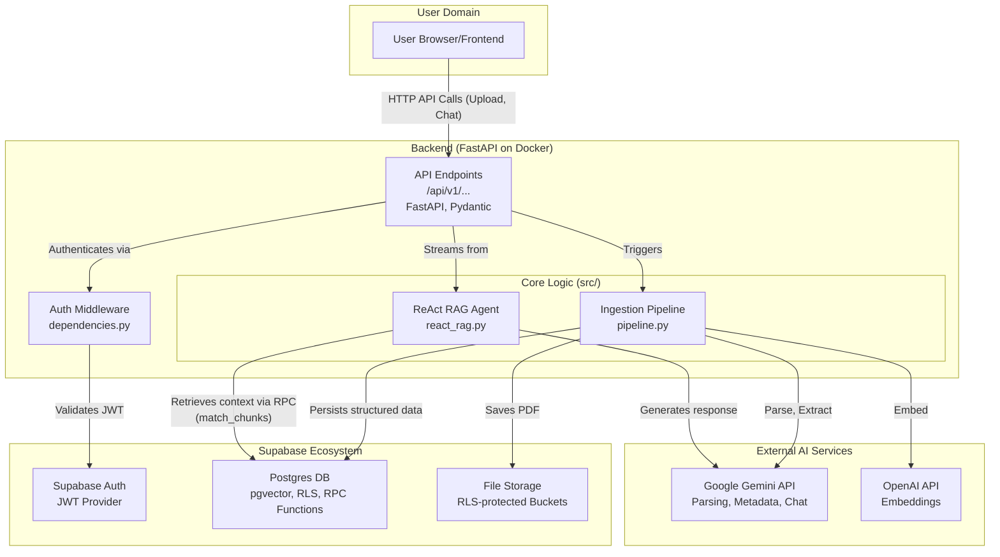
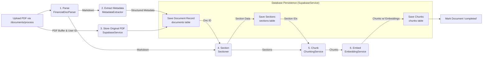
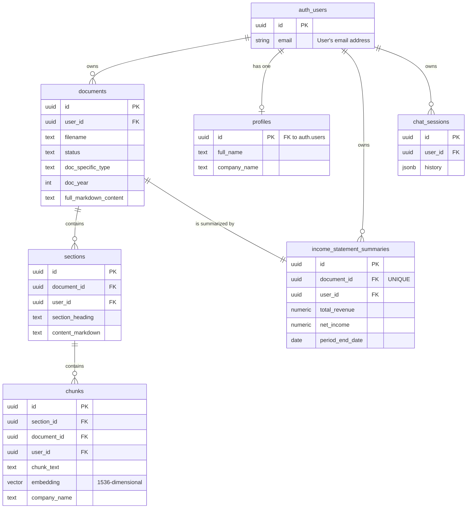

<div align="center">

# StackRAG - Backend

**AI-Powered Financial Document Analysis Platform**

[](https://www.python.org/downloads/)
[](https://fastapi.tiangolo.com/)
[](https://www.docker.com/)
[](LICENSE)

*Transform unstructured financial PDFs into intelligent, queryable insights with AI*

**Frontend Source**: [StackRAG-Frontend](https://github.com/BryanTheLai/StackRAG-Frontend)


[Quick Start](#-quick-start) • [Documentation](#-documentation) • [Architecture](#-system-architecture) • [API Reference](#-api-reference) • [Contributing](#-contributing)

</div>

---

## 🚀 Overview

Stackifier is a **multi-tenant RAG platform** engineered for financial document intelligence. The system combines a sophisticated **ETL ingestion pipeline** with a **ReAct-style conversational agent**, leveraging **multimodal LLMs**, **vector embeddings**, and a comprehensive **prompt library** to transform unstructured PDFs into **queryable knowledge**. Built on **FastAPI** with enterprise-grade **JWT authentication**, **row-level security policies**, and **containerized deployment architecture**.

### 🎯 Prerequisites & Learning Outcomes

**To understand and contribute to this project, developers should be familiar with:**

- **Vector Mathematics & Information Retrieval**: Understanding similarity search algorithms, high-dimensional vector spaces, and semantic embedding techniques for document retrieval systems
- **Advanced Python Patterns**: Object-oriented design principles, dependency injection, async/await patterns, and type-safe development with Pydantic
- **Database Design & Optimization**: Relational schema normalization, PostgreSQL advanced features (RLS, RPC functions), and hybrid relational/document storage with JSONB
- **Prompt Engineering & LLM Integration**: Dynamic prompt templating with Jinja2, structured output generation, and ReAct agent framework implementation
- **Microservices Architecture**: Service decomposition, API design patterns, containerization strategies, and external service integration
- **ETL Pipeline Design**: Data transformation workflows, fault-tolerant processing, and batch operations for unstructured data ingestion

**By working with this codebase, developers will gain hands-on experience with:**
- Production LLM application development using frameworks like `pydantic-ai`
- Multi-modal AI processing for document analysis and structured data extraction  
- Enterprise-grade security patterns including JWT authentication and row-level security
- Real-time streaming APIs and Server-Sent Events for conversational interfaces
- Financial domain modeling and specialized business logic implementation

### ✨ Key Features

- **🔒 Enterprise Security**: Multi-tenant architecture with JWT authentication and row-level security
- **🤖 Intelligent Processing**: Advanced PDF parsing using multimodal LLMs with 95%+ accuracy
- **💬 Conversational AI**: ReAct-style RAG agent with tool use capabilities
- **⚡ High Performance**: Vector similarity search with HNSW indexing and database-level optimizations
- **🐳 Production Ready**: Containerized deployment with health checks and monitoring
- **📊 Financial Intelligence**: Specialized for financial documents with automated metric extraction

## 🏗 System Architecture

Our architecture follows microservices principles with clear separation of concerns, ensuring scalability and maintainability.



## 💡 Core Features

*   **🔐 Secure Multi-Tenancy:** Enterprise-grade user authentication via Supabase JWTs with strict data isolation using Row-Level Security (RLS) policies
*   **🔄 Automated Ingestion Pipeline:** Fault-tolerant, asynchronous processing pipeline that converts PDFs into queryable formats using multimodal LLMs
*   **🧠 Advanced RAG Agent:** Conversational interface powered by ReAct (Reason+Act) methodology with intelligent tool usage:
    *   **🔍 Context Retrieval:** Filtered vector searches against your knowledge base
    *   **🧮 Financial Calculations:** Sandboxed Python execution for modeling and analysis
*   **⚡ High-Performance Database:** Postgres with RPC functions and HNSW-indexed vector search for sub-100ms query responses

## 🔧 How It Works

The system is composed of two primary workflows: Data Ingestion and Conversational RAG.

### 📥 Document Ingestion Pipeline

When a user uploads a PDF, our robust ingestion pipeline processes it through multiple stages for maximum accuracy and structure.



**Processing Stages:**

1.  **🔍 Parse (`FinancialDocParser`):** Converts PDFs to high-fidelity Markdown using multimodal LLM analysis of page images
2.  **📋 Extract Metadata (`MetadataExtractor`):** Structured data extraction using Pydantic schemas for financial metrics
3.  **💾 Store & Persist (`SupabaseService`):** Secure storage with automatic backup and versioning
4.  **📑 Section & Chunk (`Sectioner`, `ChunkingService`):** Intelligent document segmentation optimized for retrieval
5.  **🧮 Embed (`EmbeddingService`):** Vector embedding generation with metadata augmentation
6.  **💽 Save Structures (`SupabaseService`):** Batch persistence with transaction safety

### 🤖 Conversational RAG Agent

Our intelligent agent uses the ReAct framework for dynamic reasoning and tool usage:

1.  **📝 System Prompt Injection:** Dynamic context generation with user profile and temporal awareness
2.  **🔧 Agent Initialization:** Tool-equipped agent using `pydantic-ai` framework
3.  **🧠 Reason → Act Cycle:**
    *   **💭 Reason:** LLM analyzes queries and determines required actions
    *   **⚡ Act:** Automated tool execution with safety sandboxing
        *   **`retrieve_chunks`:** High-speed vector similarity search with metadata filtering
        *   **`execute_python_calculations`:** Secure Python execution for financial modeling
4.  **📡 Response Generation:** Contextual response streaming with real-time updates

## 🗄️ Database Schema

Normalized schema design with Row-Level Security (RLS) ensuring data isolation and query performance.



## 🚀 Quick Start

### Prerequisites

- **Python 3.12+** - Latest stable Python version
- **Docker & Docker Compose** - For containerized deployment
- **Supabase Project** - Backend-as-a-Service setup
- **API Keys** - Google Gemini and OpenAI credentials

### 🐳 Docker Setup (Recommended)

1. **Clone and Configure**
   ```bash
   git clone https://github.com/BryanTheLai/AI-CFO-FYP.git
   cd AI-CFO-FYP
   cp .env.example .env
   ```

2. **Environment Variables**
   ```bash
   # Supabase Configuration
   SUPABASE_URL="https://<your-project-ref>.supabase.co"
   SUPABASE_ANON_KEY="your-anon-key"

   # AI Service APIs
   GEMINI_API_KEY="your-gemini-api-key"
   OPENAI_API_KEY="your-openai-api-key"
   ```

3. **Database Setup**
   
   Execute the following SQL scripts in your Supabase SQL Editor (in order):
   ```sql
   -- Run these in sequence
   scripts/database_setup.sql
   scripts/profile_table.sql
   scripts/storage_setup.sql
   scripts/income_statement_summaries.sql
   scripts/match_chunks_function.sql
   scripts/chat_session.sql
   ```

4. **Launch Services**
   ```bash
   docker-compose up --build
   ```

5. **Verify Installation**
   ```bash
   curl http://localhost:8000/health
   # Expected: {"status": "healthy"}
   ```

### 🌐 API Access

- **API Documentation**: http://localhost:8000/docs
- **Health Check**: http://localhost:8000/health
- **Base URL**: http://localhost:8000/api/v1

## 📚 Documentation

### 📖 Additional Resources

- **[Docker Deployment Guide](DOCKER_GUIDE.md)** - Production deployment instructions
<!-- - **[API Documentation](http://localhost:8000/docs)** - Interactive OpenAPI documentation
- **[Architecture Deep Dive](docs/)** - Detailed technical documentation -->

### 🔗 Integration Guide

#### Frontend Integration

The platform is designed for seamless frontend integration:

```javascript
// Authentication with Supabase
const { data: { session } } = await supabase.auth.getSession()

// Document upload
const formData = new FormData()
formData.append('file', pdfFile)

const response = await fetch('/api/v1/documents/process', {
  method: 'POST',
  headers: {
    'Authorization': `Bearer ${session.access_token}`
  },
  body: formData
})

// Real-time chat streaming
const eventSource = new EventSource('/api/v1/chat/stream', {
  headers: { 'Authorization': `Bearer ${session.access_token}` }
})
```

## 🔌 API Reference

All endpoints require JWT authentication via `Authorization: Bearer <token>` header (except health check).

| Method | Endpoint | Description | Auth Required |
|--------|----------|-------------|---------------|
| `GET` | `/health` | Service health verification | ❌ |
| `POST` | `/api/v1/documents/process` | Upload and process PDF documents | ✅ |
| `GET` | `/api/v1/documents` | List user's processed documents | ✅ |
| `POST` | `/api/v1/chat/stream` | Start conversational RAG session (SSE) | ✅ |

### Request Examples

```bash
# Health check
curl http://localhost:8000/health

# Upload document
curl -X POST "http://localhost:8000/api/v1/documents/process" \
  -H "Authorization: Bearer YOUR_JWT_TOKEN" \
  -F "file=@financial_report.pdf"

# Start chat session
curl -X POST "http://localhost:8000/api/v1/chat/stream" \
  -H "Authorization: Bearer YOUR_JWT_TOKEN" \
  -H "Content-Type: application/json" \
  -d '{"messages": [{"role": "user", "content": "What was the revenue growth?"}]}'
```

## 📁 Project Structure

```
stackifier/
├── 🚀 api/                     # FastAPI application layer
│   └── v1/
│       ├── dependencies.py     # Authentication & session management
│       └── endpoints/          # API route handlers
├── 📜 scripts/                 # Database setup & migration scripts
├── 🧠 src/                     # Core business logic
│   ├── config/                 # Service configurations
│   ├── enums.py               # Type definitions & constants
│   ├── llm/                   # AI/ML components
│   │   ├── tools/             # RAG agent tools
│   │   └── workflow/          # Agent orchestration
│   ├── models/                # Pydantic data models
│   ├── prompts/               # LLM prompt templates
│   ├── services/              # Business logic services
│   ├── storage/               # Data persistence layer
│   └── pipeline.py            # Main ingestion orchestrator
├── 🐳 Dockerfile              # Development container
├── 🐳 Dockerfile.prod         # Production container
├── 🔧 docker-compose.yml      # Local development setup
├── 📋 requirements.txt        # Python dependencies
└── 📖 README.md              # You are here!
```

## 🤝 Contributing

We welcome contributions! Here's how to get started:

### 🔧 Development Setup

1. **Fork & Clone**
   ```bash
   git clone https://github.com/your-username/AI-CFO-FYP.git
   cd AI-CFO-FYP
   ```

2. **Create Virtual Environment**
   ```bash
   python -m venv venv
   source venv/bin/activate  # Windows: venv\Scripts\activate
   pip install -r requirements.txt
   ```

3. **Set Up Pre-commit Hooks**
   ```bash
   pip install pre-commit
   pre-commit install
   ```

### 📝 Contribution Guidelines

- **Code Style**: Follow PEP 8 and use type hints
- **Testing**: Add tests for new features
- **Documentation**: Update docs for API changes
- **Commits**: Use conventional commit messages

### 🐛 Reporting Issues

Found a bug? Please open an issue with:
- Clear description of the problem
- Steps to reproduce
- Expected vs actual behavior
- Environment details


### Health Monitoring
```bash
# Service health
curl http://localhost:8000/health

# Container health (if using Docker)
docker-compose ps
```

## 🔒 Security

- **Authentication**: JWT-based with Supabase Auth
- **Authorization**: Row-Level Security (RLS) policies
- **Data Isolation**: Complete tenant separation
- **API Security**: Rate limiting and input validation
- **Container Security**: Non-root user execution

## 📄 License

This project is licensed under the MIT License - see the [LICENSE](LICENSE) file for details.

## 🙏 Acknowledgments

- [FastAPI](https://fastapi.tiangolo.com/) - Modern Python web framework
- [Supabase](https://supabase.com/) - Open source Firebase alternative
- [OpenAI](https://openai.com/) - Embedding models
- [Google AI](https://ai.google/) - Multimodal language models
- [pgvector](https://github.com/pgvector/pgvector) - Vector similarity search

---

<div align="center">

**[⭐ Star this repo](https://github.com/BryanTheLai/AI-CFO-FYP)** if you find it helpful!

Made with ❤️ by the Stackifier team

</div>
