# AI CFO Assistant: Technical Reference Guide

**Version:** 1.3

## Table of Contents

*   [Chapter 1: Introduction](#chapter-1-introduction)
    *   [1.1 Project Overview](#11-project-overview)
    *   [1.2 The Problem: Financial Insight Bottleneck](#12-the-problem-financial-insight-bottleneck)
    *   [1.3 The Solution: AI CFO Assistant](#13-the-solution-ai-cfo-assistant)
    *   [1.4 Core Design Goal: Reliability](#14-core-design-goal-reliability)
    *   [1.5 Key Objectives](#15-key-objectives)
    *   [1.6 Scope](#16-scope)
    *   [1.7 Technology Overview](#17-technology-overview)
    *   [1.8 Document Purpose](#18-document-purpose)
*   [Chapter 2: System Architecture](#chapter-2-system-architecture)
    *   [2.1 Architecture Design](#21-architecture-design)
    *   [2.2 Ingestion Pipeline Diagram (Conceptual)](#22-ingestion-pipeline-diagram-conceptual)
    *   [2.3 Component Roles](#23-component-roles)
    *   [2.4 Data Flow (Ingestion)](#24-data-flow-ingestion)
*   [Chapter 3: Data Ingestion Pipeline](#chapter-3-data-ingestion-pipeline)
    *   [3.1 Input: Financial PDFs & User Context](#31-input-financial-pdfs--user-context)
    *   [3.2 Parsing with Multimodal AI (`FinancialDocParser`)](#32-parsing-with-multimodal-ai-financialdocparser)
    *   [3.3 Metadata Extraction (`MetadataExtractor`)](#33-metadata-extraction-metadataextractor)
    *   [3.4 Sectioning (`Sectioner`)](#34-sectioning-sectioner)
    *   [3.5 Analogous Structure: Financial Document "AST"](#35-analogous-structure-financial-document-ast)
*   [Chapter 4: Embedding & Storage (Supabase)](#chapter-4-embedding--storage-supabase)
    *   [4.1 Chunking (`ChunkingService`)](#41-chunking-chunkingservice)
    *   [4.2 Embedding Strategy (`EmbeddingService`)](#42-embedding-strategy-embeddingservice)
    *   [4.3 Supabase Backend](#43-supabase-backend)
    *   [4.4 Database Structure](#44-database-structure)
    *   [4.5 Storage Structure & Security](#45-storage-structure--security)
    *   [4.6 Persistence (`SupabaseService`)](#46-persistence-supabaseservice)
*   [Chapter 5: Retrieval Process (Partially Implemented / Future Work)](#chapter-5-retrieval-process-partially-implemented--future-work)
    *   [5.1 How Retrieval Works (Current Implementation & Vision)](#51-how-retrieval-works-current-implementation--vision)
    *   [5.2 Goal: Context Provider, Not Just RAG](#52-goal-context-provider-not-just-rag)
    *   [5.3 Handling Complex Queries (Future)](#53-handling-complex-queries-future)
    *   [5.4 Identifying Key Details & Filters (Partially Implemented)](#54-identifying-key-details--filters-partially-implemented)
    *   [5.5 Filtering by Details (Inc. User ID - Implemented)](#55-filtering-by-details-inc-user-id---implemented)
    *   [5.6 Finding Relevant Text (Vector Search + Metadata Filters Implemented)](#56-finding-relevant-text-vector-search--metadata-filters-implemented)
    *   [5.7 Refining Results (Re-ranking - Future)](#57-refining-results-re-ranking---future)
    *   [5.8 Final Selection (Implemented via `match_count`)](#58-final-selection-implemented-via-match_count)
*   [Chapter 6: Answer Generation & Tools (Partially Implemented / Future Work)](#chapter-6-answer-generation--tools-partially-implemented--future-work)
    *   [6.1 Choosing the AI Model (Implemented)](#61-choosing-the-ai-model-implemented)
    *   [6.2 Preparing Context (Implemented)](#62-preparing-context-implemented)
    *   [6.3 Guiding the AI (Prompting - Implemented)](#63-guiding-the-ai-prompting---implemented)
    *   [6.4 Using Calculation Tools (Future Work)](#64-using-calculation-tools-future-work)
    *   [6.5 Managing Tool Use (Retrieval Tool Implemented)](#65-managing-tool-use-retrieval-tool-implemented)
*   [Chapter 7: Final Output & Sources (Partially Implemented / Future Work)](#chapter-7-final-output--sources-partially-implemented--future-work)
    *   [7.1 Cleaning the Answer (Future)](#71-cleaning-the-answer-future)
    *   [7.2 Basic Checks (Future)](#72-basic-checks-future)
    *   [7.3 Showing Sources (Prompting Implemented)](#73-showing-sources-prompting-implemented)
*   [Chapter 8: Evaluation (Future Work)](#chapter-8-evaluation-future-work)
    *   [8.1 Why Evaluate?](#81-why-evaluate)
    *   [8.2 The Need for Rigorous, Quantitative Evals](#82-the-need-for-rigorous-quantitative-evals)
    *   [8.3 Test Data](#83-test-data)
    *   [8.4 Creating Test Cases](#84-creating-test-cases)
    *   [8.5 Measuring Performance - Overview](#85-measuring-performance---overview)
    *   [8.6 RAG Evaluation: Key Tips & Metrics](#86-rag-evaluation-key-tips--metrics)
    *   [8.7 Automation](#87-automation)
    *   [8.8 Improving with Evaluation](#88-improving-with-evaluation)
*   [Chapter 9: Building the System (Current State)](#chapter-9-building-the-system-current-state)
    *   [9.1 Technology Summary](#91-technology-summary)
    *   [9.2 Key Libraries Used](#92-key-libraries-used)
    *   [9.3 Setup](#93-setup)
    *   [9.4 Configuration](#94-configuration)
    *   [9.5 Code Structure](#95-code-structure)
    *   [9.6 Version Control](#96-version-control)
    *   [9.7 Development Philosophy: Agility and Iteration](#97-development-philosophy-agility-and-iteration)
*   [Chapter 10: Monitoring & Logs (Future Work)](#chapter-10-monitoring--logs-future-work)
    *   [10.1 Why Log?](#101-why-log)
    *   [10.2 Log Details](#102-log-details)
    *   [10.3 How Logging Works](#103-how-logging-works)
    *   [10.4 Using Logs](#104-using-logs)
*   [Chapter 11: Running the System](#chapter-11-running-the-system)
    *   [11.1 Testing Setup (Notebooks)](#111-testing-setup-notebooks)
    *   [11.2 Production Ideas](#112-production-ideas)
    *   [11.3 Handling More Users](#113-handling-more-users)
    *   [11.4 Managing Costs](#114-managing-costs)
    *   [11.5 User Experience: Streaming Responses (Partially Implemented)](#115-user-experience-streaming-responses-partially-implemented)
*   [Chapter 12: Next Steps](#chapter-12-next-steps)
    *   [12.1 Immediate Next Steps](#121-immediate-next-steps)
    *   [12.2 Future Enhancements](#122-future-enhancements)
*   [Chapter 13: Strategic Considerations and Future Vision](#chapter-13-strategic-considerations-and-future-vision)
    *   [13.1 Market Validation: The Office of the CFO Needs](#131-market-validation-the-office-of-the-cfo-needs)
    *   [13.2 The "Bitter Lesson": Vertical vs. Horizontal AI Applications](#132-the-bitter-lesson-vertical-vs-horizontal-ai-applications)
    *   [13.3 Implications of Opaque AI Reasoning](#133-implications-of-opaque-ai-reasoning)
    *   [13.4 Impact of Future Models](#134-impact-of-future-models)
    *   [13.5 Defending Against General Agents](#135-defending-against-general-agents)
    *   [13.6 Evolution: Becoming Infrastructure](#136-evolution-becoming-infrastructure)
*   [Appendix](#appendix)
    *   [A. Example AI Prompts](#a-example-ai-prompts)
    *   [B. Database Setup SQL (`database_setup.sql`)](#b-database-setup-sql-database_setupsql)
    *   [C. Storage Setup SQL (`storage_setup.sql`)](#c-storage-setup-sql-storage_setupsql)
    *   [D. Key Terms](#d-key-terms)

---

## Chapter 1: Introduction

### 1.1 Project Overview

This guide details the **AI CFO Assistant** ingestion pipeline and discusses the strategic considerations for the full system. This system enables Small and Medium Businesses (SMEs) to securely upload their financial documents and receive reliable, context-aware answers to questions about their finances. It leverages Retrieval-Augmented Generation (RAG), AI Tool Use (Function Calling), and a robust backend built on Supabase.

### 1.2 The Problem: Financial Insight Bottleneck

SMEs often struggle to extract timely insights from complex PDF financial reports. Data is siloed, difficult to search, and requires expertise to interpret, hindering informed decision-making.

### 1.3 The Solution: AI CFO Assistant

The assistant provides a secure, intelligent interface to financial documents. Users upload reports; the system processes them; users ask questions in natural language. The system retrieves relevant information *only from the user's documents*, performs necessary calculations using validated tools, generates a factual answer, and cites the specific sources used.

### 1.4 Core Design Goal: Reliability

Accuracy and trustworthiness are paramount for financial data. The system prioritizes **Reliability** by:

1.  **Grounded Answers:** Answers are derived solely from the user-provided documents.
2.  **Accurate Calculations:** Math is performed by reliable, deterministic Python tools, not the LLM.
3.  **Verifiable Sources:** Answers include citations linking back to specific document sections.
4.  **Data Privacy:** User data is strictly isolated via multi-tenancy controls.

### 1.5 Key Objectives

*   Accurately parse and extract data from complex financial PDFs.
*   Implement an effective context retrieval pipeline for information retrieval.
*   Integrate reliable calculation tools via LLM Function Calling.
*   Ensure AI answers are grounded in provided context and avoid hallucination.
*   Establish an automated evaluation framework for reliability metrics.
*   Build a functional Proof-of-Concept.
*   **Implement secure multi-tenancy using user accounts and data isolation.**
*   **Design for flexibility to adapt to rapid AI advancements.**

### 1.6 Scope

**In Scope (Ingestion Pipeline - Completed):**

*   Handling PDF financial reports.
*   AI-driven text, layout, and metadata extraction (`FinancialDocParser`, `MetadataExtractor`).
*   Structuring content as Markdown.
*   Storing full extracted Markdown (`documents.full_markdown_content`).
*   Segmenting Markdown into logical sections (`Sectioner`).
*   Chunking section content (`ChunkingService` with `chonkie`).
*   Generating context-aware embeddings (`EmbeddingService` with OpenAI).
*   Securely storing original files, metadata, sections, chunks, and embeddings in Supabase (`SupabaseService`).
*   Enforcing multi-tenancy via Supabase Auth (`user_id`) and RLS.

**In Scope (Query/API - Partially Implemented / Future Work):**

*   Context retrieval logic (filtering, vector search - Implemented; keyword search, re-ranking - Future).
*   Answer generation LLM integration (Implemented via `GeminiClient` chat, context formatting, and citation prompting).
*   Tool use for retrieval (Implemented for `retrieve_financial_chunks` tool).
*   Calculation tool implementation (Future Work).
*   API layer (e.g., FastAPI) for user interaction (upload, query) (Future Work).
*   User authentication handling in the API (Future Work).
*   Automated evaluation framework (Future Work).
*   System logging (to Supabase) (Future Work).
*   **Streaming responses for improved user experience (LLM client supports streaming; API layer integration - Future).**

**Out of Scope (Initial):**

*   Non-financial documents, non-PDF formats (DOCX, XLSX), heavily scanned PDFs.
*   Direct integration with accounting software.
*   Financial advice or forecasting.
*   Advanced visualization.
*   Highly polished UI/UX.

### 1.7 Technology Overview

*   **Language:** Python 3.x
*   **AI Models:**
    *   Google Gemini API (`google-genai`):
        *   `gemini-2.0-flash-lite`: For multimodal parsing and structured metadata extraction.
        *   `gemini-2.0-flash` (default): For chat-based answer generation.
    *   OpenAI API (`openai`):
        *   `text-embedding-3-small`: For text embeddings.
*   **Backend:** **Supabase**
    *   Database: PostgreSQL with `pgvector` extension.
    *   Authentication: Supabase Auth.
    *   File Storage: Supabase Storage.
*   **PDF Parsing:** `pymupdf` (Fitz)
*   **Chunking:** `chonkie` (`RecursiveChunker`)
*   **Data Validation:** `pydantic`
*   **Configuration:** `.env` files (`python-dotenv`)
*   **Key Python Libraries:** `supabase-py`, `google-genai`, `openai`, `pymupdf`, `chonkie`, `pydantic`.
*   **Web Framework (Future):** FastAPI

### 1.8 Document Purpose

This technical reference guide documents the design, implementation, and rationale for the AI CFO Assistant's ingestion pipeline and query/answer components. It outlines the strategic considerations for its future development in the context of the rapidly evolving AI landscape. It serves as a guide for developers and stakeholders involved in the project.

---

## Chapter 2: System Architecture

### 2.1 Architecture Design

The system utilizes a modular, service-oriented architecture centered around a pipeline for ingesting financial documents and a (partially implemented) pipeline for querying them. Supabase provides the core backend infrastructure (DB, Auth, Storage), enabling secure multi-tenancy through user identification (`user_id`) and Row-Level Security (RLS). The ingestion pipeline focuses on preparing data for the query process, ensuring structural understanding and context are preserved.

### 2.2 Ingestion Pipeline Diagram (Conceptual)

```mermaid
graph LR
    User_Upload[User_Upload_PDF_Context] --> Parser[FinancialDocParser];
    Parser -- Markdown --> Meta_Extract[Metadata_Extractor];
    Parser -- Markdown --> Sectioner_Service[Sectioner];

    User_Upload -- UserID_PDF_Buffer_Filename --> SB_Save_Doc[Supabase_Doc_File_Save];
    Meta_Extract -- Extracted_Doc_Metadata --> SB_Save_Doc;
    Parser -- Full_Markdown_Content --> SB_Save_Doc;
    SB_Save_Doc -- Doc_ID_Storage_Path --> DB_Docs[DB_documents_table];
    SB_Save_Doc -- Original_PDF_File --> Storage_Files[Supabase_Storage_PDF];

    DB_Docs -- Doc_ID --> Sectioner_Service;
    User_Upload -- UserID --> Sectioner_Service;
    Sectioner_Service -- Sections_Data --> SB_Save_Sec[Supabase_Sections_Save];
    SB_Save_Sec -- Section_IDs --> DB_Secs[DB_sections_table];
    
    DB_Secs -- Enriched_Sections_Data_with_IDs --> Chunker_Service[ChunkingService];
    Meta_Extract -- Extracted_Doc_Metadata --> Chunker_Service;
    DB_Docs -- Doc_ID --> Chunker_Service;
    User_Upload -- UserID --> Chunker_Service;
    Chunker_Service -- Chunks_Data --> Embed_Service[EmbeddingService];

    Embed_Service -- Chunks_with_Embeddings --> SB_Save_Chunks[Supabase_Chunks_Save];
    SB_Save_Chunks -- Success_Status --> DB_Chunks[DB_chunks_table];

    DB_Docs -- Doc_ID --> SB_Update_Status[Supabase_Doc_Status_Update];
    SB_Save_Chunks -- Ingestion_Outcome --> SB_Update_Status;
```



*Note: The diagram shows the flow. The `IngestionPipeline` class orchestrates these calls.*

### 2.3 Component Roles

*   **Ingestion Pipeline Orchestrator (`pipeline.py`):** Manages the overall sequence of ingestion steps.
*   **AI Clients (`llm/`):** Interface with Gemini (`GeminiClient`) and OpenAI (`OpenAIClient`) APIs.
*   **`FinancialDocParser`:** Converts PDF to structured Markdown using multimodal AI (`gemini-2.0-flash-lite`).
*   **`MetadataExtractor`:** Extracts document-level metadata (type, company, dates, summary) from Markdown snippet using text LLM (`gemini-2.0-flash-lite`) and Pydantic schema.
*   **`Sectioner`:** Splits full Markdown into logical sections based on headings and page markers.
*   **`ChunkingService`:** Breaks section Markdown into smaller chunks using `chonkie` and copies metadata.
*   **`EmbeddingService`:** Generates vector embeddings for chunks using context-augmented text and OpenAI's `text-embedding-3-small` model.
*   **`SupabaseService`:** Handles all interactions with Supabase (DB inserts/updates, Storage uploads), ensuring `user_id` is applied correctly for RLS.
*   **Helper Utilities (`helper/`):** Contains utility functions like `llm_helper_chat.py` for formatting LLM inputs/outputs.
*   **LLM Tools (`llm/tools/`):** Contains definitions for tools that the LLM can call, e.g., `ChunkRetriever.py`.
*   **Supabase Auth:** Manages user accounts and authentication, providing the crucial `user_id`.
*   **Supabase Storage:** Stores original PDF files securely, segregated by `user_id`.
*   **Supabase PostgreSQL:** The core database for storing all structured data.
    *   **`pgvector` Extension:** Enables efficient storage and similarity searching of vector embeddings.

### 2.4 Data Flow (Ingestion)

1.  **Input:** `IngestionPipeline.run` receives PDF buffer, `user_id`, filename, `doc_type`.
2.  **`IngestionPipeline.run` initiated.**
3.  **Parse (`FinancialDocParser`):** Produces `combined_markdown` string and `page_count`.
4.  **Extract Metadata (`MetadataExtractor`):** Produces `FinancialDocumentMetadata` object from a snippet of `combined_markdown`.
5.  **Upload (`SupabaseService`):** PDF buffer uploaded to Storage path (`{user_id}/{temp_doc_id_for_path}/{filename}`). Returns `storage_path`.
6.  **Save Document (`SupabaseService`):** Metadata, IDs, paths, `combined_markdown` -> Insert into `documents`. Returns final `document_id`.
7.  **Section (`Sectioner`):** `combined_markdown`, `document_id`, `user_id` -> `List[SectionData]`.
8.  **Save Sections (`SupabaseService`):** `List[SectionData]` -> Bulk insert into `sections`. Returns `List[section_id]`.
9.  **Add Section IDs:** Pipeline adds generated `section_id`s to `sections_data`.
10. **Chunk (`ChunkingService`):** `List[SectionData]` (with IDs), `document_metadata`, IDs -> `List[ChunkData]`.
11. **Embed (`EmbeddingService`):** `List[ChunkData]` -> Adds `embedding` vector to `List[ChunkData]`.
12. **Save Chunks (`SupabaseService`):** `List[ChunkData]` (with embeddings) -> Bulk insert into `chunks`.
13. **Update Status (`SupabaseService`):** `document_id`, 'completed' (or 'failed'/'completed_no_chunks') -> Update `documents`.
14. **Output:** `PipelineResult` dictionary returned.

---

## Chapter 3: Data Ingestion Pipeline

*(This chapter details the first few stages covered by the implemented services)*

### 3.1 Input: Financial PDFs & User Context

The pipeline starts when an authenticated user uploads a financial document (PDF). The `IngestionPipeline.run` method receives the file content as an in-memory buffer, the original filename, the file type (`doc_type`), and crucially, the unique identifier (`user_id`) of the authenticated user from Supabase Auth.

### 3.2 Parsing with Multimodal AI (`FinancialDocParser`)

*   **Purpose:** Accurately convert the visual PDF content into structured Markdown.
*   **Implementation:** The `FinancialDocParser` service uses `pymupdf` to render each page as a PNG image. These images are processed concurrently by sending them to a multimodal AI model (Gemini `gemini-2.0-flash-lite` via `GeminiClient.generate_content`) with a specific prompt (`PDF_ANNOTATION_PROMPT` from `prompts/templates/pdf_annotation.j2`) requesting accurate Markdown conversion, including tables and formatting. Basic retry logic for API errors is included.
*   **Output:** A single `combined_markdown` string containing all page content, interleaved with custom page separators (`--- Page X Start ---`, `--- Page X End ---`). This full string is stored in the `documents.full_markdown_content` column.

### 3.3 Metadata Extraction (`MetadataExtractor`)

*   **Purpose:** Extract key document-level details required for filtering and context.
*   **Implementation:** The `MetadataExtractor` service takes the initial portion (e.g., first 16k characters) of the `combined_markdown`. It sends this snippet to a text-based LLM (Gemini `gemini-2.0-flash-lite` via `GeminiClient.generate_content`) using a prompt (`METADATA_EXTRACTION_PROMPT` from `prompts/templates/metadata_extraction.j2`) designed for structured extraction. Crucially, it leverages Gemini's capability to return JSON conforming to a predefined Pydantic schema (`FinancialDocumentMetadata`), ensuring type safety and handling of missing values with placeholders (`-1`, `""`, `"1900-01-01"`).
*   **Output:** A `FinancialDocumentMetadata` object.

### 3.4 Sectioning (`Sectioner`)

*   **Purpose:** Segment the full `combined_markdown` into logical sections based on document structure.
*   **Implementation:** The `Sectioner` service uses custom Python logic with regular expressions to identify Markdown headings (`#`, `##`, etc.) as section boundaries. It collects the text content between headings and uses the page separators (`--- Page X Start ---`) to determine the `page_numbers` array associated with each section. It also assigns a sequential `section_index`.
*   **Output:** A list of `SectionData` dictionaries, ready to be saved to the `sections` table. Each dictionary contains `document_id`, `user_id`, `section_heading`, `page_numbers`, `content_markdown` (for that specific section), and `section_index`.

### 3.5 Analogous Structure: Financial Document "AST"

Just as Abstract Syntax Trees (ASTs) capture the structural essence of code, the parsing, metadata extraction, and sectioning stages aim to create an analogous structural representation of financial documents. By converting the visual PDF into structured Markdown, identifying logical sections, and extracting key metadata, we are building a representation that allows the system to understand the document's hierarchy and components beyond just raw text. This structured view (like headings, tables, or metadata) is crucial for accurate filtering and providing the LLM with context rooted in the document's original organization.

---

## Chapter 4: Embedding & Storage (Supabase)

*(This chapter details the latter stages of ingestion covered by the implemented services)*

### 4.1 Chunking (`ChunkingService`)

*   **Purpose:** Further divide section content into smaller, fixed-size chunks suitable for embedding, while retaining context.
*   **Implementation:** The `ChunkingService` iterates through the `SectionData` list (now enriched with their database `id`s after being saved by `SupabaseService`). For each section's `content_markdown`, it uses `chonkie.RecursiveChunker` configured with the "markdown" recipe and a specific `chunk_size` (e.g., 2048 tokens). For every chunk generated by `chonkie`, it creates a `ChunkData` dictionary, copying key metadata (like `doc_specific_type`, `doc_year`, `company_name`, `section_heading`) from the document/section level into dedicated fields within the chunk data structure. Positional information (`chunk_index`, `start/end_char_index`) is also included.
*   **Output:** A flat list (`List[ChunkData]`) of all chunks from all sections.

### 4.2 Embedding Strategy (`EmbeddingService`)

*   **Purpose:** Generate meaningful vector representations (embeddings) for each chunk.
*   **Implementation:** The `EmbeddingService` takes the `List[ChunkData]`. For each chunk, it constructs an "augmented text" string by pre-pending key copied metadata (e.g., "Document Type: Invoice. Year: 2024...") to the `chunk_text`. This list of augmented strings is sent to the embedding model API (OpenAI `text-embedding-3-small` via `OpenAIClient`). The resulting embedding vectors are added back to the corresponding `ChunkData` dictionaries under the `embedding` key, along with the `embedding_model` name.
*   **Output:** The `List[ChunkData]`, now enriched with embedding vectors.

### 4.3 Supabase Backend

Supabase provides the integrated backend infrastructure:

*   **Supabase Auth:** Handles user sign-up, login, and provides the unique `user_id` (UUID) necessary for multi-tenancy.
*   **Supabase Storage:** Stores the original uploaded PDF files privately. Access is controlled via RLS policies based on user ID prefixes in the file path. Bucket name: `financial-pdfs`.
*   **Supabase PostgreSQL:** The core database for storing all structured data.
    *   **`pgvector` Extension:** Enables efficient storage and similarity searching of vector embeddings.

### 4.4 Database Structure

The PostgreSQL database schema is defined in `scripts/database_setup.sql` (see Appendix B) and includes:

*   **`documents` table:** Stores document metadata, `user_id`, storage path, status, and the `full_markdown_content`. Indexed for filtering. RLS enabled.
*   **`sections` table:** Stores logical sections, their specific `content_markdown`, page numbers, index, and links (`document_id`, `user_id`). Indexed. RLS enabled.
*   **`chunks` table:** Stores the final text chunks, their vector `embedding` (`vector(1536)` type), copied metadata for filtering, and links (`section_id`, `document_id`, `user_id`). Indexed, including HNSW index on `embedding`. RLS enabled.

### 4.5 Storage Structure & Security

*   **Bucket:** A private bucket `financial-pdfs` is used.
*   **Path Structure:** Files are uploaded to `{user_id}/{document_id}/{filename}` as implemented in `SupabaseService`.
*   **RLS Policies:** Defined in `scripts/storage_setup.sql` (see Appendix C), these policies on `storage.objects` ensure users can only `SELECT`, `INSERT`, `UPDATE`, or `DELETE` files where the *first segment* of the path matches their own `auth.uid()`.

### 4.6 Persistence (`SupabaseService`)

*   **Purpose:** Abstract all direct interactions with Supabase Storage and Database.
*   **Implementation:** The `SupabaseService` class uses the `supabase-py` client library. It assumes an authenticated client context is available or initializes its own client.
    *   `upload_pdf_to_storage`: Uploads PDF bytes to the correct user-specific path.
    *   `save_document_record`: Inserts data into the `documents` table.
    *   `save_sections_batch`: Bulk inserts into the `sections` table.
    *   `save_chunks_batch`: Bulk inserts into the `chunks` table (including vectors).
    *   `update_document_status`: Updates the `documents.status` field.
*   **RLS Compliance:** Correctly includes the `user_id` in database operations, relying on the authenticated client session for Supabase to enforce RLS policies.

---

## Chapter 5: Retrieval Process (Partially Implemented / Future Work)

*(This chapter outlines current and planned functionality for querying ingested data)*

### 5.1 How Retrieval Works (Current Implementation & Vision)

**Current Implementation:**
The system uses a `RetrievalService` (defined in `llm/tools/ChunkRetriever.py`) to find relevant document chunks. This service is designed to be used as an LLM "Tool" (via function calling).
The process is:
1.  The `RetrievalService.retrieve_chunks` method receives the user's `query_text` and the authenticated `user_id`.
2.  The `query_text` is embedded using `OpenAIClient` (model `text-embedding-3-small`).
3.  The `SupabaseService` is used to call a PostgreSQL RPC function named `match_chunks` (defined in `scripts/match_chunks_function.sql`).
4.  The `match_chunks` function performs:
    *   **Mandatory filtering by `user_id`** to ensure data isolation.
    *   Optional filtering based on provided metadata: `doc_specific_type`, `company_name`, `doc_year_start`, `doc_year_end`, `doc_quarter`.
    *   Vector similarity search (cosine distance `<=>`) between the query embedding and chunk embeddings within the filtered set.
    *   Returns a list of matching chunks, including their text, metadata, and the original document filename.

**Vision:**
The overall goal is to understand the query, filter data effectively, search for semantic similarity, and refine results to provide the most relevant context to the LLM.

### 5.2 Goal: Context Provider, Not Just RAG

The objective of the retrieval process is to act as an effective **context provider** for the Language Model, not strictly to implement a traditional embedding-based RAG pipeline. While embeddings and vector search are valuable tools (and currently implemented), the focus is on providing the LLM with the most relevant and necessary information from the user's documents, regardless of the specific method used to find it. This might involve combining multiple techniques.

### 5.3 Handling Complex Queries (Future)

A planned step involves using an LLM to decompose complex questions into simpler sub-queries for sequential processing, potentially making multiple calls to the `retrieve_financial_chunks` tool or other future tools.

### 5.4 Identifying Key Details & Filters (Partially Implemented)

**Current:** The `retrieve_financial_chunks` tool (and the underlying `match_chunks` SQL function) directly accepts parameters for `doc_specific_type`, `company_name`, `doc_year_start`, `doc_year_end`, and `doc_quarter`.
**Future:** An LLM will be responsible for parsing these details from the user's natural language query and populating the arguments for the `retrieve_financial_chunks` tool call.

### 5.5 Filtering by Details (Inc. User ID - Implemented)

The **first and most critical filter** applied by the `match_chunks` SQL function is `WHERE c.user_id = match_chunks.user_id`. Additional metadata filters based on the parameters passed to the function further narrow the search space within the user's data. This is fully implemented.

### 5.6 Finding Relevant Text (Vector Search + Metadata Filters Implemented)

The current implementation in `match_chunks_function.sql` uses:
*   **Vector Search:** Using the `pgvector` extension (`<=>` operator) to find chunks semantically similar to the query embedding *within the filtered set*.
*   **Metadata Filtering:** As described above, to pre-filter chunks before vector search.

**Future Work:**
*   **Keyword Search:** Leveraging database full-text search capabilities to find exact terms or phrases.
*   **Structure-Aware Navigation:** Potentially understanding relationships between document sections.

### 5.7 Refining Results (Re-ranking - Future)

The initial chunks/sections retrieved will likely be re-ranked in the future using a more computationally intensive cross-encoder model or domain-specific logic to improve the relevance ordering before passing to the answer generation stage.

### 5.8 Final Selection (Implemented via `match_count`)

The `match_chunks` function and the `retrieve_financial_chunks` tool accept a `match_count` parameter (defaulting to 5), which determines the maximum number of top-ranked, relevant chunks to return. This forms the context for the Answer Generation LLM.

---

# Chapter 6: Answer Generation & Tools (Partially Implemented / Future Work)

This is where the final answer is created, using the retrieved information and potentially external tools for calculations.

## 6.1 Choosing the AI Model (Implemented)

We use a powerful AI model (Google Gemini via `GeminiClient`) for generating answers.
*   The default chat model in `GeminiClient.create_chat` is `gemini-2.0-flash`.
*   **Why this model?** It can handle a good amount of text, understands instructions well, and supports tool use (function calling).

## 6.2 Preparing Context (Implemented)

We build the input for the AI by combining:
*   The user's original question.
*   Detailed instructions for the AI (see next section).
*   Descriptions of the available tools (currently, `retrieve_financial_chunks`).
*   The full text and metadata of the top document sections/chunks found during retrieval. This is handled by `helper/llm_helper_chat.py::format_chunks_for_llm`, which takes the JSON output from the `retrieve_financial_chunks` tool and formats it into a readable string for the LLM.

Clear formatting and separators are used so the AI understands the different parts.

## 6.3 Guiding the AI (Prompting - Implemented)

Prompting (giving instructions to the AI) is critical for reliability. Key prompts include:
*   `prompts/templates/chat_system_prompt.j2`: General instructions for the LLM's persona and behavior, used when initializing a chat session in `GeminiClient`.
*   `prompts/templates/citation_answer.j2`: Specific instructions for answering based *only* on provided snippets and how to format citations. This prompt is dynamically constructed by `helper/llm_helper_chat.py::create_final_answer_instructions`, incorporating the user's query and the formatted retrieved snippets.

Key principles from these prompts:
*   **Be Clear:** Instructions are direct ("MUST", "MUST NOT").
*   **Stay Grounded:** The MOST important rule is to *only* use the provided document text.
*   **Refuse Gracefully:** Instruct it what to say if the answer is *not* in the documents.
*   **Cite Sources:** Instruct it to add citations in a specific Markdown link format, referencing snippet numbers and section IDs.
*   **Use Tools:** The overall chat orchestration (not fully shown but implied by tool definition) will manage when and how to use tools.

## 6.4 Using Calculation Tools (Future Work)

For accuracy, financial calculations will be handled by our own Python code, not the AI's internal math skills.
*   We will define simple functions for needed calculations.
*   These functions will handle errors and ensure deterministic, auditable results.
*   We will create structured descriptions (schemas) for these tools so the AI knows they exist and how to use them, similar to the `retrieve_financial_chunks` tool.

## 6.5 Managing Tool Use (Retrieval Tool Implemented)

The system controls the conversation with the AI:
1.  The LLM is initialized with available tool declarations (e.g., `RetrievalService.get_tool_declaration()` for `retrieve_financial_chunks` from `llm/tools/ChunkRetriever.py`).
2.  When the user asks a question, the LLM might decide to call the `retrieve_financial_chunks` tool, returning a function call request (e.g., "Call `retrieve_financial_chunks` with query_text 'X' and company_name 'Y'").
3.  The system (chat orchestrator) intercepts this, executes the `RetrievalService.retrieve_chunks` method with the user's ID and arguments provided by the LLM.
4.  The `RetrievalService` returns a JSON string of retrieved chunks.
5.  The system sends this JSON string back to the LLM as a function response.
6.  The LLM then uses this retrieved information (formatted by `format_chunks_for_llm` and guided by `citation_answer.j2` prompt) to generate the final answer.

This mechanism is in place for retrieval. Similar logic will apply to future calculation tools.

---

# Chapter 7: Final Output & Sources (Partially Implemented / Future Work)

The raw answer from the AI needs final processing before showing it to the user.

## 7.1 Cleaning the Answer (Future)

*   Remove any extra text the AI might add.
*   Make sure formatting (like numbers) is consistent.

## 7.2 Basic Checks (Future)

We run quick checks on the answer:
*   Do any numbers in the answer appear in the original source text?
*   If the question wasn't answerable, did the AI give the correct "refusal" message?

## 7.3 Showing Sources (Prompting Implemented)

To build trust, we show the user which document sections were used.
*   The `citation_answer.j2` prompt (used by `helper/llm_helper_chat.py::create_final_answer_instructions`) explicitly instructs the LLM to:
    *   Keep track of the top snippets/chunks it used from the context provided by the `retrieve_financial_chunks` tool.
    *   Format citations as Markdown links: `[<Snippet Number>. (<Source Document Name>)](https://{{YOUR_APP_DOMAIN}}/document?section_id=<Source Section ID>)`.
    *   The `YOUR_APP_DOMAIN` is a placeholder in the prompt to be replaced with the actual application domain for linking.
*   This provides verifiability back to the original document structure, leveraging `document_filename` and `section_id` returned by the retrieval tool.

---

# Chapter 8: Evaluation (Future Work)

## 8.1 Why Evaluate?

Because reliability is key, we don't just hope it works; we **prove it works** using objective testing. Evaluation helps us measure performance, find problems, see if changes improve things, and show how reliable the system is.

## 8.2 The Need for Rigorous, Quantitative Evals

Reliability is paramount for financial data. As seen in high-stakes domains like autonomous vehicles or code generation, you "can't just yolo" AI systems. Building trust and ensuring accuracy requires a rigorous, quantitative evaluation framework. This framework serves as the "hill to climb," guiding development and validating improvements.

## 8.3 Test Data

We test using financial PDF documents that we create ourselves (synthetic data). This gives us control and ensures we know the correct answers. We generate reports across different periods and types.

## 8.4 Creating Test Cases

We create a dataset of questions and their *correct* answers (Golden Dataset). Each test case includes:
*   The question.
*   The perfect, accurate answer.
*   The exact document sections that contain the answer (ground truth).
*   Any numbers involved.
*   Whether the question should *not* be answerable (requiring a refusal).

A key part of this dataset is including cases where the correct response is to refuse because the information isn't available.

## 8.5 Measuring Performance

We measure several things automatically using our Golden Dataset:
*   **Number Accuracy:** Are the numbers in the answer correct compared to our ground truth?
*   **Faithfulness:** Does the answer *only* use information from the provided document sections? (We use another AI model to check this).
*   **Source Accuracy:** Do the provided citations point to the correct source sections?
*   **Finding Performance:** How well did the system find the relevant sections in the first place?
*   **Refusal Accuracy:** Did it correctly refuse to answer when it should have?
*   **Structured Extraction Accuracy:** For tasks like table or key metric extraction, evaluate if the structured data output matches the ground truth.

## 8.6 RAG Evaluation: Key Tips & Metrics

Evaluating a Retrieval-Augmented Generation (RAG) system effectively is crucial for building reliable financial tools. Here are key tips and metrics:

**Core Principle:** Evaluate the **Retriever** (finds info) and the **Generator** (creates answer) separately and together.

#### I. High-Value Evaluation Tips:

1.  **Smart Test Data is King:**
    *   **"Golden" Datasets:** Manually create/verify a set of (Question, Ideal Answer, Ideal Source Document(s)/Chunk(s)) specific to your financial domain. This is your ground truth.
    *   **Synthetic Data Nuance:** Use LLMs to generate diverse Question-Answer pairs *from your documents*.
        *   **Tip:** Don't just ask for "questions." Use varied prompts: "Generate a question whose answer requires combining info from paragraph X and Y," or "Generate a question that is plausible but *not* answerable by this text."
        *   **Quality Check:** Always review a sample of synthetic data. Have another LLM (or human) critique generated QA pairs for relevance and accuracy.

2.  **LLM-as-a-Judge (Carefully!):** Use another LLM to assess aspects hard for traditional metrics.
    *   **Tip:** Be specific with "judge" prompts. Don't ask "Is this good?". Ask:
        *   *"Faithfulness:"* "Does the answer contain any information NOT present in the provided context? (Yes/No). If Yes, which part?"
        *   *"Relevance:"* "On a scale of 1-5, how relevant is the answer to the original question?"
    *   **Calibration:** Regularly compare judge LLM outputs with human judgments on a small subset to check for bias or drift.

3.  **Focus on Failure Modes:**
    *   **Tip:** Actively create test cases that target known weaknesses (e.g., complex table interpretation, date reasoning, specific financial jargon). This helps in targeted improvements.

4.  **The Iterative Loop:**
    *   **Evaluate -> Analyze Failures -> Hypothesize Fix -> Implement -> Re-Evaluate.** This cycle drives continuous improvement. Don't treat evaluation as a one-off.

#### II. Key Metrics (Most Useful & Actionable):

Focus on metrics that provide clear signals for improvement.

**A. Evaluating the Retriever (How well do we find the right context?):**

*   **1. Context Precision (LLM-as-Judge):**
    *   **What it is:** Measures if the retrieved chunks are truly relevant to the question.
    *   **How:** For each retrieved chunk, ask a judge LLM: "Is this chunk relevant for answering the question: '[Question]'? (Yes/No/Partially)."
    *   **Metric:** % of retrieved chunks marked "Yes" or "Partially."
    *   **Example:** Query: "What was ACME Corp's Q3 revenue?"
        *   Chunk 1 (ACME Q3 Report Intro): Partially relevant.
        *   Chunk 2 (ACME Q3 Financials Table): Yes, relevant.
        *   Chunk 3 (Competitor X Analysis): No, irrelevant.
        *   Precision for this query (top 3): (1 Yes + 1 Partial) / 3 chunks = ~66% relevant context.
    *   **Why it's useful:** Directly tells you if you're feeding good information to the generator. High context precision is foundational.

*   **2. Context Recall (LLM-as-Judge - more advanced, requires ground truth context):**
    *   **What it is:** Of all the truly relevant information in your *entire dataset* for a given question, how much did your retriever find?
    *   **How:** Identify all ground truth chunks/sentences. Check if they were among the retrieved items.
    *   **Metric:** (Number of relevant ground truth items retrieved) / (Total number of relevant ground truth items).
    *   **Why it's useful:** Helps identify if critical information is being missed entirely by the retriever. This is harder to automate fully without well-defined ground truth.

*   **3. Mean Reciprocal Rank (MRR) for Top-K Retrieval:**
    *   **What it is:** Measures how high up the *first* correct/relevant chunk appears in your ranked list of retrieved chunks.
    *   **How:** For each query, find the rank (position) of the first relevant chunk. MRR is the average of (1/rank) across all queries.
    *   **Metric:** Value between 0 and 1. Higher is better.
    *   **Example:**
        *   Query 1: First relevant chunk at rank 1 -> Reciprocal Rank = 1/1 = 1
        *   Query 2: First relevant chunk at rank 3 -> Reciprocal Rank = 1/3 = 0.33
        *   Query 3: No relevant chunk in top K -> Reciprocal Rank = 0
        *   MRR (for these 3) = (1 + 0.33 + 0) / 3 = ~0.44
    *   **Why it's useful:** Good for scenarios where users primarily look at the very top results. Simple to calculate if you can identify the "first relevant" item.

**B. Evaluating the Generator (How good is the final answer, given the context?):**

*   **1. Faithfulness / Groundedness (LLM-as-Judge):**
    *   **What it is:** Does the generated answer *only* use information from the retrieved context? Does it avoid making things up (hallucinating)?
    *   **How:** Judge LLM compares the generated answer against the *actually retrieved context* for that query. (See LLM-as-a-Judge tip above).
    *   **Metric:** % of answers deemed faithful.
    *   **Example:**
        *   Context: "ACME revenue was $10M."
        *   Question: "What was ACME's revenue?"
        *   Answer 1 (Faithful): "ACME's revenue was $10M." -> Score: Faithful
        *   Answer 2 (Unfaithful): "ACME's revenue was $10M, and they are planning an IPO." (IPO info not in context) -> Score: Unfaithful
    *   **Why it's useful:** Critical for reliability, especially in finance.

*   **2. Answer Relevance (LLM-as-Judge):**
    *   **What it is:** Does the generated answer directly and appropriately address the user's question?
    *   **How:** Judge LLM compares the generated answer to the original user question. (See LLM-as-a-Judge tip above for scale).
    *   **Metric:** Average relevance score (e.g., on 1-5 scale) or % of answers rated highly relevant.
    *   **Example:**
        *   Question: "What were the main drivers of profit growth for Q2?"
        *   Answer 1 (Relevant): "The main drivers were increased sales in Segment A and cost reductions in operations." -> Score: 5/5
        *   Answer 2 (Less Relevant): "Profit growth is important for companies." -> Score: 2/5
    *   **Why it's useful:** Ensures the LLM isn't just babbling correctly based on context but is actually answering the *specific question asked*.

**Remember:** No single metric tells the whole story. Use a combination, and always connect metrics back to the user experience and business goals.

## 8.7 Automation

We use an automated script to run all the test cases against the system and calculate these metrics. This lets us quickly see how changes affect performance.

## 8.8 Improving with Evaluation

Testing isn't just the end; it's part of development. We:
1.  Run tests to see where the system is weak (e.g., struggles with specific table formats, misinterprets dates, hallucinates numbers).
2.  Make targeted changes (e.g., improve prompts, adjust retrieval settings, enhance parsing logic, fix calculation tools).
3.  Run tests again to see if it improved (and didn't break anything else).
4.  Keep track of results to show progress and demonstrate reliability gains.

---

## Chapter 9: Building the System (Current State)

### 9.1 Technology Summary

*   **Code:** Python 3.x
*   **AI APIs:**
    *   Google Gemini (`google-genai` library):
        *   `gemini-2.0-flash-lite` (parsing, metadata extraction)
        *   `gemini-2.0-flash` (default for chat/answer generation)
    *   OpenAI (`openai` library):
        *   `text-embedding-3-small` (embeddings)
*   **Backend:** Supabase (PostgreSQL + `pgvector`, Auth, Storage)
*   **PDF Parsing:** `pymupdf`
*   **Chunking:** `chonkie`
*   **Data Models:** `pydantic`
*   **Environment:** `.env` files (`python-dotenv`)
*   **Web Framework (Future):** FastAPI

### 9.2 Key Libraries Used

*   `supabase-py`: Supabase client.
*   `google-genai`: Gemini API interaction.
*   `openai`: OpenAI API interaction (embeddings).
*   `pymupdf`: PDF rendering.
*   `chonkie`: Recursive Markdown chunking.
*   `pydantic`: Metadata schema definition and validation.
*   `python-dotenv`: Loading environment variables.
*   `fastapi`/`uvicorn` (Future): Web serving.

### 9.3 Setup

*   Python virtual environment (`.venv`).
*   `requirements.txt` for dependencies.
*   `.env` file for storing API keys and Supabase credentials (excluded from Git).

### 9.4 Configuration

*   API Keys and Supabase URL/Key stored in `.env`.
*   AI model names are defined in client/service classes (e.g., `FinancialDocParser`, `EmbeddingService`, `GeminiClient`).
*   Chunking parameters (`chunk_size`, `min_characters_per_chunk`) are configurable in `ChunkingService.__init__`.

### 9.5 Code Structure

The implementation uses `src/llm/` for AI clients, `src/llm/tools/` for LLM tool definitions (like `ChunkRetriever.py`), `src/services/` for processing logic, `src/helper/` for utility functions (like `llm_helper_chat.py`), `src/prompts/` for prompt management, and `src/storage/` for database/storage interaction, orchestrated by `src/pipeline.py`. Future API code will likely reside in `src/api/`.

### 9.6 Version Control

Git and GitHub are used for version control. The `.gitignore` file prevents secrets (`.env`) and generated files (`__pycache__`, `.venv`) from being committed.

### 9.7 Development Philosophy: Agility and Iteration

Given the rapid pace of AI advancements, the system is designed with modularity (Service-Oriented Architecture) to facilitate quick iteration and adaptation. Components (like the embedding model, chunking strategy, or even the core LLM used for generation) can be swapped out or updated with minimal impact on other parts of the system. This aligns with the need for agility in a fast-moving technology space, allowing the project to pivot or adjust strategies as new models and capabilities emerge.

---

## Chapter 10: Monitoring & Logs (Future Work)
*(This chapter describes future logging; Chapter 11 discusses deployment)*
## Chapter 11: Running the System

### 11.1 Testing Setup (Notebooks)

The ingestion pipeline components and the end-to-end flow were developed and tested using Jupyter notebooks located in the `notebooks/` directory. These notebooks demonstrate individual service functionality and the final integrated pipeline execution against a configured Supabase project. Testing of retrieval and answer generation components is ongoing.

### 11.2 Production Ideas

A production deployment would involve wrapping the `IngestionPipeline` and the query/generation logic (including chat orchestration with tool use) within a web framework like FastAPI, deploying it as a scalable service (e.g., using Docker containers on a cloud platform), and likely implementing background task queues for handling the potentially long-running ingestion process triggered by API uploads.

### 11.3 Handling More Users

The current design supports multi-tenancy via `user_id` and RLS. Scaling requires attention to database indexing (already implemented), potential database connection pooling, API rate limits for AI services, and potentially scaling the application instances running the pipeline and query/answer logic.

### 11.4 Managing Costs

Costs primarily involve AI API usage (Gemini, OpenAI) and Supabase resource consumption. Tracking token counts and Supabase usage metrics is important. Model selection (e.g., using `flash` versions), efficient prompting/processing (like using snippets for metadata), and optimizing retrieval queries help manage costs.

### 11.5 User Experience: Streaming Responses (Partially Implemented)

To provide a responsive user experience, especially during the potentially long-running retrieval and answer generation steps, the API will be designed to stream responses.
*   **Implemented:** The `GeminiClient.send_message_stream` method supports streaming responses from the LLM.
*   **Future Work:** The API layer (e.g., FastAPI) will need to leverage this by using Server-Sent Events (SSE) via FastAPI's `StreamingResponse`. The backend generator will yield status updates (e.g., "Retrieving documents...", "Generating answer...") and LLM tokens as they are produced, allowing the frontend to display progress and the answer incrementally.

---

## Chapter 12: Next Steps

### 12.1 Immediate Next Steps

The immediate next steps involve completing the "query/answer" side of the application and the user interface:

1.  **Refine Context Retrieval Logic (Ongoing):** While basic vector search with metadata filtering is implemented (`RetrievalService`, `match_chunks`), future work includes:
    *   Implementing robust extraction of filter parameters (dates, company names, etc.) from natural language queries to pass to the `retrieve_financial_chunks` tool.
    *   Exploring keyword search and re-ranking techniques.
2.  **Implement Calculation Tools (Future):** Create the Python functions for required financial calculations, define their tool schemas, and integrate them into the LLM's tool-use capabilities.
3.  **Implement Full Chat Orchestration (Ongoing):**
    *   Build the main loop that manages the conversation with the `GeminiClient`.
    *   This loop will handle sending user queries, receiving LLM responses (text or tool calls), executing tools (like `retrieve_financial_chunks` or future calculation tools), sending tool results back to the LLM, and finally presenting the LLM's answer.
    *   Integrate `format_chunks_for_llm` and `create_final_answer_instructions` into this flow.
4.  **Develop API Layer (FastAPI - Future):** Build endpoints for `/upload-document` (triggering `IngestionPipeline`) and `/ask-question` (triggering the chat orchestration logic). Implement authentication middleware and the streaming response mechanism for `/ask-question`.
5.  **Develop Frontend (Future):** Create a user interface for login, upload, and querying, designed to handle and display streamed updates and answers with citations.

### 12.2 Future Enhancements

*   **Templated Reporting & Dashboards:** Develop features to generate standardized reports (e.g., summaries, variance analyses) or visual dashboards using customizable templates populated with extracted and calculated data.
*   Anomaly Detection: Implement capabilities to automatically flag unusual data points or trends within financial documents or across multiple reports.
*   Other external data sources like Google Drive (with strict access controls).
*   RAG need embeddings, what if internal google like Search Engine for retrieval instead.
*   User feedback mechanisms for continuous improvement.
*   More robust error handling and logging throughout the query/answer pipeline.
*   More sophisticated table extraction and financial statement recognition.
*   Support for other file types (DOCX, XLSX).
*   Advanced context retrieval techniques (e.g., graph-based methods, query transformation).
*   Fine-tuning embedding or re-ranking models.
*   OCR for scanned PDFs.


---

## Chapter 13: Strategic Considerations and Future Vision

This chapter discusses the strategic landscape for AI applications, drawing insights from the "AI Founder's Bitter Lesson" and "Linguistic Imperialism" articles, and how they shape the long-term vision and defense strategy for the AI CFO Assistant.

### 13.1 Market Validation: The Office of the CFO Needs

Market analysis, such as insights from VC articles on the "Office of the CFO," strongly validates the core problem: the difficulty SMEs face in extracting insights from financial documents. Key pain points identified directly inform the value proposition and desired features:

*   Automating tasks within document-intensive workflows (e.g., processing reports).
*   Supporting strategic and analytical activities (e.g., FP&A, forecasting) by synthesizing data from disparate sources.
*   Addressing specific financial analysis needs (e.g., variance analysis, flux commentary, inputs for forecasting, multivariate analysis).
*   A clear need for reliable calculation capabilities for financial metrics.

This confirms that the focus on document processing, context retrieval, and tool-assisted generation for these specific financial tasks aligns with expressed market demand.

### 13.2 The "Bitter Lesson": Vertical vs. Horizontal AI Applications

The "Bitter Lesson" posits that general methods that leverage computation tend to outperform specific, hand-engineered solutions over time. Applied to AI products, this suggests that "vertical workflows" (like the AI CFO Assistant, specializing in a domain and using engineering to make current models work) may be vulnerable to powerful, general "horizontal agents" built by large labs as AI capabilities advance.

*   **Challenge:** As models become better at understanding documents, extracting information, and acting agentically, a general agent with file access could potentially replicate core functionalities of the AI CFO Assistant without needing the specific engineering steps (parsing, chunking, embedding, RAG) designed to work around current model limitations.
*   **Implication:** Reliance solely on the AI processing pipeline as a differentiator is risky in the long term. The value proposition must extend beyond being "AI that reads PDFs better."

### 13.3 Implications of Opaque AI Reasoning

As AI models become more autonomous through RL training, their internal reasoning ("Chain-of-Thought") may become less human-interpretable, residing in opaque "latent space." This raises concerns about auditing and understanding *why* an AI made a specific decision or calculation, especially in high-stakes environments.

*   **Relevance:** While less critical for the current, less autonomous pipeline, this is a significant concern if the system evolves towards more agentic financial tasks (e.g., initiating transactions, making complex recommendations).
*   **Validation of Design:** This reinforces the importance of the system's design decisions:
    *   Using **deterministic calculation tools** for mathematical operations ensures that numerical results are derived transparently and are fully auditable by human users, regardless of the LLM's internal process.
    *   Enforcing **grounded answers with source citations** provides a verifiable link between the AI's output and the original human-readable document text, offering a crucial layer of transparency and trust even if the AI's internal path to the answer is opaque.

### 13.4 Impact of Future Models

Should models reach a "GPT-5 level" capable of reasoning natively over entire document sets (large context window, inherent structure understanding), several components of the current architecture would likely become less critical or redundant:

*   **Reduced/Eliminated:** `ChunkingService`, `EmbeddingService`, `pgvector` for chunk search, external vector retrieval logic (`RetrievalService`'s embedding step).
*   **Shifted Role:** `Sectioner` and `MetadataExtractor` might still be useful for providing structured input or filtering *before* sending to the large model, but their output wouldn't strictly be needed for managing context window limitations.
*   **Unchanged:** Supabase (DB, Storage, Auth, RLS), API Layer, Calculation Tools, Grounded Answer/Citation logic, Initial PDF-to-Text Conversion.

The core value would shift from data preparation for limited models to orchestrating interaction with highly capable models, ensuring security, reliability, and verifiability.

### 13.5 Defending Against General Agents

In a future where general agents can access files and replicate basic document AI capabilities, the AI CFO Assistant must defend its position by focusing on aspects where general agents are inherently weaker or less suitable for enterprise finance:

1.  **Trust and Security Moat:** The primary defense is the system's design as a **secure, multi-tenant platform for sensitive financial data**. This includes guaranteed data isolation (RLS), auditable access, and compliance focus – properties a generic agent accessing dispersed files cannot easily replicate. Trust in handling confidential financial information is paramount.
2.  **Reliability and Accuracy for Domain-Specific Tasks:** Demonstrating superior, validated accuracy for *specific financial analysis tasks* (parsing complex tables, calculating nuanced metrics, identifying specific data points) using deterministic tools and rigorous evaluation (Chapter 8) provides a critical advantage over a general agent's potentially less reliable output in a high-stakes domain.
3.  **Domain-Specific User Experience & Workflow Integration:** Tailoring the interface and functionality specifically to financial workflows (e.g., dedicated views for comparing balance sheets, integrated calculation interfaces) provides a more effective tool than a generic chat or command-line interface.
4.  **Regulatory and Compliance Readiness:** Building features necessary for financial compliance and auditability adds a layer of value beyond raw AI capability.

### 13.6 Evolution: Becoming Infrastructure

Rather than being replaced, the AI CFO Assistant could evolve to become a specialized piece of infrastructure used by general agents. This involves exposing its core capabilities as reliable, secure services:

*   **Secure Financial Document Access API:** Providing authorized access to user-specific documents and metadata, enforcing RLS at the API level.
*   **Structured Financial Data Extraction Service:** Offering an API to reliably extract structured data (tables, key figures, entities) from specified documents, providing clean inputs for agents.
*   **Domain-Specific Calculation Service:** Exposing deterministic financial calculations as callable functions that agents can invoke with specific inputs.
*   **Grounded Financial Retrieval Service:** Providing an API to retrieve relevant document sections (like the current `retrieve_financial_chunks` tool), formatted with necessary source information for citation.

By offering these secure, reliable, domain-specific primitives, the AI CFO Assistant can become a valuable component in the future AI ecosystem, enabling general agents to interact with sensitive financial data and perform complex analyses accurately and verifiably, rather than attempting to replicate these complex, high-trust functions themselves. This leverages the system's strengths (security, reliability, domain expertise) in a way that complements the general capabilities of future AI.

---

## Appendix

### A. Example AI Prompts

*(Key prompts are referenced throughout the document and are located in `src/prompts/templates/` with management via `src/prompts/prompt_manager.py`.)*
*   `pdf_annotation.j2`: Used by `FinancialDocParser`.
*   `metadata_extraction.j2`: Used by `MetadataExtractor`.
*   `chat_system_prompt.j2`: Used by `GeminiClient` for chat initialization.
*   `citation_answer.j2`: Used by `helper.llm_helper_chat` for final answer generation with citations.

### B. Database Setup SQL (`database_setup.sql`)

*(Contents of `scripts/database_setup.sql` as provided previously)*

### C. Storage Setup SQL (`storage_setup.sql`)

*(Contents of `scripts/storage_setup.sql` as provided previously)*

### D. Key Terms

*   **AI Model (LLM):** Large language model (e.g., Gemini).
*   **API:** Application Programming Interface.
*   **AST (Abstract Syntax Tree):** A structural representation of code; concept applied analogously to financial documents.
*   **Chunking:** Splitting text into smaller pieces (`chonkie`).
*   **Context Provider:** The role of the retrieval process, focused on finding relevant information for the LLM.
*   **Embedding:** Numerical vector representation of text meaning (via OpenAI `text-embedding-3-small`).
*   **Function Calling / Tool Use:** LLM requesting execution of external code (e.g., `retrieve_financial_chunks` tool).
*   **Grounded Answer:** An answer derived solely from provided source material.
*   **Ingestion:** Processing and storing documents.
*   **Markdown:** Text formatting language.
*   **Metadata:** Data *about* the document (type, date, company, summary).
*   **Multi-tenancy:** Supporting multiple users with isolated data.
*   **`pgvector`:** PostgreSQL extension for vector storage and search.
*   **Pipeline:** The sequence of steps in a process (`IngestionPipeline`).
*   **Pydantic:** Python library for data validation and schema definition.
*   **RAG:** Retrieval-Augmented Generation.
*   **Reliability:** Core design goal focused on accuracy, trust, and verifiability.
*   **Retrieval:** Finding relevant information (e.g., via `RetrievalService` and `match_chunks` RPC).
*   **RLS (Row-Level Security):** Database feature enforcing data access rules per user.
*   **RPC (Remote Procedure Call):** Used to execute database functions like `match_chunks`.
*   **Sectioning:** Dividing a document into logical parts based on headings.
*   **Semantic Search:** Searching based on meaning using embeddings.
*   **Service:** A modular code component with a specific responsibility.
*   **SSE (Server-Sent Events):** Protocol for streaming updates from server to browser.
*   **StreamingResponse:** FastAPI class for sending data incrementally via SSE.
*   **Structured Extraction:** Identifying and pulling out data into defined fields (like from tables or key figures).
*   **Supabase:** Backend-as-a-Service platform used for DB, Auth, Storage.
*   **Vector:** A list of numbers representing data (like text embeddings).
*   **Vertical Workflow:** An AI application specialized for a narrow domain using engineered steps.

---
```