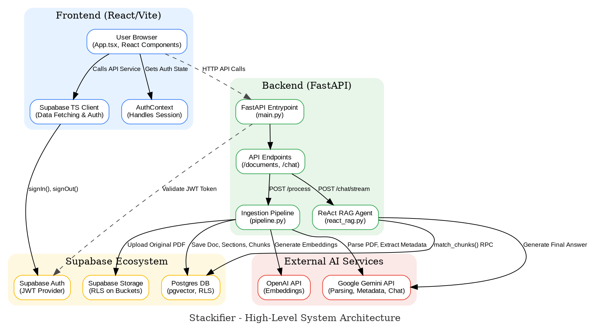

# Stackifier - AI Financial Document Analysis Platform (Front + Backend)

**Stackifier** is a full-stack, AI-powered platform designed to streamline financial analysis. Users can securely upload financial documents (like annual reports and income statements), and the system automatically parses, structures, and stores the data. A sophisticated RAG (Retrieval-Augmented Generation) agent then allows users to chat with their documents, perform complex calculations, and generate insightful visualizations.

**Core Goal:** To transform unstructured financial PDFs into an interactive, queryable knowledge base, providing users with an "AI CFO" to accelerate their analysis and decision-making.

**[Stackifier](Stackifier.com)** &nbsp;&nbsp;&nbsp; **|** &nbsp;&nbsp;&nbsp; **[Link to 3-Minute Loom Walkthrough]**

You can paste this into a tool like [Graphviz Online](https://dreampuf.github.io/GraphvizOnline) to generate the SVG or PNG image.

### Architecture Diagram (Graphviz Code)



---

## Core Features

*   **Secure Multi-Tenant Authentication:** Leverages Supabase for robust user authentication (JWT) and authorization.
*   **End-to-End Document Processing Pipeline:** A fully automated pipeline ingests PDFs, uses a multimodal LLM (Gemini) for parsing, extracts structured metadata, generates embeddings (OpenAI), and stores the data in a normalized Postgres database.
*   **Advanced RAG Agent:** A conversational interface powered by a ReAct (Reason+Act) agent that can:
    *   Query the document knowledge base using vector search.
    *   Perform complex financial calculations using a sandboxed Python tool.
    *   Generate dynamic charts and tables to visualize data.
*   **Robust Data Security:** Implements Row-Level Security (RLS) across the entire data layer (database and storage) to ensure users can only access their own data.
*   **Interactive Dashboard:** A frontend dashboard for visualizing key financial metrics and trends over time.

---

## Technical Architecture

The system is designed with a clean separation of concerns, comprising a React/Vite frontend, a FastAPI backend, and the Supabase ecosystem for data persistence and authentication.


### Backend (Python / FastAPI)

The backend is the core engine of the platform, handling API requests, the ingestion pipeline, and the AI agent logic.

*   **API Layer (`api/`)**: Built with FastAPI, providing a clear and versioned set of endpoints (`/documents`, `/chat`). It handles request validation (Pydantic), dependency injection (`dependencies.py`), and authentication by validating JWTs against Supabase Auth on every protected route.

*   **Ingestion Pipeline (`src/pipeline.py`)**: This is the orchestrator for document processing. It's a robust, sequential process designed for reliability:
    1.  **Parse (`FinancialDocParser`):** A multimodal LLM (Gemini Pro Vision) converts each PDF page into structured markdown. This process is parallelized for performance.
    2.  **Extract (`MetadataExtractor`):** A text-based LLM (Gemini Pro) analyzes the markdown to extract structured metadata (e.g., company name, report date, document type) according to a Pydantic schema.
    3.  **Store Original (`SupabaseService`):** The original PDF is uploaded to a private Supabase Storage bucket, with RLS policies ensuring user data isolation.
    4.  **Section (`Sectioner`):** The full markdown document is logically split into sections based on headings.
    5.  **Chunk (`ChunkingService`):** Each section is broken down into smaller, semantically meaningful chunks suitable for embedding.
    6.  **Embed (`EmbeddingService`):** An embedding model (OpenAI `text-embedding-3-small`) converts each chunk into a vector representation.
    7.  **Save (`SupabaseService`):** All structured data—the document record, sections, and chunks with their embeddings—are saved to the Postgres database.

*   **RAG Agent & LLM Tools (`src/llm/`)**:
    *   **`react_rag.py`**: The main workflow for the conversational agent. It uses the `pydantic-ai` library to create an agent that can reason and use tools.
    *   **`tools/ChunkRetriever.py`**: A custom tool that allows the agent to search for relevant document chunks. It embeds the user's query and calls a Postgres stored procedure (`match_chunks`) to perform an efficient vector similarity search with metadata filtering.
    *   **`tools/PythonCalculatorTool.py`**: A sandboxed Python execution environment that allows the agent to perform complex calculations without exposing the main application to security risks.

### Frontend (TypeScript / React)

The frontend is a modern, responsive single-page application built with Vite, React, and TypeScript.

*   **Routing (`App.tsx`)**: Uses `wouter` for clean, hook-based routing. `PrivateRoute` components ensure that dashboard and chat pages are only accessible to authenticated users.
*   **State Management (`contexts/AuthContext.tsx`)**: A global React Context provides session and user information throughout the application, handling sign-in, sign-out, and loading states cleanly.
*   **API Interaction (`supabase/` directory)**: Contains typed functions for interacting with both the custom FastAPI backend (`processDocument`) and the Supabase client directly (`fetchDocuments`, `signIn`).
*   **Core Components (`pages/` and `components/`)**:
    *   `Documents.tsx`: Manages listing, uploading, and deleting documents.
    *   `Chat.tsx`: The primary user interface for interacting with the RAG agent, handling streaming responses and rendering markdown, tables, and dynamic charts.
    *   `Dashboard.tsx`: Displays financial summaries and time-series data using `recharts`.
    *   `ChartComponent.tsx`: A reusable component designed to render various chart types based on a standardized JSON schema provided by the LLM.

### Database (Supabase / Postgres)

The data layer is built on Supabase, leveraging its powerful Postgres backend.

*   **Normalized Schema**: The database schema is highly normalized into `documents`, `sections`, and `chunks` tables. This structure is efficient for storage and allows for complex, relational queries. Dedicated tables like `profiles` and `income_statement_summaries` further organize data.
*   **Vector Search (`pgvector`)**: The `chunks` table uses the `pgvector` extension to store embeddings and enables high-speed similarity search, which is the foundation of the RAG system.
*   **Stored Procedures (`match_chunks_function.sql`)**: A PL/pgSQL database function (`match_chunks`) encapsulates the complex logic of performing a filtered vector search. This is more performant and secure than writing the query in the application code.
*   **Row-Level Security (RLS)**: RLS is enabled on *all* tables and storage buckets. Policies are written to ensure that users can only ever read, write, update, or delete their own data, providing a robust security model for this multi-tenant application.

---

## Tech Stack

| Category  | Technology                                                                                                  |
| :-------- | :---------------------------------------------------------------------------------------------------------- |
| **Frontend**  | `React`, `TypeScript`, `Vite`, `Tailwind CSS`, `DaisyUI`, `Recharts`                                          |
| **Backend**   | `Python`, `FastAPI`, `Pydantic`                                                                             |
| **AI/ML**     | `Google Gemini` (Parsing & Chat), `OpenAI` (Embeddings), `pydantic-ai` (Agent Framework), `pgvector` (Vector Search) |
| **Database**  | `Supabase`, `PostgreSQL`                                                                                    |
| **Auth**      | `Supabase Auth` (JWT-based)                                                                                 |
| **Storage**   | `Supabase Storage`                                                                                          |

---

## Local Setup & Installation

1.  **Clone the Repository:**
    ```bash
    git clone https://github.com/your-username/your-repo-name.git
    cd your-repo-name
    ```

2.  **Setup Backend (Python):**
    *   Create a virtual environment: `python -m venv venv`
    *   Activate it: `source venv/bin/activate` (macOS/Linux) or `venv\Scripts\activate` (Windows)
    *   Install dependencies: `pip install -r requirements.txt`
    *   Create a `.env` file in the root directory and add your API keys and Supabase credentials:
        ```env
        SUPABASE_URL=...
        SUPABASE_ANON_KEY=...
        GEMINI_API_KEY=...
        OPENAI_API_KEY=...
        VITE_TEST_EMAIL=...
        VITE_TEST_PASSWORD=...
        ```
    *   Run the backend server: `uvicorn api.main:app --reload`

3.  **Setup Frontend (React):**
    *   Navigate to the frontend directory: `cd frontend`
    *   Install dependencies: `npm install`
    *   Create a `.env.local` file and add your Supabase credentials (prefixed with `VITE_`):
        ```env
        VITE_SUPABASE_URL=...
        VITE_SUPABASE_ANON_KEY=...
        VITE_FASTAPI_BACKEND_URL=http://127.0.0.1:8000
        VITE_TEST_EMAIL=...
        VITE_TEST_PASSWORD=...
        ```
    *   Run the development server: `npm run dev`

4.  **Setup Database (Supabase):**
    *   Go to your Supabase project dashboard.
    *   Run the SQL scripts from the `sql/` directory in the Supabase SQL Editor in the following order:
        1.  `database_setup.sql`
        2.  `profile_table.sql`
        3.  `storage_setup.sql`
        4.  `income_statement_summaries.sql`
        5.  `match_chunks_function.sql`
        6.  `chat_session.sql`

The application should now be running, with the frontend available at `http://localhost:5173` and the backend at `http://localhost:8000`.