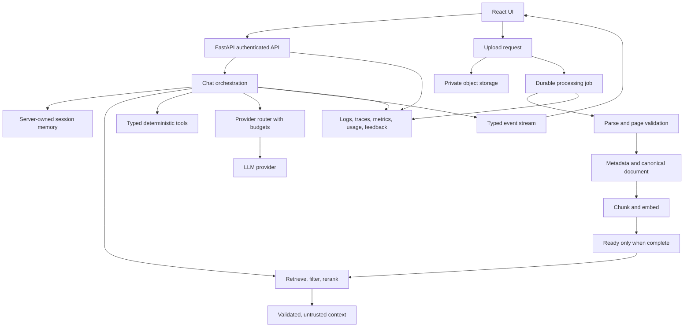

# StackRAG remediation plan

Status: COMPLETED AND VERIFIED  
Date: 2026-08-09  

Branch: `audit/stackrag-remediation-plan`  
Scope: `StackRAG-Frontend` and `StackRAG-Backend`

This is the canonical cross-repository plan. It intentionally lives in the backend repository because the backend owns the API, AI workflow, evaluation, and database contract. Do not create a second copy in the frontend repository.

## Purpose

Turn StackRAG from a credible financial-document AI prototype into a reliable, evidence-first AI product that can withstand real users, malformed documents, provider failures, cost pressure, mobile use, and technical review.

The desired product promise is:

> StackRAG turns messy financial documents into reviewable answers with traceable evidence, predictable calculations, and safe human control.

## Ground truth and confidence rules

- `CONFIRMED`: directly supported by the checked-in code, configuration, documentation, or a reproducible local command.
- `VERIFY`: a credible risk visible in code, but deployment state, provider behavior, browser behavior, or live Supabase grants must still be tested.
- `DOC`: documentation or product-contract drift that should be corrected even if the runtime path happens to work in one environment.
- No P0 unauthenticated data breach was proven during this read-only audit.
- P1 means the issue can affect trust, data integrity, cost, availability, or core usability and should be addressed before calling the system production-ready.
- P2 means important hardening, maintainability, accessibility, or product-quality work that follows the P1 foundation.

## Repositories and source-of-truth decisions

Primary repositories audited:

- Frontend: `C:/Users/wbrya/OneDrive/Documents/GitHub/StackRAG-Frontend`
- Backend: `C:/Users/wbrya/OneDrive/Documents/GitHub/StackRAG-Backend`

Related repositories used for comparison only:

- `C:/Users/wbrya/OneDrive/Documents/GitHub/stackifier-ledger`
- `C:/Users/wbrya/OneDrive/Documents/GitHub/simple-stackifier-mvp`

The related MVP has pre-existing modified and untracked files. It was not changed.

Decisions:

1. Keep React/TypeScript/Vite plus FastAPI/Python for now. Migrating to Next.js only to satisfy a résumé keyword would add risk without solving the current reliability problems.
2. Keep this document as the single cross-repo backlog.
3. Keep database migrations in one canonical repository. The seven SQL files are currently duplicated byte-for-byte in both primary repositories; the backend should become canonical and the frontend should reference it or consume generated types.
4. Use one typed API/event contract shared by both repositories.
5. Treat the `stackifier-ledger` review/audit workflow and the `simple-stackifier-mvp` typed/evidence patterns as sources of patterns, not as code to merge blindly.
6. Do not claim production readiness, zero hallucinations, 100% accuracy, or 100% uptime until the evidence and CI process support those claims.

## Target architecture

## P1 backlog: fix before production claims

### P1-01 — Fix the frontend/backend API contract

Evidence:

- `StackRAG-Frontend/src/config/api.ts:2-6` builds `/documents` and `/chat` from the environment value.
- `StackRAG-Backend/api/__init__.py:5` adds `/api`.
- `StackRAG-Backend/api/v1/__init__.py:5` adds `/v1`.
- `StackRAG-Frontend/README.md:183-194` documents a backend origin without `/api/v1`.

Fix:

- Define `VITE_API_ORIGIN` as origin only.
- Define `API_PREFIX = "/api/v1"` exactly once.
- Generate or hand-maintain a typed client from the backend OpenAPI schema.
- Add a smoke test that uploads a fixture, polls its job, starts chat, receives a completion event, and verifies the frontend route contract.
- Document local, staging, and production values separately.

Done when:

- A clean checkout can run frontend and backend locally using the documented environment values.
- No endpoint path is assembled independently in multiple files.
- A CI smoke test fails if the route prefix drifts.

### P1-02 — Restore reproducible frontend verification and add CI

Evidence:

- The captured frontend `npm run build` fails with unresolved modules and TypeScript errors.
- `npm run lint` cannot start in the captured checkout.
- The frontend has no test script.
- Neither primary repository has a `.github` workflow directory.
- The backend has no conventional `tests/` directory.

Fix:

- Run a clean lockfile install and repair the remaining type errors.
- Add frontend unit tests for API parsing, SSE parsing, chart/PDF tag validation, and async race guards.
- Add backend tests for auth ownership, request limits, event sequencing, retrieval ranking, job transitions, and cleanup behavior.
- Add browser tests for login, upload, processing failure, retry, chat success, chat failure, citation opening, keyboard navigation, and mobile layouts.
- Add one CI workflow with dependency installation, typecheck, lint, unit tests, integration tests, build, and dependency audit.

Done when:

- `npm run build`, `npm run lint`, frontend tests, backend tests, and the smoke suite pass from a clean checkout.
- CI blocks merges when any of those fail.

### P1-03 — Replace in-process document work with durable jobs

Evidence:

- `StackRAG-Backend/api/v1/endpoints/document_process.py:21-23,322-331` uses an in-process semaphore and `BackgroundTasks`.
- `StackRAG-Backend/Dockerfile.prod:43-48` starts multiple workers, each with its own semaphore.

Why this matters:

FastAPI documents `BackgroundTasks` as appropriate for small work such as notifications. Heavy work that must survive process restarts belongs in a queue or worker system that can run across processes and servers.

Fix:

- Keep the API request responsible only for validation, object storage, and job creation.
- Add a durable worker using a queue or database lease model.
- Add `queued`, `processing`, `retryable`, `failed`, `cancelled`, and `completed` states.
- Add `attempt_count`, `lease_until`, `last_heartbeat_at`, `next_attempt_at`, and `error_code`.
- Reclaim stale leases on startup and periodically.
- Make retry transitions atomic and idempotent.
- Use a global concurrency budget, not a per-process semaphore.

Done when:

- Restarting the API cannot silently lose a queued job.
- Two retry requests cannot create two processing runs.
- Worker concurrency is bounded across all replicas.

### P1-04 — Make ingestion complete-or-failed, never silently partial

Evidence:

- `StackRAG-Backend/src/services/EmbeddingService.py:53-69` swallows embedding failures and allows count mismatches.
- `StackRAG-Backend/src/storage/SupabaseService.py:154-192` silently skips chunks without embeddings.
- `StackRAG-Backend/src/pipeline.py:183-215,259-347` writes artifacts in stages without a compensating cleanup path.
- `StackRAG-Backend/src/services/FinancialDocParser.py:178-189` converts failed page attempts into content strings.

Fix:

- Validate `len(embeddings) == len(chunks)` before persistence.
- Fail the job if required pages or chunks are unavailable.
- Track page-level outcomes instead of embedding errors in Markdown.
- Use idempotent upserts keyed by document/version/section/chunk.
- Use a database transaction where possible and explicit object-storage cleanup otherwise.
- Store `pipeline_version`, `parser_version`, `embedding_model`, and `source_hash`.

Done when:

- A simulated provider failure leaves no misleading `completed` document.
- A retry can safely resume or replace a failed attempt without duplicates.
- Retrieval never sees a document marked ready with missing required chunks.

### P1-05 — Bound PDF size, memory, pages, and processing time

Evidence:

- `StackRAG-Backend/api/v1/endpoints/document_process.py:280-326` reads the upload into memory.
- `StackRAG-Backend/src/services/FinancialDocParser.py:54-114` retains buffers, rendered pages, and combined Markdown.

Fix:

- Stream uploads to private object storage or bounded temporary files.
- Enforce byte, page-count, rendered-pixel, text-length, and total-time budgets.
- Process pages incrementally and release page images after use.
- Reject malformed or suspicious PDFs before expensive model calls.
- Add cancellation when the job is deleted or superseded.

Done when:

- A 50 MB multi-page fixture stays within an explicit memory budget.
- Provider calls cannot continue indefinitely.
- A cancelled job stops new work and reports a stable state.

### P1-06 — Make chat events reliable and genuinely streamable

Evidence:

- `StackRAG-Backend/api/v1/endpoints/chat.py:95-103` emits hand-built SSE strings and sends errors inside HTTP 200.
- `StackRAG-Backend/src/llm/workflow/react_rag.py:341-395` performs complete model attempts and only then chunks the final answer.
- `StackRAG-Frontend/src/pages/private/Chat.tsx:277-317` ignores `stream_error` and persists the result.

Fix:

- Use typed SSE event models or a documented protocol such as AG-UI/Vercel AI Data Stream where appropriate.
- Emit event names, IDs, retry hints, keepalive comments, and no-cache/no-buffer headers.
- Stream model/tool events as they occur instead of slicing a completed answer into fake chunks.
- Add `message.started`, `message.delta`, `tool.started`, `tool.completed`, `citation.added`, `usage.reported`, `message.completed`, and `message.failed`.
- Persist only after a completion event.
- Abort provider work on disconnect where supported.
- Add fragmented, CRLF, multiline, reconnect, error, EOF, and duplicate-event tests.

Done when:

- A provider failure is visible to the user and never becomes a successful saved response.
- Slow work produces keepalives or progress events.
- A reconnect can use an event ID without duplicating already persisted output.

### P1-07 — Make chat memory server-owned and bounded

Evidence:

- `StackRAG-Backend/api/v1/endpoints/chat.py:34-62,80-96` accepts browser-supplied assistant history.
- `StackRAG-Frontend/src/pages/private/Chat.tsx:354-377` sends the entire client history.

Fix:

- Send `session_id` plus the latest user message.
- Load history from Supabase under the authenticated user.
- Append only server-produced user, assistant, tool, and citation events.
- Add a server-side summary/window strategy for long sessions.
- Enforce per-turn, per-session, and total token limits.
- Store a message schema version and source of each message.

Done when:

- A forged assistant message in the browser cannot become trusted model memory.
- Oversized history requests receive a stable validation error.
- Users can resume a conversation without the client inventing prior tool results.

### P1-08 — Treat retrieved documents as untrusted data

Evidence:

- `StackRAG-Backend/src/llm/workflow/react_rag.py:320-330` inserts retrieved text into the system prompt.

Fix:

- Place retrieved chunks in a separate data context, not the immutable instruction layer.
- Add explicit instructions that document text is untrusted and cannot change policy, tools, or output format.
- Strip or escape control delimiters before prompt assembly.
- Add prompt-injection fixtures to the evaluation suite.
- Validate any tool argument, chart value, document ID, and citation against server-side state.

Done when:

- A document containing instruction-like text cannot change the agent’s tool permissions or citation policy.
- Injection tests run in CI and record the prompt/model/version used.

### P1-09 — Preserve retrieval relevance and provenance

Evidence:

- `StackRAG-Backend/src/llm/tools/ChunkRetriever.py:100-169` expands sections and sorts by filename/section/chunk order.
- `StackRAG-Backend/src/llm/workflow/react_rag.py:162-203` keeps only the first ten compacted chunks.

Fix:

- Preserve similarity rank and score.
- Limit section expansion per selected chunk.
- Add reranking or a deterministic relevance policy.
- Keep source metadata attached to every context item.
- Record retrieved chunk IDs for evaluation and citations.

Done when:

- The most relevant chunk cannot be removed merely because another filename sorts earlier.
- Evaluation can calculate chunk-level retrieval metrics from recorded artifacts.

### P1-10 — Make citations claim-grounded

Evidence:

- `StackRAG-Backend/src/llm/workflow/react_rag.py:113-159,366-377` can select the first result, default the page, or create a placeholder.

Fix:

- Require citations to contain validated `document_id`, `chunk_id`, page, and excerpt metadata.
- Generate citations from context actually used by the answer.
- Reject out-of-range pages and documents the user cannot access.
- Render “no verified source” rather than a fabricated navigation target.
- Add citation-opened and citation-wrong feedback events.

Done when:

- Every displayed source resolves to the authenticated user’s document and page.
- A citation test fails if document ID, page, or excerpt does not match the stored evidence.

### P1-11 — Replace format retries with bounded model orchestration

Evidence:

- `StackRAG-Backend/src/llm/workflow/react_rag.py:341-365` can execute up to three complete model calls.
- The retries are mostly attempts to add tags, not provider, latency, or cost fallback.

Fix:

- Use Pydantic AI typed output models instead of manual `<ChartData>` and `<PDFNav>` tags.
- Configure separate retry budgets for tools and output validation.
- Add request, token, cost, and wall-clock budgets.
- Route retryable provider errors to an approved fallback model only when the policy allows it.
- Make the model policy explicit and observable per request.

Done when:

- A request has a predictable maximum number of provider calls and tokens.
- The response records provider, model, retries, latency, usage, and final status.

### P1-12 — Make financial calculations deterministic

Evidence:

- The prompt advertises calculator behavior, but `PythonCalculatorTool` is disabled.
- If re-enabled, `PythonCalculatorTool.py:41-83` executes model-supplied Python in the backend process.

Fix:

- Define a small typed calculation API: sum, difference, ratio, percentage change, min/max, and period comparison.
- Parse numeric inputs server-side using decimal arithmetic.
- Return calculation steps and source values to the model/UI.
- Never execute arbitrary model-generated Python in the API process.

Done when:

- Numeric answers pass deterministic tests independent of model wording.
- The UI can show the formula, inputs, units, and source documents.

### P1-13 — Stop leaking internal errors and sensitive answer content

Evidence:

- `StackRAG-Backend/api/v1/endpoints/chat.py:100-103` serializes `str(e)` to clients.
- `StackRAG-Backend/api/v1/endpoints/document_process.py:342-346,379-383,479-482` returns raw exception text.
- `StackRAG-Backend/src/llm/workflow/react_rag.py:250,379-386` logs user/session context and full final answers.

Fix:

- Return stable public error codes and user-safe messages.
- Log detailed exceptions only on the server with correlation IDs.
- Redact prompts, financial outputs, tokens, credentials, and provider payloads.
- Add a request/job ID to every client-visible failure.

Done when:

- A provider, Supabase, or database exception does not reveal implementation details.
- Production logs contain metadata needed to debug without storing complete financial answers.

### P1-14 — Fix frontend recovery, races, mobile, and accessibility

Evidence:

- `StackRAG-Frontend/src/components/Sidebar.tsx:262-265` keeps a full sidebar on narrow layouts.
- `StackRAG-Frontend/src/pages/private/Chat.tsx:631-667` fixes chat and PDF panes at half width.
- `StackRAG-Frontend/src/pages/private/Chat.tsx:109-141,369-391` lacks cancellation/sequence guards.
- `StackRAG-Frontend/src/components/PDFViewerEmbedded.tsx:20-82` can apply stale asynchronous results.
- `StackRAG-Frontend/src/pages/private/Documents.tsx:87-126` hides document/job loading failures.
- `StackRAG-Frontend/src/pages/private/Chat.tsx:600-622` removes the composer when an error exists.
- `StackRAG-Frontend/src/pages/private/Documents.tsx:541-588` makes table rows mouse-only.
- `StackRAG-Frontend/src/pages/Login.tsx:99`, `Signup.tsx:135`, and `Chat.tsx:607-643` need stronger label/name semantics.

Fix:

- Add a keyboard-accessible mobile drawer and full-screen mobile PDF viewer.
- Use `AbortController` and request identity guards for chat, documents, jobs, and PDF loads.
- Keep the composer visible after failure and add retry/copy/report actions.
- Add explicit loading, empty, error, partial, cancelled, and retrying states.
- Replace row click behavior with a focusable details link/button.
- Add `aria-label`, `htmlFor`, visible focus, and screen-reader status announcements.
- Add an accessible data table or textual summary for every chart.

Done when:

- Core flows work at 375px, 768px, and 1280px widths.
- Keyboard users can upload, open documents, use chat, open citations, and recover from errors.
- Accessibility tests cover labels, focus, contrast, dialogs, tables, and live status.

## P2 backlog: hardening and cleanup

### P2-01 — Validate structured outputs at the boundary

Evidence: `StackRAG-Backend/src/llm/workflow/react_rag.py:345-377` checks for tag presence; `StackRAG-Frontend/src/pages/private/Chat.tsx:42-71` parses JSON ad hoc.

Fix: define shared schemas for `AssistantResponse`, `Chart`, `Citation`, `Usage`, and `Error`; validate with Pydantic on the backend and Zod or generated TypeScript types on the frontend. Reject invalid IDs, pages, values, and shapes before rendering.

### P2-02 — Add prompt versioning and prompt-specific regression tests

Evidence: `StackRAG-Backend/src/prompts/prompt_manager.py:18-38` and `src/prompts/templates/chat_system_prompt.j2` provide templates but no version contract or snapshots.

Fix: version prompts, record prompt version on every run, snapshot rendered prompts with safe fixtures, and test ordinary, missing-context, multilingual, adversarial, and calculation cases.

### P2-03 — Add telemetry, usage limits, and cost accounting

Fix: instrument model runs, retrieval, tool calls, output validation, user feedback, and job processing. Record actual provider usage rather than estimating cost from final text length. Add per-user and global budgets.

### P2-04 — Add explicit timeouts and readiness checks

Evidence: `StackRAG-Backend/src/llm/OpenAIClient.py:20-45`, `GeminiClient.py:27-28`, and `services/MetadataExtractor.py:66-73` do not establish a clear application-level deadline; `src/main.py:25-28` reports a static healthy response.

Fix: add connect/read/total deadlines, classify retryable errors, cap cumulative job time, and expose separate `/health/live` and `/health/ready` endpoints.

### P2-05 — Verify and strengthen related-row ownership

Evidence: `StackRAG-Backend/scripts/3_income_statement_summaries.sql:15-18,53-59` stores `document_id` and `user_id` without an explicit composite ownership relationship.

Fix: add a composite foreign key or an RLS policy that verifies the referenced document belongs to `auth.uid()`. Run pgTAP/PostgREST tests against a real Supabase project before classifying this as fixed.

### P2-06 — Harden uploads and storage paths

Evidence: `StackRAG-Backend/src/storage/SupabaseService.py:33-50` derives object paths from user ID, document ID, and original filename.

Fix: normalize filenames, use server-generated object names, preserve the original name only as metadata, verify content signatures, enforce private bucket policies, and test download/delete ownership with two users.

### P2-07 — Reduce repeated frontend data transfer

Evidence: `StackRAG-Frontend/src/supabase/documents.ts:35-40` selects full Markdown content and `Documents.tsx:101-126` refreshes the document list every three seconds while jobs run.

Fix: use a lightweight list query without full content, fetch detail content on demand, poll only active job IDs, and use realtime or bounded backoff where appropriate.

### P2-08 — Avoid base64 PDF duplication

Evidence: `StackRAG-Frontend/src/pages/private/Documents.tsx:272-300` and `src/components/PDFViewerEmbedded.tsx:63-75` create data URLs for PDFs.

Fix: use short-lived signed URLs or Blob URLs, revoke Blob URLs on cleanup, and add large-document/mobile memory tests.

### P2-09 — Unify duplicate frontend PDF viewers

Evidence: `StackRAG-Frontend/src/components/PDFViewerEmbedded.tsx` and `PDFViewerModal.tsx` implement overlapping storage/download/viewer behavior.

Fix: create one viewer service and one viewer component with a responsive presentation mode. Keep loading, access, cancellation, and error behavior in one place.

### P2-10 — Remove duplicated and stale repository surfaces

Fix:

- Keep one canonical SQL migration directory.
- Keep one evaluation analyzer; remove or explicitly deprecate `evaluation/analyzer.py` versus `analyzer_clean.py`.
- Remove dead calculator imports/comments or add the calculator only after sandboxing and tests.
- Audit the duplicate/legacy `/items` route against the document-processing API and either remove it or document its ownership.
- Remove unused frontend dependencies and standardize on one icon/component strategy where possible.

### P2-11 — Make dependencies reproducible and auditable

Fix:

- Pin every Python dependency, including evaluation and plotting packages.
- Refresh vulnerable frontend dependencies deliberately and review breaking changes.
- Keep lockfiles current.
- Add `npm audit` and Python dependency auditing to CI.
- Record runtime versions in the repository documentation.

### P2-12 — Rewrite stale documentation

Fix these known drift points:

- Frontend API URL instructions must include the actual contract behavior.
- Frontend README must describe `fetch`-based POST streaming rather than implying native `EventSource` usage with custom authorization headers.
- Backend README must use the actual numbered SQL filenames.
- Remove unsupported claims about 100% accuracy, zero hallucinations, 100% uptime, sandboxed Python, transaction safety, and comprehensive testing.
- Label evaluation results with dataset size, commit, model, prompt version, and date.
- Add a real `.env.example` to the frontend with placeholders only.
- Link signup terms/privacy controls to real documents or remove the links until they exist.

## Evaluation plan

Create a versioned evaluation suite with the following groups:

1. Exact financial extraction: revenue, expenses, gross profit, net income, signs, units, and scale.
2. Calculations: percentage change, margins, totals, negative values, missing values, and conflicting sources.
3. Retrieval: labeled relevant chunks with recall@k, precision@k, MRR, nDCG, and context sufficiency.
4. Provenance: document ID, page bounds, chunk ID, excerpt match, and user ownership.
5. Robustness: malformed PDF, blank page, failed page, duplicate upload, partial embedding, provider timeout, quota error, and cancellation.
6. Prompt injection: instructions hidden in PDF text, filenames, metadata, tables, and retrieved chunks.
7. Conversation integrity: forged assistant messages, stale sessions, concurrent sends, and oversized history.
8. UX: loading, empty, error, retry, mobile, keyboard, focus, and screen-reader flows.
9. Performance: upload time, extraction time, retrieval latency, time-to-first-event, total response latency, memory, and provider cost.
10. Localization: English and Bahasa Melayu financial-document questions and Malaysian currency/accounting conventions.

Every evaluation result must record:

- commit SHA;
- dataset hash;
- prompt versions;
- model/provider versions;
- configuration and limits;
- raw structured result;
- deterministic checks;
- judge output, if a judge is used;
- latency and usage;
- pass/fail reason.

LLM judges may supplement deterministic checks; they must not replace them for numeric correctness, citations, security, or reliability.

## YTL AI Product Engineer coverage

| YTL capability | StackRAG evidence today | Work required to demonstrate it strongly |
|---|---|---|
| React/Next plus Python/Node | React/TypeScript/Vite and FastAPI/Python | Make the current stack buildable and tested; do not migrate only for keyword matching. |
| Prompt builders | Jinja templates | Add versioned prompt registry, schemas, fixtures, and controlled experiments. |
| Memory APIs | JSON chat history | Move history server-side, add summaries/windows, and enforce ownership and limits. |
| Agent orchestration | Pydantic AI agent and retrieval | Add typed tools, provider routing, durable runs, cancellation, and event streams. |
| Context management | Profile, retrieval, history | Fix ranking, untrusted-context isolation, provenance, and token budgets. |
| Fallback mechanisms | Format retries | Add deadlines, provider fallback, usage limits, cancellation, and cost-aware policy. |
| React UI | Existing private dashboard/doc/chat/PDF surfaces | Fix mobile, accessibility, error recovery, evidence display, and typed events. |
| Backend routing | FastAPI routes and retrieval service | Add shared contracts, versioned API, structured errors, and tool registry. |
| CI/CD and monitoring | Docker configuration | Add CI gates, deployment checks, readiness, traces, metrics, and alerting. |
| Feedback and telemetry | Small static evaluation artifact | Add user feedback, replayable runs, usage metrics, and automated regression evaluation. |
| Reusable patterns | Some service separation | Remove duplicate SQL/evaluators/viewers and publish shared contracts. |
| RAG/prompt evaluation | Real embeddings plus 12-case evaluation | Add labeled retrieval, citation, adversarial, deterministic, and repeated-run metrics. |
| Fintech/financial UX | Financial statements and calculations | Add review confidence, evidence, formulas, and human approval workflow. |
| Sovereign/local context | Not yet demonstrated | Add English/Bahasa Melayu fixtures and Malaysia-specific financial terminology. |

## Recommended implementation order

### Milestone 1 — Restore trust

- P1-01, P1-02, P1-06, P1-07, P1-13, P1-14.
- Outcome: the product runs, errors are honest, client history is not trusted, and users can recover.

### Milestone 2 — Make ingestion durable

- P1-03, P1-04, P1-05, P2-04, P2-06.
- Outcome: uploads survive restarts, retries are safe, and a document is ready only when complete.

### Milestone 3 — Make answers grounded and measurable

- P1-08, P1-09, P1-10, P1-11, P1-12, P2-01, P2-02, P2-03.
- Outcome: model output is typed, calculations are deterministic, citations are validated, and cost/quality are measurable.

### Milestone 4 — Clean the product surface

- P2-07 through P2-12.
- Outcome: one source of truth, current docs, audited dependencies, accessible charts, and maintainable UI primitives.

### Milestone 5 — Publish the proof

Create a safe public case study containing:

- architecture diagram;
- before/after latency and cost;
- retrieval/citation evaluation;
- prompt-injection results;
- CI evidence;
- mobile screenshots;
- one incident or failure-mode write-up and its fix.

## Verification matrix

Before calling the plan complete, run:

| Area | Required proof |
|---|---|
| Frontend | clean install, typecheck, lint, unit tests, production build |
| Backend | AST/import checks, unit tests, API tests, worker tests |
| Database | migration replay, RLS/ownership tests with two users, pgTAP where practical |
| Storage | private read/write/delete ownership tests, path normalization tests |
| Chat | success/error/cancel/reconnect/duplicate-event tests |
| RAG | labeled retrieval metrics, citation validation, injection fixtures |
| Calculations | deterministic decimal arithmetic tests and formula rendering tests |
| Ingestion | large PDF, failed page, failed embedding, retry race, restart recovery |
| UX | 375px/768px/1280px, keyboard, focus, screen reader, empty/error/loading states |
| Operations | readiness checks, traces, metrics, cost, alert, dependency audit |
| Documentation | every command and claim verified from the current branch |

## Live verification still required

These were intentionally not treated as proven local facts:

- deployed Supabase grants and RLS behavior;
- production environment values and frontend API origin;
- real provider streaming, timeout, quota, and cancellation behavior;
- production worker/deployment topology;
- browser E2E behavior on real mobile viewports;
- actual memory usage for large PDFs;
- real tenant-isolation tests against the deployed database.

## Evidence and references

Repository evidence is cited above by absolute repository-relative source path and line range. The following current primary documentation was consulted for implementation direction:

- [FastAPI Background Tasks](https://fastapi.tiangolo.com/tutorial/background-tasks/)
- [FastAPI Server-Sent Events](https://fastapi.tiangolo.com/tutorial/server-sent-events/)
- [FastAPI SSE reference](https://fastapi.tiangolo.com/reference/sse/)
- [Pydantic AI agents](https://pydantic.dev/docs/ai/core-concepts/agent/)
- [Pydantic AI structured output](https://pydantic.dev/docs/ai/api/pydantic-ai/output/)
- [Pydantic AI UI event streams and security considerations](https://pydantic.dev/docs/ai/integrations/ui/overview)
- [Supabase RLS and ownership guidance](https://supabase.com/docs/guides/database/postgres/row-level-security)
- [Supabase Storage ownership policies](https://supabase.com/docs/guides/storage/security/ownership)

Context7 was used for FastAPI, Pydantic AI, and Supabase documentation lookup. Exa web search was used to cross-check current official documentation pages. DeepWiki was queried for both repositories, but returned only an indexing/loading shell; no DeepWiki-generated repository claims are used in this plan.
